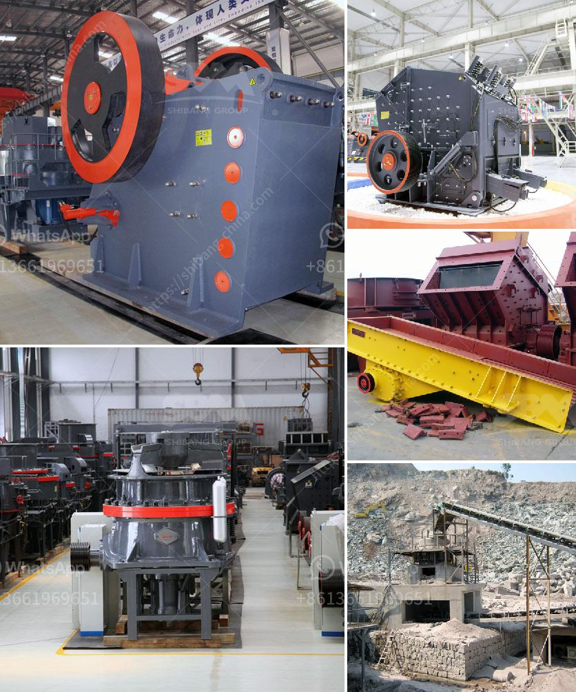

<h3>آلة غسيل الرمل للبيع في سريلانكا</h3>
يعتبر غسيل الرمل أحد أهم العمليات في صناعة البناء والتشييد، حيث تُستخدم آلة غسيل الرمل لفصل الشوائب والأوساخ من الرمل للحصول على مواد بناء عالية الجودة. وفي سريلانكا، تتوفر آلات غسيل الرمل ذات الجودة العالية بأسعار تنافسية وبين 200-400 دولار.

تُعد آلات غسيل الرمل الصغيرة من بين الأكثر شيوعًا في سريلانكا، حيث تتميز بأنها صغيرة الحجم وسهلة الاستخدام والتنظيف. وتتضمن هذه الآلات عادة صندوقًا كبيرًا يحتوي على شبكة وسلة داخلية لفصل الرمل عن الشوائب.

تحتوي آلة غسيل الرمل على محرك قوي يساعد في دفع الماء بقوة من خلال الصندوق لغسل الرمل بفعالية. كما يمكن التحكم في ضغط الماء باستخدام الصمامات الموجودة على الجهاز لتلبية احتياجات العملاء المختلفة.

تتميز آلات غسيل الرمل في سريلانكا بالعديد من المزايا، منها السرعة والكفاءة في العمل. تستطيع هذه الآلات غسل وتنظيف كميات كبيرة من الرمل في وقت قصير، مما يساهم في زيادة إنتاجية موقع البناء وتوفير الوقت والجهد. لا تتطلب هذه الآلات الكثير من الصيانة، وبالتالي فهي اختيار مثالي للمقاولين والشركات في سريلانكا.

بالإضافة إلى ذلك، تقدم بعض الشركات المصنعة ضمانًا على آلات غسيل الرمل التي تبيعها، مما يجعلها أكثر جاذبية للعملاء. كما تتوفر هذه الآلات بأحجام وقدرات مختلفة، مما يتيح للمشترين الاختيار المناسب وفقًا لاحتياجاتهم.

للختام، آلات غسيل الرمل للبيع في سريلانكا تعتبر استثمارًا مهمًا للشركات والمقاولين في صناعة البناء والتشييد في البلاد. بفضل توفرها وجودتها العالية وأسعارها التنافسية، تُعد هذه الآلات اختيارًا مثاليًا لمن يبحثون عن معدات غسيل الرمل الفعالة والموثوقة في سريلانكا.
<h3>Contact us</h3><ul><li><strong>Whatsapp:&nbsp;<a href="https://wa.me/8613661969651">+8613661969651</a></strong></li><li><a href="https://swt.shibang-china.com/?git&amp;zhl&amp;آلة غسيل الرمل للبيع في سريلانكا"><strong>Online Service(chat now)</strong></a></li></ul><h3>Related</h3><ul><li><a href='تحجيم مطاحن الكرة.md'>تحجيم مطاحن الكرة</a></li><li><a href='سعر آلة تكسير الذهب في الولايات المتحدة.md'>سعر آلة تكسير الذهب في الولايات المتحدة</a></li><li><a href='عمليات مصنع كسارة الصخور.md'>عمليات مصنع كسارة الصخور</a></li><li><a href='مواصفات معدات مصنع طحن الحجر.md'>مواصفات معدات مصنع طحن الحجر</a></li><li><a href='مصنع كرة الاسمنت المواد والطاقة.md'>مصنع كرة الاسمنت المواد والطاقة</a></li></ul>