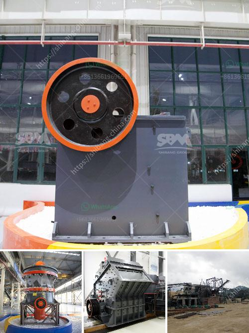

<h3>آلة غسيل الفحم طن</h3>
تعد آلة غسيل الفحم أحد الأدوات الرئيسية في صناعة التعدين، حيث يتم استخدامها لفصل الفحم عن الرواسب والمواد الأخرى الموجودة فيه. يتم غسيل الفحم لتحسين جودته وزيادة نسبة الكربون فيه، مما يؤدي إلى زيادة قيمته الاقتصادية وتحسين أدائه في العمليات الصناعية.

تعمل آلة غسيل الفحم عن طريق تفريغ الفحم في حوض كبير يحتوي على محلول من الماء والمواد الكيميائية الملائمة. يتم تشغيل الآلة لفصل الرواسب والمواد الأخرى بعد تنقل الفحم في المحلول مع تدويره باستخدام آليات ميكانيكية.

تتكون آلة غسيل الفحم من عدة مراحل، حيث يتم تحويل الفحم من الحجم الكبير إلى قطع صغيرة عن طريق الكسر والطحن. ثم يتم تنظيفه وتصفيته باستخدام الفصل الجاذب والفصل الجاذب المغناطيسي، حيث يتم فصل الرواسب والمعادن الأخرى بناءً على اختلاف صفاتها الفيزيائية.

تعتبر آلة غسيل الفحم أحدث التكنولوجيات المستخدمة في صناعة التعدين، حيث تساهم في تحسين الكفاءة والجودة والسلامة في عملية تنقية الفحم. بالإضافة إلى ذلك، فإن استخدام هذه الآلة يقلل من تأثيرات التلوث البيئي الناتجة عن صناعة التعدين، حيث يتم التحكم في تدفق المياه والمواد الكيميائية المستخدمة.

وفي الختام، تعتبر آلة غسيل الفحم أداة حاسمة في صناعة التعدين، حيث تساهم في تحسين جودة الفحم وزيادة قيمته الاقتصادية. كما أنها تلعب دورًا هامًا في تقليل التأثيرات البيئية الناتجة عن هذه الصناعة. ومن المتوقع أن تستمر الابتكارات والتحسينات في هذا المجال لتحسين الكفاءة والاستدامة في صناعة التعدين.
<h3>Contact us</h3><ul><li><strong>Whatsapp:&nbsp;<a href="https://wa.me/8613661969651">+8613661969651</a></strong></li><li><a href="https://swt.shibang-china.com/?git&amp;zhl&amp;آلة غسيل الفحم طن"><strong>Online Service(chat now)</strong></a></li></ul><h3>Related</h3><ul><li><a href='سيور ناقلة في فرنسا.md'>سيور ناقلة في فرنسا</a></li><li><a href='صور تعدين خام النحاس في نيجيريا.md'>صور تعدين خام النحاس في نيجيريا</a></li><li><a href='مطحنة رايموند في بورور.md'>مطحنة رايموند في بورور</a></li><li><a href='موردين لمصانع سحق ld slag في الهند.md'>موردين لمصانع سحق ld slag في الهند</a></li><li><a href='كسارة الحجر المستعملة للبيع في زيمبابوي.md'>كسارة الحجر المستعملة للبيع في زيمبابوي</a></li></ul>