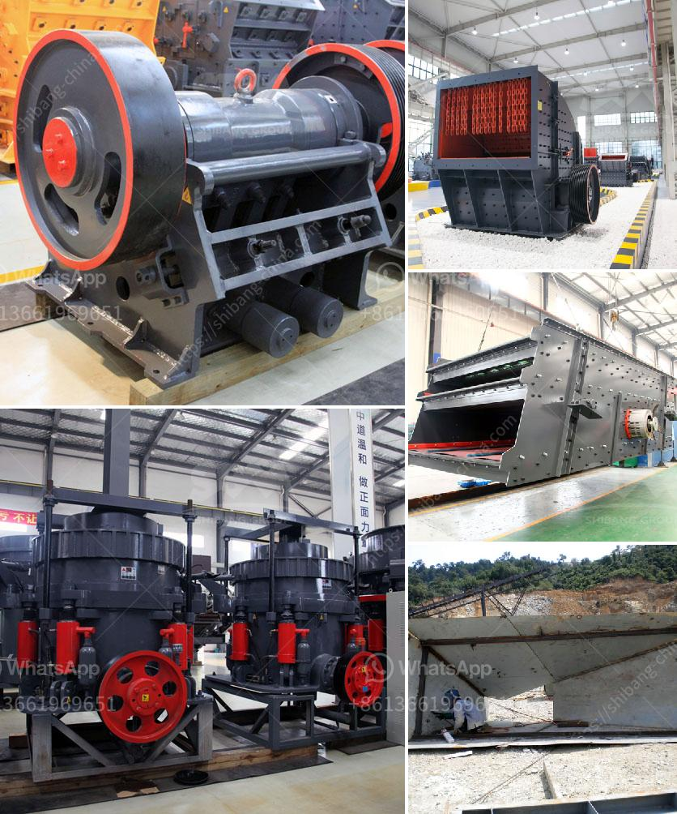

<h3>آلة فاصلة للرمل والحصى للبيع في الفلبين</h3>
تتمتع الفلبين بمواردها الطبيعية الغنية، وأحد هذه الموارد هو الرمل والحصى. يتم استخدام الرمل والحصى في العديد من الصناعات مثل البناء، والتشييد، والطرق، والزراعة، والتعدين. ولذلك، يعتبر الحفاظ على جودة الرمل والحصى ضرورة قصوى.

واحدة من الآلات المهمة التي تساهم في صناعة البناء، وتصفية وفصل الرمل والحصى هي آلة فاصلة. تعد آلة فاصلة للرمل والحصى أداة فعالة تقوم بفصل المواد الصلبة وفقًا لخواصها الفيزيائية المختلفة مثل الكتلة والكثافة. تعمل الآلة فاصلة عن طريق تحريك الرمل والحصى بسرعة على طول سطح مائي، وبفضل قوة الجاذبية، يتم فصل المواد الأثقل عن الأخف والأبعد عن الأقل.

تتوفر آلات فاصلة للرمل والحصى في الفلبين بأحجام وقدرات مختلفة. يتراوح سعر هذه الآلات في الفلبين عادةً بين 200 و 400 دولار حسب الحجم والقدرة. إن تكلفة هذه الآلات تعتبر معقولة مقارنةً بفوائدها والوقت والجهد الذي يمكن توفيره في عملية فصل الرمل والحصى يدويًا.

إلى جانب توفير الوقت والجهد، تعتبر هذه الآلات أيضًا ضرورية للحفاظ على جودة الرمل والحصى. فالأوساخ والشوائب الزائدة قد تؤثر على جودة المواد وتؤدي إلى تدهور الهيكلية للمباني والطرق، وبالتالي فإن استخدام آلة فاصلة يعزز جودة المواد ويحسن متانتها وقابليتها للإستخدام لعدة سنوات.

بالإضافة إلى ذلك، يمكن استخدام آلات فاصلة للرمل والحصى في الفلبين لأغراض تجارية، حيث يمكن شراء الرمل والحصى وفصلها ثم بيعها للعملاء. يعد هذا النشاط التجاري فرصة مربحة للأفراد والشركات، حيث يزدهر قطاع البناء والتشييد في الفلبين ويزيد الطلب على الرمل والحصى.

باختصار، آلة فاصلة للرمل والحصى هي أداة مهمة لصناعة البناء في الفلبين. تعمل على تحسين جودة المواد وتسهيل عملية الفصل والتصفية. إضافة إلى ذلك، يمكن استخدامها لأغراض تجارية وتحقيق أرباح مالية. تعتبر هذه الآلات متاحة بتكلفة معقولة في الفلبين وتستحق الاهتمام للشركات والأفراد الذين يعملون في قطاع البناء والتشييد.
<h3>Contact us</h3><ul><li><strong>Whatsapp:&nbsp;<a href="https://wa.me/8613661969651">+8613661969651</a></strong></li><li><a href="https://swt.shibang-china.com/?git&amp;zhl&amp;آلة فاصلة للرمل والحصى للبيع في الفلبين"><strong>Online Service(chat now)</strong></a></li></ul><h3>Related</h3><ul><li><a href='استفسار حول كسارة الصدم.md'>استفسار حول كسارة الصدم</a></li><li><a href='حجم الشبكة لمطحنة الكرة.md'>حجم الشبكة لمطحنة الكرة</a></li><li><a href='كسارة عمودية.md'>كسارة عمودية</a></li><li><a href='آلات سحق الحجر اليابانية.md'>آلات سحق الحجر اليابانية</a></li><li><a href='سعر ماكينة مولين في ميدان.md'>سعر ماكينة مولين في ميدان</a></li></ul>