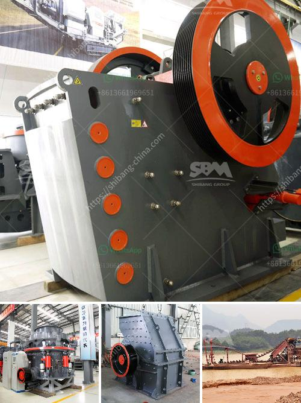

<h3>آلة فحص الرمال المصنعة</h3>
تعتبر آلة فحص الرمال أحد الأجهزة المهمة في صناعة البناء والمقاولات. فهي تستخدم لفحص جودة ونوعية الرمال المستخدمة في إنتاج الخرسانة والأسفلت والطوب وغيرها من المواد الإنشائية. تُستخدم الآلة لفصل وفحص الرمل المستخدم من الشوائب والشوائب الزائدة التي يمكن أن تؤثر على جودة المنتج النهائي.

تتكون آلة فحص الرمل من عدد من المكونات الأساسية. الأجزاء الرئيسية للآلة تشمل الصندوق الاهتزازي، والمحرك الاهتزازي، وشبكة الفحص. يتم تجميع الآلة على هيكل قوي ومتين قادر على تحمل الاهتزازات المستمرة والقوية. يتم تشغيل المحرك الاهتزازي لتوليد الاهتزازات التي تنقلها إلى الصندوق الاهتزازي وتساعد في فصل الرمال المختلفة حسب حجمها.

توجد شبكات فحص متعددة في الجزء العلوي من الصندوق الاهتزازي. تختلف تلك الشبكات في حجم فتحاتها، مما يسمح بفصل الرمال وتصنيفها حسب أحجامها المختلفة. تمتاز شبكات الفحص بجودتها العالية ومقاومتها للتآكل، حيث يتم تصنيعها من مواد متينة وقوية تضمن عمرًا طويلًا للآلة.

تستخدم الآلة عادةً في عملية تدفق الرمل، حيث يتم إدخال الرمال الخام في الصندوق الاهتزازي من الجزء العلوي. يتم اهتزاز الرمال وفصلها تلقائيًا على الشبكات المختلفة، حيث يتم تهاوي الرمال الخفيفة وتمريرها من خلال الفتحات الصغيرة في الشبكة، في حين تتراكم الرمال الأثقل وتنزلق من خلال فتحات أكبر.

تعتبر آلة فحص الرمل ضرورية للحصول على رمال ذات جودة عالية للاستخدام في البناء. فحص الرمال يساهم في تحسين جودة المنتج النهائي، ويقلل من وجود الشوائب والشوائب الزائدة، مما يساهم في زيادة الكفاءة والاستدامة في العملية الإنتاجية.
<h3>Contact us</h3><ul><li><strong>Whatsapp:&nbsp;<a href="https://wa.me/8613661969651">+8613661969651</a></strong></li><li><a href="https://swt.shibang-china.com/?git&amp;zhl&amp;آلة فحص الرمال المصنعة"><strong>Online Service(chat now)</strong></a></li></ul><h3>Related</h3><ul><li><a href='شركة تصنيع كسارات الحجر.md'>شركة تصنيع كسارات الحجر</a></li><li><a href='اقتباسات مطحنة الكرة.md'>اقتباسات مطحنة الكرة</a></li><li><a href='مصنع طحن الجبس المصنع في الهند.md'>مصنع طحن الجبس المصنع في الهند</a></li><li><a href='كتالوج كسارة الفك بوزولانا.md'>كتالوج كسارة الفك بوزولانا</a></li><li><a href='سعر مطحنة رايموند للكاولين.md'>سعر مطحنة رايموند للكاولين</a></li></ul>