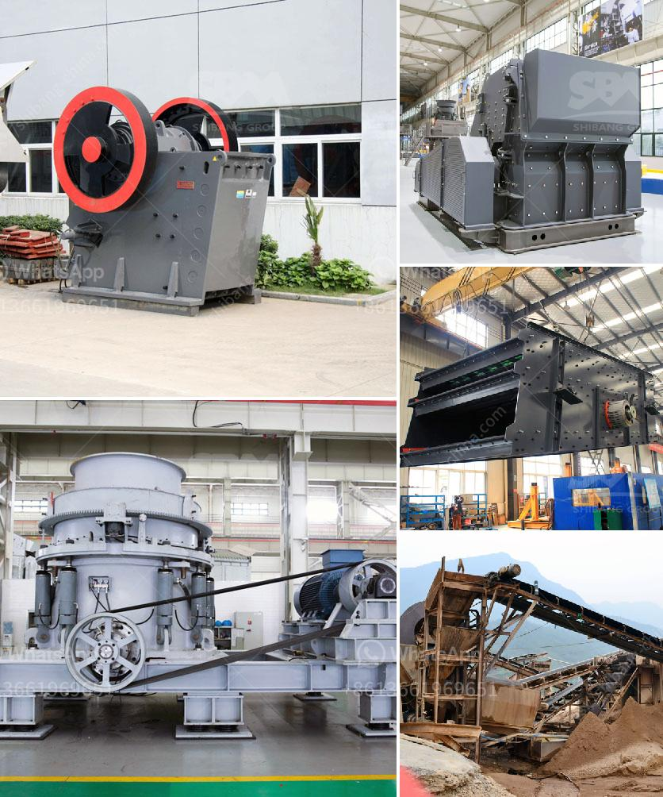

<h3>آلة فحص الرمل في ماليزيا</h3>
تعتبر آلة فحص الرمل في ماليزيا من الأدوات الحديثة التي تستخدم في صناعة البناء والتشييد. تعد هذه الآلة ضرورية جدًا للتحقق من جودة الرمل المستخدم في البناء وضمان سلامة المشاريع الهندسية.

يعتبر الرمل أحد المواد الأساسية في صناعة البناء، ويستخدم في تشكيل الخرسانة والأسمنت والزجاج وغيرها من المواد الإنشائية. ومع ذلك، يتوجب أن يكون الرمل ذا جودة عالية وخالٍ من الشوائب والأملاح الضارة، حيث أن استخدام رمل ذي جودة سيئة يمكن أن يؤدي إلى تدهور المشروع الهندسي وسلامة المبنى.

تأتي آلة فحص الرمل لتلبية هذه الحاجة الضرورية في ماليزيا. تعتمد هذه الآلة على تقنية الفحص بالاهتزاز، حيث يتم تهتز الرمل بشكل متكرر داخل غربال خاص. تقوم الآلة بازالة الأتربة والشوائب الأخرى من الرمل عن طريق قوة الاهتزاز والغربلة. يتم قياس نسبة الشوائب المتبقية في الرمل وتصنيفها وفقًا لمقاييس الجودة المعتمدة.

إن آلة فحص الرمل في ماليزيا تعد حلاً مثاليًا لتحقيق مستوى عالٍ من الدقة والإنتاجية في نفس الوقت. يمكنها معالجة كمية كبيرة من الرمل بشكل سريع وفعال. تعد هذه الآلة أيضًا سهلة الاستخدام والصيانة وتحافظ على البيئة، حيث تعمل بواسطة محرك كهربائي قوي ولا تتطلب استخدام العديد من الموارد الطبيعية.

بالإضافة إلى ذلك، توفر آلة فحص الرمل في ماليزيا دقة عالية في النتائج، حيث يتم فصل الشوائب بشكل فعال ودقيق. يمكن للمشغلين تعديل إعدادات الآلة بناءً على احتياجاتهم الدقيقة، بما في ذلك تحديد حجم الرمل المرغوب وفقًا لمعايير الصناعة.

بشكل عام، يمكن القول أن آلة فحص الرمل في ماليزيا تلعب دورًا حاسمًا في ضمان جودة الرمل المستخدم في صناعة البناء. تتيح هذه الآلة للمهندسين والعمال البناء تنفيذ المشاريع بشكل آمن وفعال، وتحميهم من المشاكل الناتجة عن استخدام رمل غير مناسب. إن تحقيق جودة الرمل يعد خطوة هامة تضمن استدامة الهياكل والمباني وسلامة المستخدمين.
<h3>Contact us</h3><ul><li><strong>Whatsapp:&nbsp;<a href="https://wa.me/8613661969651">+8613661969651</a></strong></li><li><a href="https://swt.shibang-china.com/?git&amp;zhl&amp;آلة فحص الرمل في ماليزيا"><strong>Online Service(chat now)</strong></a></li></ul><h3>Related</h3><ul><li><a href='تمييز كسارة الصدم في سحق المواد الرطبة.md'>تمييز كسارة الصدم في سحق المواد الرطبة</a></li><li><a href='معدات تأثير المحجر.md'>معدات تأثير المحجر</a></li><li><a href='كسارة الأسطوانة للبيع.md'>كسارة الأسطوانة للبيع</a></li><li><a href='آلات كسارة للبيع.md'>آلات كسارة للبيع</a></li><li><a href='سحق مصنع لخام الحديد.md'>سحق مصنع لخام الحديد</a></li></ul>