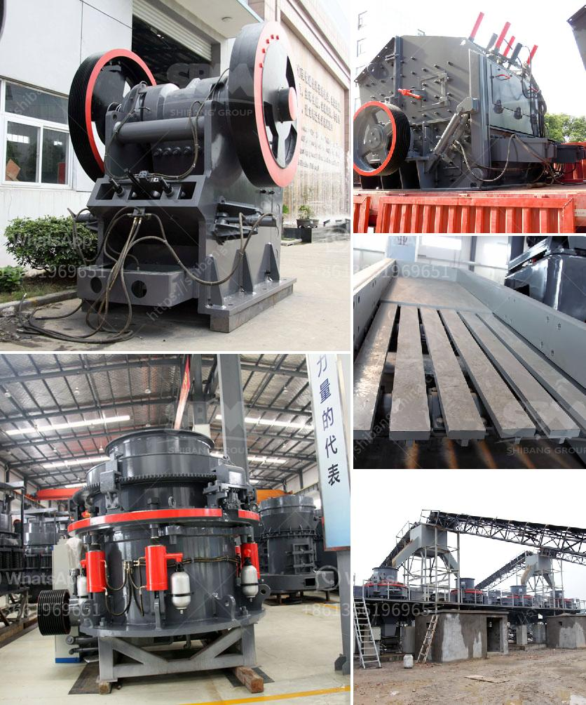

<h3>آلة فحص متنقلة في جنوب أفريقيا</h3>
تنادي جنوب أفريقيا باعتبارها واحدة من الدول الأكثر تنوعًا وتعقيدًا في العالم. توجد بها العديد من المناطق الريفية والمناطق النائية التي تفتقر إلى الخدمات الطبية الأساسية. في مثل هذه المواقع، تعتبر آلة الفحص المتنقلة حلاً رائعًا لتوفير الرعاية الصحية والفحص الطبي للسكان المحليين.

تعمل آلة الفحص المتنقلة كوحدة صحية متنقلة توجه إلى المناطق النائية والمحرومة في جنوب أفريقيا. يتم تجهيز هذه الآلة بجميع المعدات الطبية اللازمة لإجراء الفحوصات المختلفة مثل قياس ضغط الدم، وفحص النظر، وفحص السكر في الدم، وأخذ عينات الدم للتحاليل الطبية. بفضل هذه الآلة، يمكن للسكان المحليين الاستفادة من الرعاية الصحية الأساسية والفحوص الطبية بسهولة وراحة.

تعد آلة الفحص المتنقلة حلاً ملائمًا بالنسبة للمناطق الريفية في جنوب أفريقيا نظرًا لصعوبة الوصول إلى الخدمات الطبية القائمة على الأرض. في مثل هذه المناطق، قد يكون السكان عالقين بسبب ضيق النقل وعدم وجود وسائل النقل العامة المنتظمة. بفضل آلة الفحص المتنقلة، يمكن للسكان الحصول على الرعاية الصحية من أطباء مدربين وفحوصات طبية على بعد خطوات قليلة من منازلهم.

تلعب آلة الفحص المتنقلة دورًا حاسمًا في مكافحة الأمراض وتوفير الرعاية الصحية للشعب الجنوب أفريقي. فهي تساعد في اكتشاف المشاكل الصحية في وقت مبكر وتقديم العلاج اللازم. كما تعمل على توعية الناس بأهمية المخاطر الصحية والسلوكيات الصحية السليمة. تعزز آلة الفحص المتنقلة التواصل بين الأطباء والمرضى وتوفر بيئة آمنة ومريحة للمناقشة وتقديم التوجيه الطبي.

بالإضافة إلى ذلك، تعد آلة الفحص المتنقلة حلاً اقتصاديًا مقابل إنشاء مراكز صحية مستقلة في كل منطقة نائية. فبدلاً من الاستثمار في بناء وصيانة مرافق ثابتة، يمكن تجهيز الآلة ونقلها إلى المواقع التي تحتاج إليها في الوقت المناسب. هذا يتيح القدرة على توفير الخدمات الطبية لعدد أكبر من الأشخاص، وبالتالي تحسين جودة حياتهم وصحتهم بشكل عام.

يجب أن نشجع مبادرات مثل آلة الفحص المتنقلة في جنوب أفريقيا. فهي تلعب دورًا حيويًا في توفير الرعاية الصحية الأساسية للسكان الذين يفتقرون إلى الوصول إليها. من خلال الجمع بين الابتكار والتكنولوجيا، يمكننا توفير الفحوص الطبية والعلاج الضروري للجميع دون أن يكون الوقت والمسافة عائقًا.
<h3>Contact us</h3><ul><li><strong>Whatsapp:&nbsp;<a href="https://wa.me/8613661969651">+8613661969651</a></strong></li><li><a href="https://swt.shibang-china.com/?git&amp;zhl&amp;آلة فحص متنقلة في جنوب أفريقيا"><strong>Online Service(chat now)</strong></a></li></ul><h3>Related</h3><ul><li><a href='مطحنة محمولة في أستراليا بيرث.md'>مطحنة محمولة في أستراليا بيرث</a></li><li><a href='مطحنة الكرة في التعدين.md'>مطحنة الكرة في التعدين</a></li><li><a href='مبدأ عمل مطحنة الهامر.md'>مبدأ عمل مطحنة الهامر</a></li><li><a href='مطحنة الكرة للجبس.md'>مطحنة الكرة للجبس</a></li><li><a href='كسارة الحجر Kyc.md'>كسارة الحجر Kyc</a></li></ul>