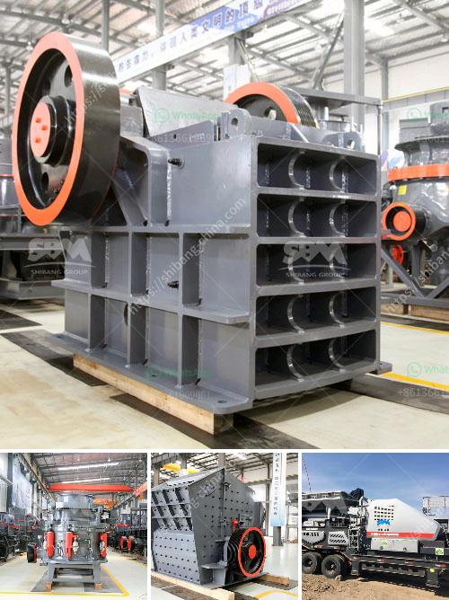

<h3>آلة فرز للبيع في جنوب أفريقيا</h3>
إذا كنت تبحث عن طريقة فعالة لزيادة كفاءة العمل وتوفير الوقت والجهد في الفرز، فإن آلة فرز عالية الجودة هي ما تحتاج إليه. في جنوب أفريقيا، تتوفر آلات فرز متطورة وذات تقنيات حديثة للبيع بأسعار تتراوح بين 200 و 400 دولار.

1. سرعة الفرز: تتميز آلات الفرز المتوفرة للبيع في جنوب أفريقيا بسرعة عالية في عملية الفرز. يمكن للآلات أن تفرز العناصر بشكل سريع ودقيق ، مما يوفر الكثير من الوقت والجهد.

2. دقة الفرز: بفضل التقنيات المتطورة والحديثة، تستطيع الآلات فرز العناصر بدقة عالية. تتمتع هذه الآلات بالقدرة على تحديد الفروق الدقيقة بين العناصر وفرزها وفقًا للمعايير المحددة.

3. سهولة الاستخدام: تصمم آلات الفرز المتاحة في جنوب أفريقيا لتكون سهلة الاستخدام ويستطيع أي شخص تشغيلها بسهولة. تحتوي الآلات على واجهة بسيطة ومنظمة تسهل عملية التحكم وتعديل الإعدادات وفقًا لاحتياجاتك.

4. متعددة الاستخدام: تتوفر آلات الفرز بأحجام وأشكال مختلفة ويمكن استخدامها في العديد من الصناعات والتطبيقات. سواء كنت تحتاج لفرز الحبوب أو المواد البلاستيكية أو المواد الكيميائية أو الأحجار الكريمة أو الفواكه والخضروات، فإن هذه الآلات مثالية للاستخدام العام.

5. صيانة سهلة: تتطلب الآلات العناية البسيطة والصيانة المنتظمة لتحافظ على أدائها بأفضل حال. تأتي معظم الآلات مع دليل صيانة يحدد التعليمات اللازمة للحفاظ على أداء الآلة على نحو سلس وفعال.

سواء كنت تمتلك مزرعة صغيرة أو شركة صناعية، فإن آلة الفرز هي استثمار ذكي لزيادة الإنتاجية والتحسين في عملية الفرز. من خلال شراء آلة فرز عالية الجودة في جنوب أفريقيا ، يمكنك الحصول على فوائد عديدة وتحقيق عائد استثمار ممتاز.

قبل شراء الآلة، يجب عليك أن تفحص الموردين المحليين ومقارنة الأسعار والمواصفات المختلفة المتاحة. تأكد من أن الآلة التي ستشتريها تتوافق مع احتياجاتك وتتضمن ضمانًا لفترة طويلة.

بالاعتماد على آلة الفرز، ستحصل على عملية فرز فعالة ومنظمة، وبالتالي ستتمكن من توفير الوقت والجهد وتحقيق نتائج أفضل في العمل. اجعل اختيارك الذكي واحصل على آلة فرز عالية الجودة اليوم في جنوب أفريقيا.
<h3>Contact us</h3><ul><li><strong>Whatsapp:&nbsp;<a href="https://wa.me/8613661969651">+8613661969651</a></strong></li><li><a href="https://swt.shibang-china.com/?git&amp;zhl&amp;آلة فرز للبيع في جنوب أفريقيا"><strong>Online Service(chat now)</strong></a></li></ul><h3>Related</h3><ul><li><a href='طحن خام بحجم يمر عبر الشبكة 200.md'>طحن خام بحجم يمر عبر الشبكة 200</a></li><li><a href='حجم كسارة الفك pe 600x900.md'>حجم كسارة الفك pe 600x900</a></li><li><a href='سعر معدات معالجة المنغنيز.md'>سعر معدات معالجة المنغنيز</a></li><li><a href='آلة طلاء مسحوق كربونات الكالسيوم في الهند.md'>آلة طلاء مسحوق كربونات الكالسيوم في الهند</a></li><li><a href='كيفية عمل كسارة الأسنان.md'>كيفية عمل كسارة الأسنان</a></li></ul>