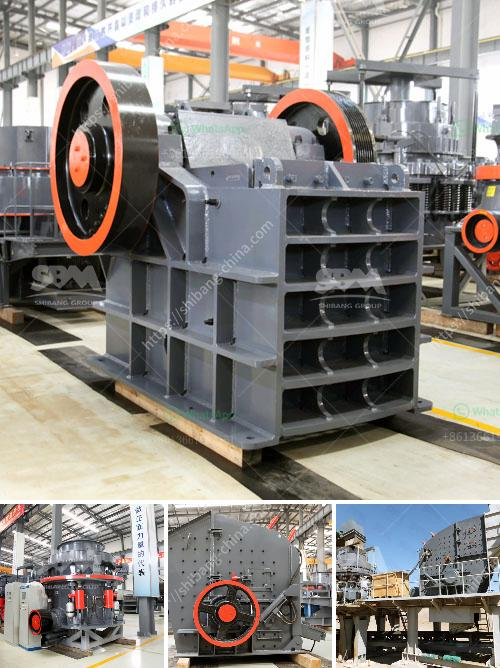

<h3>آلة فصل خام النحاس</h3>
تعتبر آلة فصل خام النحاس من الآلات الهامة التي تستخدم في صناعة النحاس. وتهدف هذه الآلة إلى فصل النحاس عن بقية المعادن الأخرى الموجودة في الخام، وذلك بإجراء تعديلات كيميائية وفيزيائية لتحويل الخام إلى خام نحاسي نقي.

تتألف آلة فصل خام النحاس عادة من عدة مراحل. في المرحلة الأولى، يتم سحق الخام إلى حجم صغير باستخدام الكسارات والطواحين. ثم يتم خلط الخام المفتت إلى مسحوق مع مواد كيميائية مثل الرغوة والمواد المثبتة. يتم إضافة الماء أيضًا لتشكيل خليط طيني يسمى "ضباب التعويم".

في المرحلة التالية، يتم تعليق خليط الخام والماء في خزان كبير. تُسمى هذه العملية بالتقليب. وتهدف عملية التقليب إلى تشكيل رغوة فقاقيع صغيرة في الخلايا داخل الخزان. يُصبح الرغوة طبقة على وجه الخزان، وتحتوي هذه الفقاعات على جزيئات النحاس المفصولة عن المعادن الأخرى.

في المرحلة النهائية، يتم جمع الرغوة المحملة بجزيئات النحاس ونقلها إلى آلة تعدين النحاس الأخرى. يجري هناك تجفيف الرغوة وثنيها لفصل النحاس عن باقي المواد. وبعد ذلك، يتم الحصول على نحاس نقي تقريبًا بنسبة 98٪.

تعد آلة فصل خام النحاس من المعدات الرئيسية في صناعة النحاس. فهي تسهم في إنتاج الكميات الكبيرة من النحاس النقي، والذي يستخدم في العديد من التطبيقات المختلفة، مثل الأسلاك الكهربائية والمعدات الالكترونية ومواد البناء وغيرها.

بالإضافة إلى ذلك، فإن آلة فصل خام النحاس تلعب دورًا هامًا في حماية البيئة. فصناعة النحاس قد تصاحبها مشاكل بيئية عديدة، مثل تلوث المياه والتربة والهواء. ومع ذلك، تستخدم آلة فصل خام النحاس التكنولوجيا الحديثة والعمليات النظيفة لتحقيق فصل النحاس بطرق مستدامة وصديقة للبيئة.

وبهذا تكون آلة فصل خام النحاس عبارة عن آلة هامة للغاية في صناعة النحاس، حيث تلعب دورًا حاسمًا في إزالة المواد الزائدة والحصول على خام نحاسي نقي. وتعود أهمية النحاس إلى استخداماته المتعددة ودوره الحيوي في تطوير العديد من الصناعات المختلفة.
<h3>Contact us</h3><ul><li><strong>Whatsapp:&nbsp;<a href="https://wa.me/8613661969651">+8613661969651</a></strong></li><li><a href="https://swt.shibang-china.com/?git&amp;zhl&amp;آلة فصل خام النحاس"><strong>Online Service(chat now)</strong></a></li></ul><h3>Related</h3><ul><li><a href='مطحنة الهامر للحبوب.md'>مطحنة الهامر للحبوب</a></li><li><a href='كسارة صخرية بسعة 500 متر مكعب في اليوم.md'>كسارة صخرية بسعة 500 متر مكعب في اليوم</a></li><li><a href='كسارة لفة معدات مستخدمة tph الفحم الروسية.md'>كسارة لفة معدات مستخدمة tph الفحم الروسية</a></li><li><a href='آلة كسارة للبيع بسعر منخفض في أوريسا.md'>آلة كسارة للبيع بسعر منخفض في أوريسا</a></li><li><a href='آلة مطحنة الكرة في الصين.md'>آلة مطحنة الكرة في الصين</a></li></ul>