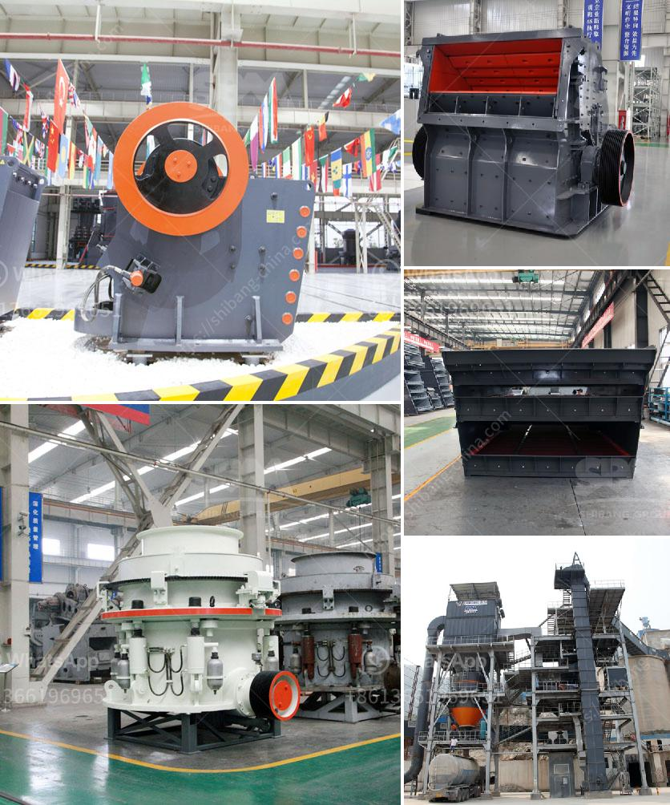

<h3>آلة قطع الحجر المستخدمة من اليابان</h3>
تعتبر آلة قطع الحجر المستخدمة من اليابان من بين أبرز التقنيات والابتكارات التي قدمتها اليابان في مجال الهندسة المعمارية وصناعة البناء. تستخدم هذه الآلة لقطع الحجر بدقة عالية وسرعة مذهلة مما يسهل ويسرع عملية البناء ويقلل التكلفة والمجهود البشري في عملية القطع.

تتميز آلة قطع الحجر المستخدمة من اليابان بعدة مزايا، تشمل التالي:

1- دقة عالية: تعتبر هذه الآلة مثالية للعمليات التي تتطلب قطع الحجر بدقة فائقة. حيث يمكنها قطع الحجر بسمك وشكل وحجم محدد ومناسب للتركيب، مما يضمن التوافق والانتظام في بناء المشاريع.

2- سرعة عملية: تقوم آلة قطع الحجر المستخدمة من اليابان بقطع الحجر بسرعة عالية مما يوفر الوقت والجهد ويزيد من كفاءة العمل. يعود ذلك إلى الاستخدام المتقدم للتقنيات الحديثة وتطبيق المبادئ الهندسية الدقيقة في تصميم الآلة.

3- سهولة التشغيل: تم تصميم هذه الآلة بشكل يسهل تشغيلها واستخدامها حتى بواسطة الأشخاص غير المتخصصين. فهي تأتي مزودة بواجهة تحكم سهلة الاستخدام تسمح بضبط وتعديل المعلمات والإعدادات بسهولة.

4- التوفير والاقتصاد: تعتبر آلة قطع الحجر المستخدمة من اليابان استثمارًا مستدامًا للشركات وأصحاب المشاريع، حيث تقلل من التكاليف البشرية وتحافظ على استدامة الإنتاجية. كما أنها تتميز بكفاءة عالية في استهلاك الطاقة والموارد.

5- التنوع والمرونة: يمكن تجهيز هذه الآلة بمجموعة متنوعة من الأدوات والشفرات لتناسب احتياجات مشاريع البناء المختلفة. فهي تستخدم لقطع الحجر، والرخام، والجرانيت وغيرها من المواد الصلبة.

باختصار، تعد آلة قطع الحجر المستخدمة من اليابان من أحدث التقنيات في صناعة البناء وتصميم المباني. فهي توفر دقة عالية وسرعة في العمل وتوفير الوقت والجهد. كما تسهل هذه الآلة من عملية القطع وتوفر مرونة كبيرة في التعامل مع مختلف أنواع الحجر والمواد الأخرى. وبفضل ميزة الاقتصاد والتوفر للموارد، تعتبر هذه الآلة خيارًا مثاليًا للشركات والمقاولين في صناعة البناء.
<h3>Contact us</h3><ul><li><strong>Whatsapp:&nbsp;<a href="https://wa.me/8613661969651">+8613661969651</a></strong></li><li><a href="https://swt.shibang-china.com/?git&amp;zhl&amp;آلة قطع الحجر المستخدمة من اليابان"><strong>Online Service(chat now)</strong></a></li></ul><h3>Related</h3><ul><li><a href='كسارة حجر ثانوية للبيع في الفلبين.md'>كسارة حجر ثانوية للبيع في الفلبين</a></li><li><a href='مصنع كامل لاستخراج النحاس للبيع.md'>مصنع كامل لاستخراج النحاس للبيع</a></li><li><a href='مطحنة هامر 7 في 8 للذهب والكوارتز.md'>مطحنة هامر 7 في 8 للذهب والكوارتز</a></li><li><a href='معدات تعدين الكروم للبيع في جنوب أفريقيا.md'>معدات تعدين الكروم للبيع في جنوب أفريقيا</a></li><li><a href='معدات المحجر المملكة المتحدة.md'>معدات المحجر المملكة المتحدة</a></li></ul>