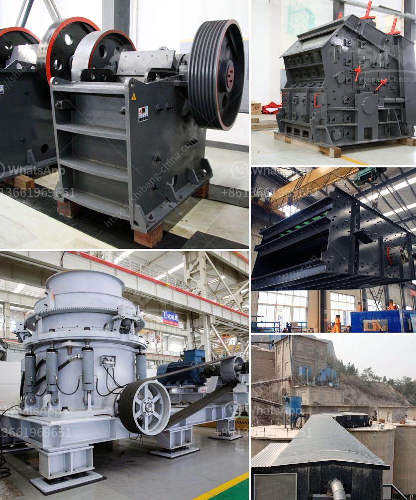

<h3>آلة كسارة VSI</h3>
تعتبر آلة كسارة VSI واحدة من الأدوات الحديثة والمهمة في صناعة التعدين والبناء. تعمل هذه الآلة على سحق المواد الصلبة من حجم كبير إلى حجم أصغر كي تصبح جاهزة للاستخدام في العمليات الإنتاجية اللاحقة.

تعمل آلة الكسارة VSI بطريقة فعالة وفعالة من حيث التكلفة حيث تستخدم التكنولوجيا المتقدمة لسحق المواد بطريقة فعالة وبأدنى استهلاك للطاقة. يتم استخدام نظام الحماية المزدوجة للتأكد من عدم حدوث أي ضرر للآلة أو للمستخدم خلال عملية الكسارة.

تتميز الآلة بسرعة عالية وأداء قوي، حيث يتم تعديل سرعة الدوران وفقًا للمتطلبات المحددة للعملية الإنتاجية. يتميز هذا النظام بتحقيق كفاءة عالية ونتائج ممتازة.

أحد التطبيقات الشائعة لآلة الكسارة VSI هو سحق الصخور الصلبة والأحجار المعدنية مثل الجرانيت والبازلت والكوارتز والحصى. إن قدرة الآلة على سحق هذه المواد بفعالية تساعد في تحسين جودة المواد النهائية المستخدمة في مشاريع البناء والتعدين.

تتميز آلة الكسارة VSI بتصميمها الجيد وهي مصممة لتكون قادرة على تحمل ضغوط العمل الشاقة والاستخدام الطويل. يتم استخدام مكونات ذات جودة عالية في تصنيع الآلة، مما يضمن استدامة عملها وقدرتها على التحمل.

باختصار، آلة كسارة VSI هي أداة قوية وفعالة في صناعة التعدين والبناء. إن استخدامها في سحق المواد الصلبة يعمل على تحسين جودة المواد النهائية وتقليل تكلفة الإنتاج. تعتبر هذه الآلة خيارًا مثاليًا للاستخدام في المشاريع الكبيرة والصغيرة على حد سواء.
<h3>Contact us</h3><ul><li><strong>Whatsapp:&nbsp;<a href="https://wa.me/8613661969651">+8613661969651</a></strong></li><li><a href="https://swt.shibang-china.com/?git&amp;zhl&amp;آلة كسارة VSI"><strong>Online Service(chat now)</strong></a></li></ul><h3>Related</h3><ul><li><a href='آلة غسيل الرمال للبيع.md'>آلة غسيل الرمال للبيع</a></li><li><a href='معدات إنتاج الركام.md'>معدات إنتاج الركام</a></li><li><a href='طاحونة مسحوق ناعمة جدا.md'>طاحونة مسحوق ناعمة جدا</a></li><li><a href='موزعون لمعدات المحاجر والتعدين في الصين.md'>موزعون لمعدات المحاجر والتعدين في الصين</a></li><li><a href='مصنع آلات كسارة الحجر في كمبوديا.md'>مصنع آلات كسارة الحجر في كمبوديا</a></li></ul>