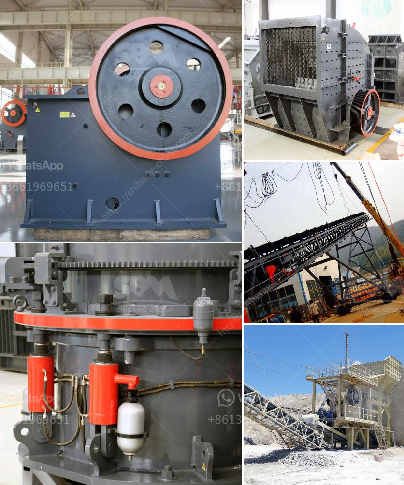

<h3>آلة كسارة الباريت</h3>
تعتبر آلة كسارة الباريت من أحدث التكنولوجيا المتاحة في صناعة التكسير والطحن. تستخدم هذه الآلة لطحن وسحق خام الباريت للحصول على حجم جسيمات صغير واستخلاص المعدن القيم منه.

يعد الباريت معدنًا ذو أهمية كبيرة في الصناعات المختلفة مثل الصناعة النفطية والطبية والكيميائية والتعدين. يُعرف الباريت بكونه واحدًا من أهم المواد المُستخدمة في صناعة الطلاء، حيث يتم استخدامه كمعدن حشو (فوهة) لتحسين أداء ومظهر الطلاء. يتم استخدامه أيضًا في تركيب بعض أنواع الزجاج والبلاستيك والورق.

تحتوي آلة كسارة الباريت على تكنولوجيا متقدمة وتصميم مبتكر يضمن قدرة عالية على التحمل والأداء الفعال. تتكون الآلة من العديد من الأجزاء المهمة مثل الفك المتحرك، والفك الثابت، والصواريخ المتحركة. تستخدم هذه الأجزاء المختلفة معًا لتحقيق عملية سحق فعالة ودقيقة.

تتميز آلة كسارة الباريت بسرعتها العالية في السحق وتباين الحجم الجيد للمواد المسحوقة. تساعد هذه السمات في تحسين كفاءة الإنتاج وخفض استهلاك الطاقة المطلوبة لعملية الطحن وتقليل التلوث البيئي.

وبالإضافة إلى ذلك، فإن آلة كسارة الباريت تأتي مع نظام تحكم آلي متطور يسمح بضبط ومراقبة دقيقة لعملية السحق. يمكن ضبط حجم الفتحة والتحكم في سرعة التغذية لتحسين جودة المنتج النهائي وضمان الحصول على النتائج المطلوبة.

باختصار، تعتبر آلة كسارة الباريت منتجًا فعالًا وفعالًا يستخدم في صناعة التكسير والطحن لاستخراج الباريت بشكل فعال. يعتبر الباريت معدنًا ثمينًا بسبب خصائصه الممتازة واستخداماته المتعددة في الصناعات المختلفة. باستخدام آلة كسارة الباريت، يمكن تحقيق عملية سحق فعالة واستخلاص قيمة الباريت بأقل استهلاك للطاقة وبأعلى كفاءة إنتاجية ممكنة.
<h3>Contact us</h3><ul><li><strong>Whatsapp:&nbsp;<a href="https://wa.me/8613661969651">+8613661969651</a></strong></li><li><a href="https://swt.shibang-china.com/?git&amp;zhl&amp;آلة كسارة الباريت"><strong>Online Service(chat now)</strong></a></li></ul><h3>Related</h3><ul><li><a href='حساب قطر كرة الطحن لمطحنة الكرة.md'>حساب قطر كرة الطحن لمطحنة الكرة</a></li><li><a href='كسارة متنقلة في اليابان.md'>كسارة متنقلة في اليابان</a></li><li><a href='مطحنة أسطوانية لمرادآباد.md'>مطحنة أسطوانية لمرادآباد</a></li><li><a href='عملية تصنيع الإسمنت بالطريقة الرطبة.md'>عملية تصنيع الإسمنت بالطريقة الرطبة</a></li><li><a href='طاقة إنتاج مسحوق الجبس 80 طن في الساعة.md'>طاقة إنتاج مسحوق الجبس 80 طن في الساعة</a></li></ul>