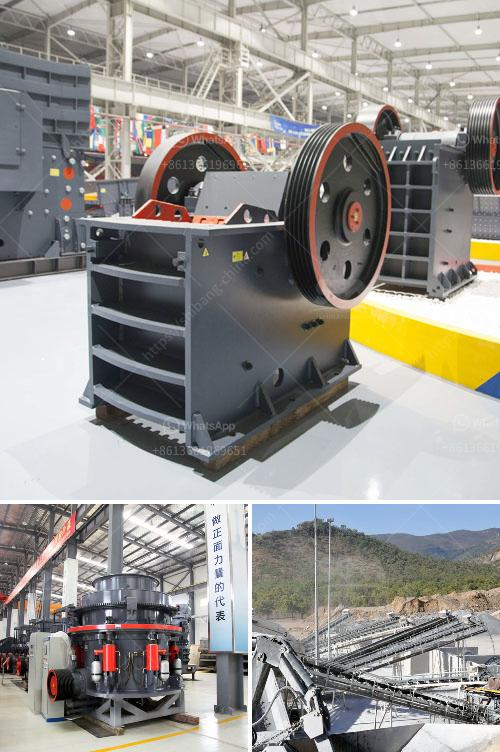

<h3>آلة كسارة البنتونيت</h3>
تعتبر البنتونيت واحدة من أهم المواد المعدنية في العالم، حيث تستخدم في العديد من الصناعات مثل الحفر والنفط والتشييد والبناء. إنها صخرة رمادية اللون تتألف بشكل رئيسي من معادن السميك والمونتموريلونايت. يتم استخراج البنتونيت من المحاجر ويتم طحنها إلى الحجم المطلوب باستخدام آلة كسارة البنتونيت.

توجد العديد من الاستخدامات للبنتونيت، وهي تعتبر مادة أساسية في العديد من الصناعات. في صناعة الحفر، يتم استخدام مسحوق البنتونيت كوسيط حفر لضبط ضغط آبار النفط. بفضل مرونتها وامتصاصها العالي للماء، تعمل البنتونيت على ضمان سلامة البئر ومنع تسرب الزيت أو الغاز. كما أنها تستخدم في حفر آبار المياه وتعزيز تربة أساسات البناء.

بالإضافة إلى ذلك، تستخدم آلة كسارة البنتونيت في صناعة الأغذية والمشروبات وصناعات أخرى. يتم طحن البنتونيت إلى مسحوق ناعم لتحسين معالجة الأطعمة والمشروبات. يتم استخدامه أيضًا في تصنيع الأدوية والمستحضرات العلاجية بسبب خصائصها الاستيعابية والتغليفية.

يعد استخدام آلة كسارة البنتونيت ضروريًا لإنتاج مسحوق بنتونيت عالي الجودة. يتم استخدام هذه الآلة لسحق الصخور الكبيرة إلى جسيمات صغيرة وتحويلها إلى مسحوق ناعم. بالإضافة إلى ذلك، فإن الآلة تعمل على فصل الشوائب والشوائب الأخرى الموجودة في البنتونيت، مما يضمن المنتج النهائي عالي النقاء والجودة.

يجب أن يتم اختيار آلة كسارة البنتونيت ذات الجودة العالية والقوية لضمان أداء مستدام وفعالية إنتاجية عالية. يعتمد ذلك على العديد من العوامل مثل قدرة الإنتاج وقوة المحرك وكفاءة المعالجة. يجب أيضًا الأخذ في الاعتبار المتطلبات البيئية والصحية والسلامة.

في الختام، لا يمكن التغاضي عن أهمية آلة كسارة البنتونيت في صناعات مختلفة وتطبيقاتها المتعددة. تلعب البنتونيت دورًا حيويًا في عمليات الحفر والمعالجة والتصنيع، وتساهم في تحسين الأداء والجودة. لذلك، ينبغي الاهتمام بمراعاة تطبيقات هذه المادة القيمة وضمان استخدام الآلات والتقنيات المناسبة لتوفير منتجات عالية الجودة والكفاءة.
<h3>Contact us</h3><ul><li><strong>Whatsapp:&nbsp;<a href="https://wa.me/8613661969651">+8613661969651</a></strong></li><li><a href="https://swt.shibang-china.com/?git&amp;zhl&amp;آلة كسارة البنتونيت"><strong>Online Service(chat now)</strong></a></li></ul><h3>Related</h3><ul><li><a href='آلة طحن الحجر الصخري في فوجيان.md'>آلة طحن الحجر الصخري في فوجيان</a></li><li><a href='مصنع لوحات الجبس الجديد في الهند.md'>مصنع لوحات الجبس الجديد في الهند</a></li><li><a href='أهداف مطحنة الكرة.md'>أهداف مطحنة الكرة</a></li><li><a href='مطحنة طحن الكرةستخدم لطحن الكرات.md'>مطحنة طحن الكرةستخدم لطحن الكرات</a></li><li><a href='موردين مطاحن الكرة في جنوب أفريقيا.md'>موردين مطاحن الكرة في جنوب أفريقيا</a></li></ul>