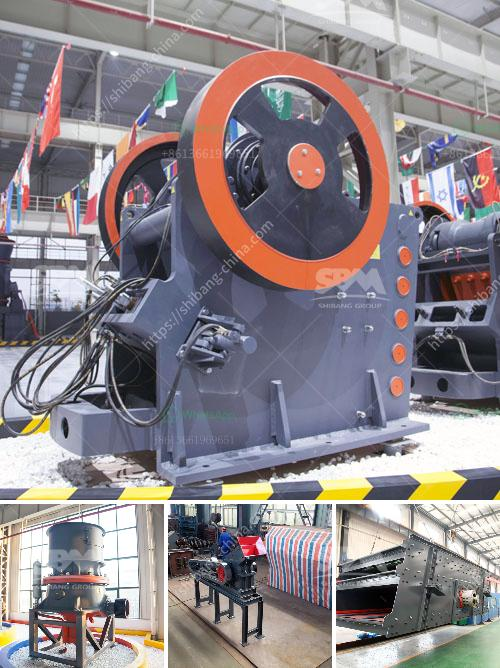

<h3>آلة كسارة الحجر 250 400</h3>
كسارة الحجر 250 400 هي آلة تستخدم في عملية تكسير الحجارة الكبيرة إلى قطع أصغر قابلة للاستخدام في البناء والأعمال الهندسية المختلفة. يتم استخدامها بشكل رئيسي في محاجر الحجر ومناجم الفحم والمشاريع الأخرى التي تحتاج إلى تكسير الحجارة.

تتألف كسارة الحجر 250 400 من هيكل رئيسي ونظام تشغيل وحدة تغذية ونظام تهتز الشاشة وناقل الحزام وغيرها من الأجزاء الرئيسية. تتميز الآلة بأداء مستقر وسهولة الاستخدام والصيانة. يتم تشغيل الآلة بواسطة محرك كهربائي يحرك الفك المتحرك للكسارة بالترددات اللازمة لتكسير الحجارة.

تعتبر كسارة الحجر 250 400 مناسبة لتكسير الحجارة التي يبلغ حجمها 200-400 ملم. تعتبر هذه العملية مهمة في العديد من مشاريع البناء حيث يتم استخدام الحجارة المكسرة في إنتاج الخرسانة وبناء الطرق والجسور والمباني الأخرى.

تحتاج كسارة الحجر 250 400 إلى صيانة دورية لضمان عملها السليم وتقليل تكاليف الإصلاح. يجب أن يتم تزويد الجزء العلوي من الكسارة بتشحيم منتظم وإزالة أي أوساخ أو حجارة معلقة. يجب أيضًا على المشغلين ارتداء الواقيات الواقية لحماية أنفسهم من الغبار والشظايا الطائرة أثناء العمل.

تعتبر كسارة الحجر 250 400 آلة قيمة في صناعة البناء والهندسة المدنية ، حيث تقدم حلولاً سهلة وفعالة لتكسير الحجارة الكبيرة وتحويلها إلى مواد قابلة للاستخدام في البناء. ي
<h3>Contact us</h3><ul><li><strong>Whatsapp:&nbsp;<a href="https://wa.me/8613661969651">+8613661969651</a></strong></li><li><a href="https://swt.shibang-china.com/?git&amp;zhl&amp;آلة كسارة الحجر 250 400"><strong>Online Service(chat now)</strong></a></li></ul><h3>Related</h3><ul><li><a href='تقرير مشروع كسارة الحجر في كارناتاكا.md'>تقرير مشروع كسارة الحجر في كارناتاكا</a></li><li><a href='عملية تصنيع لوح الجبس.md'>عملية تصنيع لوح الجبس</a></li><li><a href='أنواع كسارات الحجر الجيري.md'>أنواع كسارات الحجر الجيري</a></li><li><a href='تكلفة الكسارة المحمولة للساعة الواحدة.md'>تكلفة الكسارة المحمولة للساعة الواحدة</a></li><li><a href='كسارة مطرقية متعددة.md'>كسارة مطرقية متعددة</a></li></ul>