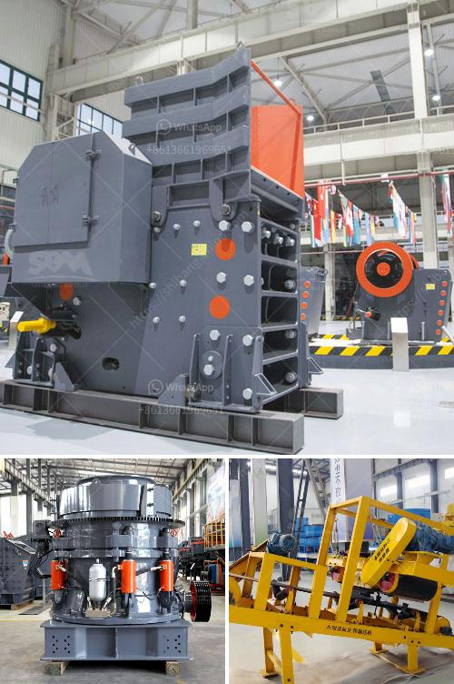

<h3>آلة كسارة الحجر التركية</h3>
تعتبر آلة كسارة الحجر التركية من أهم الآلات المستخدمة في صناعة التعدين والبناء. تستخدم هذه الآلة لكسر الحجارة الكبيرة إلى حجارة صغيرة من أجل استخدامها في البناء أو في عمليات تصنيع مواد البناء. تتميز هذه الآلة بأداءها العالي وكفاءتها في تحويل الحجارة الضخمة إلى حجارة صغيرة بشكل سريع وفعال.

تتكون آلة كسارة الحجر التركية من مجموعة من المكونات الرئيسية مثل الفك الثابت والفك المتحرك والأسطوانة والسلة وعلبة التروس والمحرك. تعمل هذه المكونات معًا لضمان عمل الآلة بفعالية وسلاسة.

توجد عدة أنواع من آلات كسارة الحجر التركية، ويتم اختيار النوع المناسب بناءً على حجم الحجر المراد كسره والكمية المطلوبة. يمكن أن تعمل تلك الآلات بوحدة ثابتة أو محمولة، وهذا يعتمد على حجم المشروع والمكان الذي ستستخدم فيه.

تعد آلة كسارة الحجر التركية آلة قوية وفعالة وسهلة الصيانة. تم تصميم الآلة بتكنولوجيا حديثة ومواد عالية الجودة لتوفير أقصى قدر من الأداء والمتانة. إن تشغيل هذه الآلة آليًا يجعلها سهلة الاستخدام ويزيد من سرعتها وكفاءتها.

تتميز آلة كسارة الحجر التركية بالعديد من المزايا، بما في ذلك القدرة العالية على التحمل والقوة العالية ومرونتها في التشغيل. بالإضافة إلى ذلك، فإن استخدام الآلة يحسن كفاءة عملية الكسر ويقلل من تكاليف العمالة والوقت المستغرق في عمليات البناء والتعدين.

في الختام، تعد آلة كسارة الحجر التركية أداة هامة في صناعة التعدين والبناء. تحظى بشعبية كبيرة بسبب قدرتها على تحويل الحجارة الكبيرة إلى حجارة صغيرة بسرعة وفعالية. بفضل تقنية التشغيل الآلي والمزايا العديدة الأخرى، فإن استخدام هذه الآلة يساهم في تحسين كفاءة العمل وتقليل التكاليف.
<h3>Contact us</h3><ul><li><strong>Whatsapp:&nbsp;<a href="https://wa.me/8613661969651">+8613661969651</a></strong></li><li><a href="https://swt.shibang-china.com/?git&amp;zhl&amp;آلة كسارة الحجر التركية"><strong>Online Service(chat now)</strong></a></li></ul><h3>Related</h3><ul><li><a href='أفضل كسارة لمسحوق الكوارتز.md'>أفضل كسارة لمسحوق الكوارتز</a></li><li><a href='آخر آلة معالجة ذهب في إندونيسيا.md'>آخر آلة معالجة ذهب في إندونيسيا</a></li><li><a href='مصانع الأسمنت الحجر في أفريقيا.md'>مصانع الأسمنت الحجر في أفريقيا</a></li><li><a href='سعر مطحنة الكسارة سعر الحجر.md'>سعر مطحنة الكسارة سعر الحجر</a></li><li><a href='مصنع كسارة في الهند.md'>مصنع كسارة في الهند</a></li></ul>