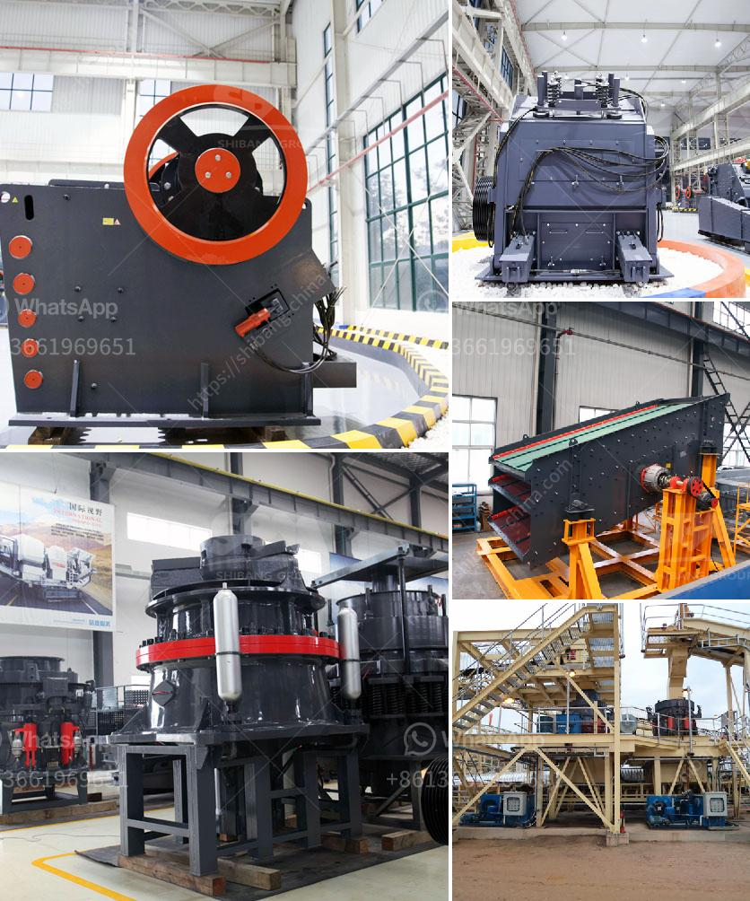

<h3>آلة كسارة الحجر الصينية</h3>
تعتبر آلة كسارة الحجر الصينية واحدة من الآلات الحديثة المستخدمة في صناعة البناء والتعدين. تم تصميمها لتكون قادرة على كسر الحجارة الكبيرة والتحولها إلى حجارة أصغر وأكثر ملاءمة للاستخدام في المشاريع الإنشائية المختلفة.

تأتي الآلة بأحجام وطاقات مختلفة وتوفر خيارات متنوعة للعملاء المهتمين. يمكن أن تتراوح سعة الكسارة بين 200 و 400 طن في الساعة، وهذا يعني أنها قادرة على كسر كميات كبيرة من الحجارة في وقت قصير.

تتميز الآلات الصينية بالعديد من الميزات التي تجعلها مفضلة لدى العديد من العملاء. إحدى هذه الميزات هو الكفاءة العالية في الإنتاج، حيث تعمل الآلة بكفاءة عالية في عملية الكسر والتحويل، مما يعزز الإنتاجية ويوفر الوقت والجهد.

كما تتميز الآلات الصينية بسهولة الاستخدام والتشغيل. فهي مصممة بطريقة تجعل عملية التشغيل والتحكم فيها بسيطة وسهلة، مما يتيح للمشغلين التحكم بسهولة وتنفيذ المهام المطلوبة بكفاءة عالية.

وتعتبر آلات التكسير الصينية متينة وقوية، حيث يتم تصنيعها باستخدام مواد عالية الجودة وتكنولوجيا متقدمة، مما يجعلها قادرة على التعامل مع الحجارة الصلبة والصعبة بكفاءة عالية دون أي تلف أو تآكل.

وتعتبر الآلات الصينية أيضًا اقتصادية وفعالة من حيث التكلفة. فهي توفر حلا اقتصاديًا للعملاء، حيث تسمح بتوفير التكاليف والوقت في عمليات الكسارة والتحويل، مما يعزز الربحية والتنافسية في السوق.

وبرغم جميع هذه الميزات، يجب الأخذ في الاعتبار أن استخدام آلة كسارة الحجر الصينية يتطلب اتباع إجراءات السلامة والحذر. يجب على المشغلين اتباع التعليمات اللازمة وارتداء المعدات الواقية لضمان سلامتهم وحماية الآلة من أي ضرر.

باختصار، تعتبر آلة كسارة الحجر الصينية حلاً موثوقًا وفعالًا لعملية الكسارة والتحويل في صناعة البناء والتعدين. توفر الآلة الكفاءة والسهولة في الاستخدام والتشغيل، مع الحفاظ على التوافر والاقتصادية. إذا كنت تبحث عن آلة كسارة حجر موثوقة وفعالة، فإن الآلة الصينية هي الخيار المثالي لك.
<h3>Contact us</h3><ul><li><strong>Whatsapp:&nbsp;<a href="https://wa.me/8613661969651">+8613661969651</a></strong></li><li><a href="https://swt.shibang-china.com/?git&amp;zhl&amp;آلة كسارة الحجر الصينية"><strong>Online Service(chat now)</strong></a></li></ul><h3>Related</h3><ul><li><a href='مطحنة طحن رايموند في باكستان.md'>مطحنة طحن رايموند في باكستان</a></li><li><a href='آلات معالجة الجير.md'>آلات معالجة الجير</a></li><li><a href='آلة سحق محمولة من إسبانيا.md'>آلة سحق محمولة من إسبانيا</a></li><li><a href='مصنعو كسارات الجيري.md'>مصنعو كسارات الجيري</a></li><li><a href='آلة كسارة الحجر.md'>آلة كسارة الحجر</a></li></ul>