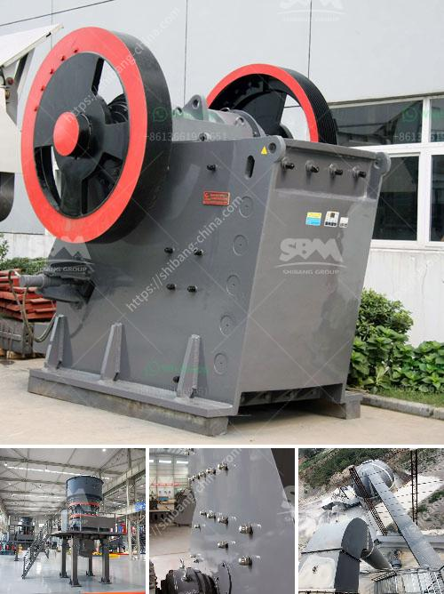

<h3>آلة كسارة الحجر في المملكة العربية السعودية</h3>
تعتبر آلة كسارة الحجر من أهم الآلات والمعدات المستخدمة في صناعة التعدين والبناء في المملكة العربية السعودية. فهي تستخدم لكسر الحجارة الكبيرة إلى أحجام أصغر تستخدم في إنتاج الركام والأسفلت والخرسانة المسلحة والشظايا المعدنية وغيرها من الاستخدامات البناءية.

تعتبر المملكة العربية السعودية من الدول الغنية بالموارد الطبيعية، وتحتوي على كميات كبيرة من الصخور والحجارة التي يمكن استغلالها في صناعة البناء والتشييد. ولكن، قبل إعادة استخدام هذه الحجارة، يجب تفتيتها وتكسيرها باستخدام آلة كسارة الحجر.

تتكون آلة كسارة الحجر من عدة أجزاء رئيسية، بما في ذلك الفك المتحرك والفم الثابت والعتلة والصفيح الكبير والصفيح المتحرك والربطة الضاغطة والربطة العكسية. يتم تثبيت الصخور الكبيرة في فم الكسارة ثم يتم سحقها عن طريق حركة الفك المتحرك لأعلى ولأسفل. تمر الصخور بين الفكين وتتم تكسيرها بشكل مستمر حتى تتمكن من التمركز في الفم الثابت والحصول على الحجم المطلوب.

تعتبر آلة كسارة الحجر متعددة الاستخدامات في صناعة البناء. فهي تستخدم في إنتاج الركام من الصخور المكسورة، والتي تستخدم في مجموعة متنوعة من التطبيقات بما في ذلك الأسفلت والخرسانة المسلحة والبناء المدني. إضافةً إلى ذلك، فإن الحجارة المكسورة المؤهلة تستخدم في صناعة الأسمنت وإنتاج الخرسانة الجاهزة وصناعة الرصف.

تتميز آلة كسارة الحجر بأنها سريعة وفعالة في عملية التكسير. وتعمل على تحقيق إنتاجية عالية وتوفير الوقت والجهد. كما تتميز بأنها آلة سهلة الصيانة والتشغيل، مما يجعلها موثوقة وقابلة للاستخدام لفترات طويلة من الزمن.

باختصار، تلعب آلة كسارة الحجر دورًا حاسمًا في صناعة التعدين والبناء في المملكة العربية السعودية. فهي تعمل على كسر الحجارة الكبيرة وتحويلها إلى أحجام صغيرة تستخدم في العديد من التطبيقات البناءية المختلفة.
<h3>Contact us</h3><ul><li><strong>Whatsapp:&nbsp;<a href="https://wa.me/8613661969651">+8613661969651</a></strong></li><li><a href="https://swt.shibang-china.com/?git&amp;zhl&amp;آلة كسارة الحجر في المملكة العربية السعودية"><strong>Online Service(chat now)</strong></a></li></ul><h3>Related</h3><ul><li><a href='وحدة إنتاج مطحنة الرمل في كيرالا.md'>وحدة إنتاج مطحنة الرمل في كيرالا</a></li><li><a href='معدات تعدين النحاس.md'>معدات تعدين النحاس</a></li><li><a href='مصانع الأسمنت الحجر في أفريقيا.md'>مصانع الأسمنت الحجر في أفريقيا</a></li><li><a href='مصنع معالجة التنغستن في الهند.md'>مصنع معالجة التنغستن في الهند</a></li><li><a href='رمل وحجر الكسارة في كينيا.md'>رمل وحجر الكسارة في كينيا</a></li></ul>