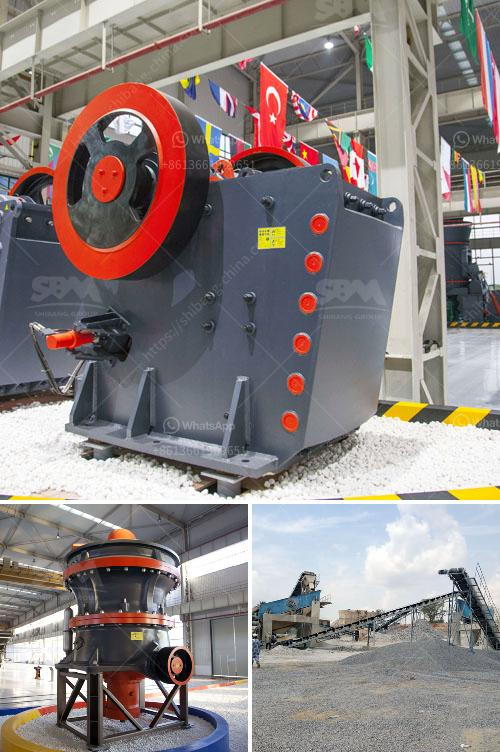

<h3>آلة كسارة الحجر للبيع في الإمارات</h3>
تعتبر آلة كسارة الحجر من أهم الآلات المستخدمة في صناعة البناء والتشييد في الإمارات العربية المتحدة. تستخدم هذه الآلة لكسر الحجارة وتحويلها إلى قطع صغيرة تستخدم في البناء والتشييد.

توجد العديد من معدات الكسارة المختلفة المتوفرة في الإمارات للبيع بأسعار تتراوح بين 200 إلى 400 ألف درهم. تختلف هذه الآلات في سعتها وقدرتها على العمل واستخدامها. تتراوح السعة المتوفرة لهذه الآلات بين 50 إلى 500 طن في الساعة، حسب الطراز والمواصفات.

نظرًا للطلب الكبير على الحجارة المكسورة في الإمارات، فإن آلات كسارة الحجر للبيع تعتبر استثمارًا مربحًا للغاية. ففي الإمارات يوجد العديد من مشاريع البناء الكبيرة مثل المباني السكنية والتجارية والفنادق والمطارات، وجميعها تحتاج إلى حجارة مكسورة عالية الجودة للبناء. لذلك، فإن امتلاك آلة كسارة الحجر يمكن أن يوفر إمكانية تلبية هذا الطلب وتحقيق أرباح جيدة.

بالإضافة إلى ذلك، فإن آلة كسارة الحجر قابلة للاستخدام في مجموعة متنوعة من المشاريع الأخرى مثل صناعة الأسمنت والطرق وتعدين الفحم وصناعة الصلب والزجاج والسيراميك. لذلك، يمكن لهذه الآلة توفير فرص عمل إضافية وزيادة الدخل.

بالإضافة إلى ذلك، فإن آلة كسارة الحجر سهلة الاستخدام وتتميز بنظام تشغيل بسيط. يمكن للعاملين التعامل معها بسهولة وفعالية دون الحاجة إلى مهارات فنية خاصة. كما أنها تأتي مع تقنيات حديثة تسهل عملية التشغيل وتحسن كفاءة الإنتاج.

باختصار، آلة كسارة الحجر للبيع في الإمارات هي عبارة عن استثمار مربح في صناعة البناء والتشييد. تساعد هذه الآلة في تلبية الطلب المتزايد على الحجارة المكسورة في الإمارات، وتعطي الفرصة لتوفير فرص عمل إضافية وزيادة الدخل. كما أنها سهلة الاستخدام ومجهزة بتقنيات حديثة لضمان الكفاءة العالية في الإنتاج.
<h3>Contact us</h3><ul><li><strong>Whatsapp:&nbsp;<a href="https://wa.me/8613661969651">+8613661969651</a></strong></li><li><a href="https://swt.shibang-china.com/?git&amp;zhl&amp;آلة كسارة الحجر للبيع في الإمارات"><strong>Online Service(chat now)</strong></a></li></ul><h3>Related</h3><ul><li><a href='كسارات وشاشات متنقلة مستعملة في جنوب أفريقيا.md'>كسارات وشاشات متنقلة مستعملة في جنوب أفريقيا</a></li><li><a href='تكلفة مصنع سحق bmw 200tph stage.md'>تكلفة مصنع سحق bmw 200tph stage</a></li><li><a href='فرضية عامة لكسارة الفك.md'>فرضية عامة لكسارة الفك</a></li><li><a href='كسارة متنقلة قابلة للنقل بسعة 200 طن.md'>كسارة متنقلة قابلة للنقل بسعة 200 طن</a></li><li><a href='سعر ناقل الحزام للتعدين.md'>سعر ناقل الحزام للتعدين</a></li></ul>