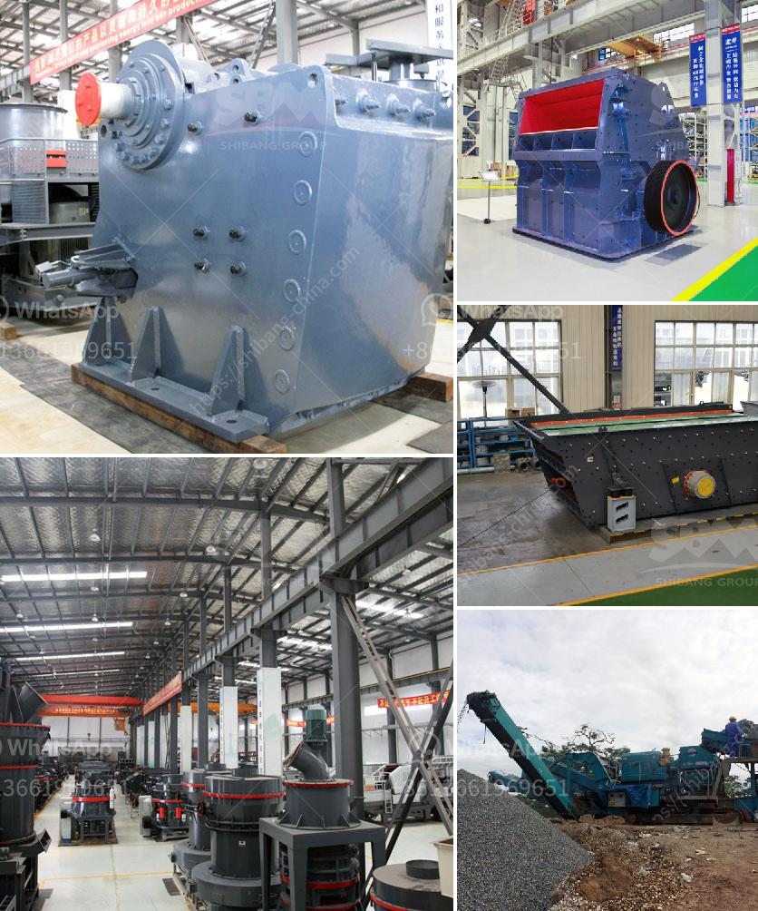

<h3>آلة كسارة الحجر للبيع في نيوزيلندا</h3>
إذا كنت تبحث عن آلة كسارة حجر للبيع في نيوزيلندا، فإن هذا المقال سيوفر لك بعض المعلومات الأساسية حول هذا الموضوع.

تُستخدم آلات الكسارة الحجرية لتحطيم الصخور الكبيرة إلى قطع صغيرة، ويتم استخدامها في العديد من الصناعات مثل صناعة البناء والرصف والتعدين والطرق.

نيوزيلندا هي وجهة مثالية لشراء آلة كسارة حجر للبيع بسبب ثقافتها الصناعية القوية والحاجة المتزايدة في البناء والتشييد. توفر نيوزيلندا سوقًا نشطًا للمعدات الثقيلة وآلات الكسارات والكسارات المتنقلة.

عندما تبحث عن آلة كسارة حجر للبيع في نيوزيلندا، عليك النظر في العوامل التالية:

1. الاحتياجات: تحدد الاحتياجات الخاصة بك بدقة. هل تحتاج إلى آلة كسارة ثابتة أم متنقلة؟ ما هو حجم الصخور التي تحتاج إلى كسرها؟ هل تحتاج إلى آلة كسارة حجر صغيرة لمشروع بناء صغير أو آلة كسارة حجر كبيرة لمشروع تعدين كبير؟

2. الميزانية: يجب أخذ الميزانية المتاحة في الاعتبار عند شراء آلة كسارة حجر. هل تمتلك الميزانية اللازمة لشراء آلة كسارة حجر جديدة، أم أنك تفضل شراء آلة مستعملة بأسعار أقل؟

3. الجودة: يجب أن تشتري آلة كسارة حجر عالية الجودة تلبي متطلبات الصناعة المحلية. تأكد من البحث عن المصنعين الموثوقين وتقييم جودة المنتجات التي يقدمونها.

4. الصيانة والدعم: يجب أن تعتني آلة الكسارة بعناية وتصيانتها بشكل منتظم للحفاظ على أداءها المثلى. تأكد من توفر الدعم الفني المستمر والصيانة لديك.

من الجدير بالذكر أنه يمكنك العثور على العديد من الشركات والموزعين في نيوزيلندا الذين يوفرون آلات كسارة الحجر للبيع. يمكنك التحقق من المواقع الإلكترونية لهذه الشركات والاتصال بها للحصول على مزيد من المعلومات والاستفسارات.

باختصار، إذا كنت تبحث عن آلة كسارة حجر للبيع في نيوزيلندا، فمن المهم تحديد احتياجاتك والميزانية المتاحة والجودة المطلوبة قبل قرار الشراء. تأكد من البحث الجيد واستشارة الخبراء قبل اتخاذ قرار نهائي.
<h3>Contact us</h3><ul><li><strong>Whatsapp:&nbsp;<a href="https://wa.me/8613661969651">+8613661969651</a></strong></li><li><a href="https://swt.shibang-china.com/?git&amp;zhl&amp;آلة كسارة الحجر للبيع في نيوزيلندا"><strong>Online Service(chat now)</strong></a></li></ul><h3>Related</h3><ul><li><a href='كسارة الصخور المحمولة.md'>كسارة الصخور المحمولة</a></li><li><a href='سعر مصنع كسارة محمولة في نيجيريا.md'>سعر مصنع كسارة محمولة في نيجيريا</a></li><li><a href='مصنع معالجة للبيع في جنوب أفريقيا.md'>مصنع معالجة للبيع في جنوب أفريقيا</a></li><li><a href='أفكار مشروع مصفاة النحاس صغيرة المقياس.md'>أفكار مشروع مصفاة النحاس صغيرة المقياس</a></li><li><a href='مطحنة طحن ريموند في أوروبا.md'>مطحنة طحن ريموند في أوروبا</a></li></ul>