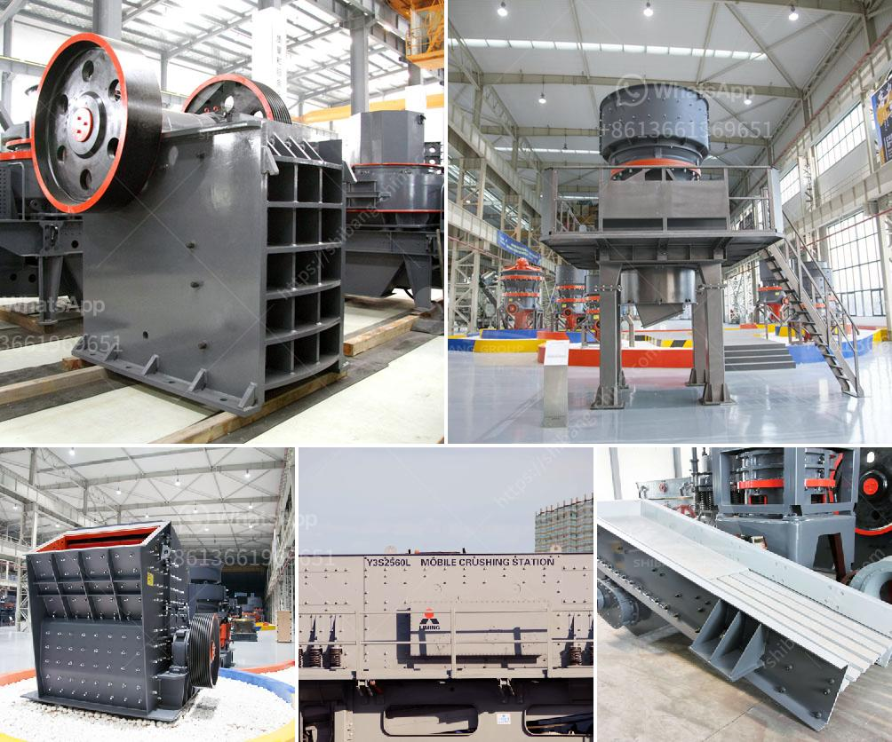

<h3>آلة كسارة الحجر للشراء السعر</h3>
تعتبر آلة كسارة الحجر من الآلات الهامة في صناعة التعدين والبناء. فهي تستخدم لكسر الحجارة الكبيرة إلى حجم صغير يمكن استخدامه في البناء أو في عمليات تصنيع المواد الأخرى. وتعد كسارة الحجر من الآلات الأساسية في صناعة البناء، حيث يستخدم الحجر كمادة أساسية في العديد من التطبيقات مثل الأساسات الخرسانية والطرق والجدران والأعمدة والجسور وغيرها.

يوجد العديد من أنواع آلات كسارة الحجر ومنها الكسارات الفكية والكسارات الصدمية والكسارات المخروطية. تختلف هذه الآلات عن بعضها في الشكل والحجم والأداء، وتستخدم وفقًا للاحتياجات المحددة لكل مشروع.

تتألف آلة كسارة الحجر عادة من الإطار الرئيسي والمغذي الاهتزازي وكسارة الفك أو الصدم والشاشة الاهتزازية وناقل الحزام. يعمل المغذي الاهتزازي على نقل الحجارة إلى فك الكسارة أو الكسارة الصدمية بطريقة جزئية وتدريجية. ثم تتم عملية الكسر عن طريق كسارة الفك أو الصدم وتتم إزاحة الحجارة المكسورة عبر الشاشة الاهتزازية والناقل الحزام إلى الموقع المطلوب.

سعر آلة كسارة الحجر يتفاوت وفقًا لعدة عوامل، بما في ذلك نوع الآلة وحجمها وقدرتها والعلامة التجارية ومكان الشراء وغيرها. ومع ذلك، يمكن القول عمومًا إن سعر آلة كسارة الحجر في نطاق 200-400 يعتبر مناسبًا. يجب على المشترين مراعاة جودة الآلة والمواصفات المطلوبة وتقييم قدرتها على تحمل العمل الشاق وتحقيق الهدف المرجو من استخدامها.

باختيار آلة كسارة الحجر المناسبة، يمكن للمشتري الاستفادة من الفوائد العديدة مثل زيادة إنتاجية العمل وتقليل التكاليف وتحسين جودة المنتج النهائي. لذا، ينصح المشترين بالتعاون مع الشركات المختصة وزيارة المصانع والمعارض والتحقق من المواصفات والضمانات المقدمة قبل الشراء.

في النهاية، آلة كسارة الحجر هي استثمار ضخم يجب على المشترين النظر فيه. ينبغي أن يتم الشراء بحكمة وبعناية واستنادًا إلى الاحتياجات المطلوبة لضمان الحصول على أفضل أداء وأعلى جودة ممكنة.
<h3>Contact us</h3><ul><li><strong>Whatsapp:&nbsp;<a href="https://wa.me/8613661969651">+8613661969651</a></strong></li><li><a href="https://swt.shibang-china.com/?git&amp;zhl&amp;آلة كسارة الحجر للشراء السعر"><strong>Online Service(chat now)</strong></a></li></ul><h3>Related</h3><ul><li><a href='كيفية غسل الرمل للبناء.md'>كيفية غسل الرمل للبناء</a></li><li><a href='تجميع مصنع التكسير.md'>تجميع مصنع التكسير</a></li><li><a href='مطحنة الدولوميت بحجم 13x18 للبيع.md'>مطحنة الدولوميت بحجم 13x18 للبيع</a></li><li><a href='أسعار كسارة الحجر في إندونيسيا.md'>أسعار كسارة الحجر في إندونيسيا</a></li><li><a href='مصنع كبير للكسارة بسعة ١٠٠٠ حجر.md'>مصنع كبير للكسارة بسعة ١٠٠٠ حجر</a></li></ul>