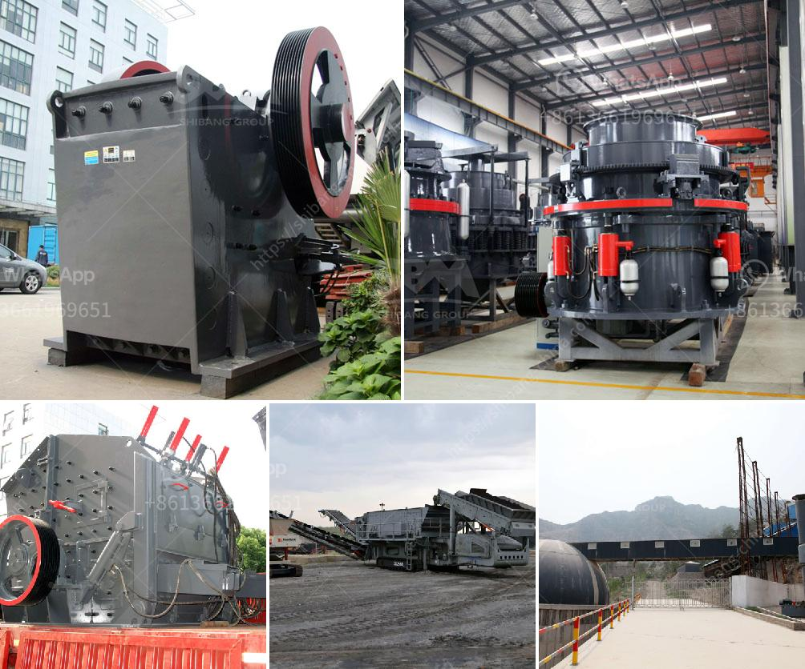

<h3>آلة كسارة الحجر</h3>
آلة كسارة الحجر هي آلة تستخدم لتكسير الحجر إلى قطع صغيرة أو رملية بحجم محدد. تستخدم هذه الآلة في العديد من الصناعات مثل صناعة البناء والتشييد وصناعة الطرق.

تتكون آلة كسارة الحجر من جزئين رئيسيين هما الفك الثابت والفك المتحرك. يحتوي الفك الثابت على بطانة مقاومة للاهتراء لحماية الفك المتحرك وزيادة عمر الآلة. يتم تطبيق قوة ضغط على الحجر الموجود بين الفكين ، مما يؤدي إلى تكسير الحجر إلى قطع أصغر.

تتميز آلة كسارة الحجر بعدة مزايا. أولاً ، فهي سهلة الاستخدام والصيانة. يتم التحكم في تشغيل الآلة بواسطة أزرار بسيطة ، ويمكن الوصول إلى الأجزاء الداخلية بسهولة لتنظيفها أو إصلاحها. ثانيًا ، فهي توفر كفاءة عالية في التكسير وإنتاجية عالية. يمكن استخدام كسارة الحجر لتجهيز كميات كبيرة من الحجر في وقت قصير ، مما يساهم في زيادة إنتاجية العمل وتوفير الوقت والجهد. ثالثًا ، فهي توفر تكلفة منخفضة للصيانة والإصلاح. بفضل تصميمها البسيط والمتين ، تقلل آلة كسارة الحجر من تكاليف الصيانة والإصلاح المستمرة.

لا تزال آلة كسارة الحجر تستخدم بشكل واسع في العديد من البلدان حول العالم. فهي تلبي احتياجات صناعة البناء والتشييد والمشاريع الكبيرة الأخرى. تساهم هذه الآلة في سرعة تشييد المباني والطرق ، وتحسين جودة البناء ، وتقليل تكاليف الإنتاج. يمكن أن تكون الكسارة الحجرية أداة أساسية للعديد من المشاريع الكبيرة والصغيرة.

باختصار ، آلة كسارة الحجر هي آلة تستخدم لتكسير الحجر إلى قطع صغيرة أو رملية بحجم محدد. تتميز بسهولة الاستخدام والصيانة ، كفاءة عالية في التكسير ، تكلفة منخفضة للصيانة والإصلاح ، وامتداد استخدامها في العديد من الصناعات. تقوم الآلة بتحسين عمليات البناء وتوفير الوقت والجهد والتكاليف، مما يجعلها آلة لا غنى عنها في العديد من المشاريع.
<h3>Contact us</h3><ul><li><strong>Whatsapp:&nbsp;<a href="https://wa.me/8613661969651">+8613661969651</a></strong></li><li><a href="https://swt.shibang-china.com/?git&amp;zhl&amp;آلة كسارة الحجر"><strong>Online Service(chat now)</strong></a></li></ul><h3>Related</h3><ul><li><a href='تحجيم هيدروليكي لمصنع كسارة رمل السيليكا.md'>تحجيم هيدروليكي لمصنع كسارة رمل السيليكا</a></li><li><a href='مصنع كسارة مسحوق الرخام.md'>مصنع كسارة مسحوق الرخام</a></li><li><a href='عملية صنع الكوارتز.md'>عملية صنع الكوارتز</a></li><li><a href='مصنعي أحزمة الناقلات في بنجلاديش.md'>مصنعي أحزمة الناقلات في بنجلاديش</a></li><li><a href='شركة تصنيع آلة طحن الكرة في الهند.md'>شركة تصنيع آلة طحن الكرة في الهند</a></li></ul>