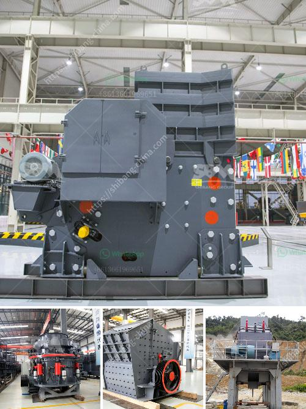

<h3>آلة كسارة الحصى</h3>
تعتبر آلة كسارة الحصى من الآلات الهامة في صناعة البناء، حيث تستخدم في تكسير القطع الصخرية الكبيرة إلى حجم أصغر يمكن استخدامه في الانشاءات المختلفة.

تتكون آلة كسارة الحصى من جزأين رئيسيين، وهما الفك الثابت والفك المتحرك. يقوم الفك الثابت بثبيت الحصى الكبير في مكانه، بينما يقوم الفك المتحرك بالحركة التكسيرية لتكسير الحصى إلى أجزاء صغيرة. يتم تحريك الفك المتحرك بواسطة محرك يعمل بالكهرباء أو بالديزل.

تتميز آلة كسارة الحصى بقدرتها على التعامل مع الحصى ذو الصلابة المختلفة، حيث يمكنها تكسير الصخور الصلبة والحجارة الكبيرة بسهولة. كما أنها تتميز بقدرتها على ضبط حجم الحصى المراد تكسيره، حيث يمكن تعديل فتحة الفك المتحرك للسماح بتحقيق الحجم المناسب.

يعتبر استخدام آلة كسارة الحصى من الأدوات الرئيسية في صناعة البناء والطرق، حيث تستخدم في تجهيز وتجميع المواد الخام كالحصى والرمل للاستخدام في مشاريع البناء المختلفة. تستخدم أيضا في تكسير الأحجار الصغيرة لإنتاج مواد بناء مثل الركام والبحص.

تتميز آلة كسارة الحصى بعدة مزايا، فهي تعزز من كفاءة الإنتاج وتقلل من التكاليف، كما توفر وقتًا وجهدًا في التجهيز وتقلل من الاعتماد على اليد العاملة. بالإضافة إلى ذلك، تساهم في تحسين جودة المواد النهائية المستخدمة في البناء، مما يساهم في زيادة متانة الهياكل المبنية.

في الختام، تعد آلة كسارة الحصى أداة هامة في صناعة البناء تساهم في تحسين كفاءة الإنتاج وجودة المواد البنائية. تستخدم في تكسير الحصى والصخور الكبيرة لتحقيق الحجم المناسب، مما يجعلها لا غنى عنها في مشاريع البناء.
<h3>Contact us</h3><ul><li><strong>Whatsapp:&nbsp;<a href="https://wa.me/8613661969651">+8613661969651</a></strong></li><li><a href="https://swt.shibang-china.com/?git&amp;zhl&amp;آلة كسارة الحصى"><strong>Online Service(chat now)</strong></a></li></ul><h3>Related</h3><ul><li><a href='الفرق بين مطاحن الكرة وكسارة الفك.md'>الفرق بين مطاحن الكرة وكسارة الفك</a></li><li><a href='سعر كسارة الفحم القدرة.md'>سعر كسارة الفحم القدرة</a></li><li><a href='مطاحن الهامر المستخدمة في تعدين الذهب.md'>مطاحن الهامر المستخدمة في تعدين الذهب</a></li><li><a href='مطحنة الأسطوانة للطحن.md'>مطحنة الأسطوانة للطحن</a></li><li><a href='موردي مطحنة ريموند.md'>موردي مطحنة ريموند</a></li></ul>