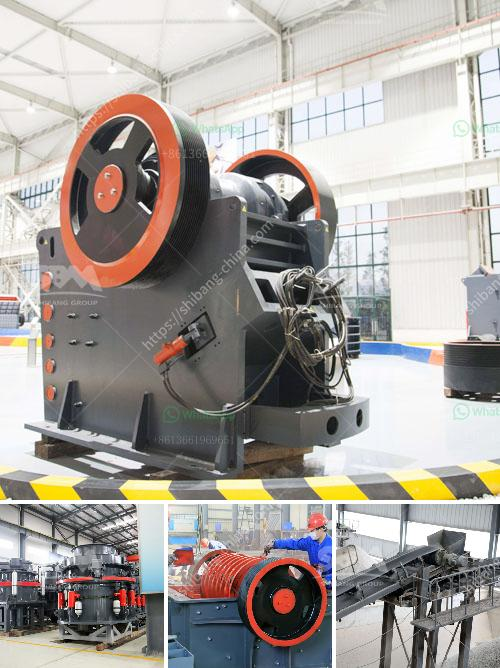

<h3>آلة كسارة الخرسانة</h3>
تعد آلة كسارة الخرسانة أداة حيوية في صناعة البناء والهندسة المدنية. تهدف هذه الآلة إلى تحطيم الخرسانة الصلبة وإعادة تدويرها لاستخدامها في مشاريع بناء جديدة وتقليل الأثر البيئي لهذه الصناعة.

تتكون آلة كسارة الخرسانة من عدة أجزاء رئيسية، بما في ذلك الفك المتحرك والفك الثابت والمطرقة والمحرك. وعادةً ما تعمل الآلة بمحرك بقوة كهربائية أو بواسطة محرك ديزل، مما يجعلها مناسبة للاستخدام في نطاقات مختلفة.

يتم استخدام آلة الكسارة الخرسانية لتدمير الهياكل الخرسانية القديمة والمتضررة والاسمنتية الصلبة. وعندما يتم تحطيم الخرسانة، يتم فصل النفايات المتولدة مثل الحجارة والأنقاض الأخرى عن الخرسانة لاستخدامها في وقت لاحق. يساهم هذا في تقليل كمية النفايات التي يتم التخلص منها واستخدام الموارد بشكل أكثر فعالية.

تعتبر آلة كسارة الخرسانة مفيدة أيضًا في إعادة تدوير الخرسانة الناتجة عن هدم المنازل والمباني القديمة. عند استخدام الكسارة الخرسانية، يمكن تحويل الخرسانة المعاد تدويرها إلى حطام صغير يمكن استخدامه لتعزيز الطرق أو في مشاريع أخرى، بدلاً من أن يتم التخلص منه في الموقع النفايات.

بالإضافة إلى ذلك، تقدم آلة كسارة الخرسانة الفوائد الاقتصادية، حيث تقلل من تكلفة شراء مواد البناء الجديدة بفضل إمكانية استخدام الخرسانة المعاد تدويرها من مصادر أخرى. كما أن استخدام الكسارة الخرسانية يؤدي إلى تقليل استنزاف الموارد الطبيعية والتلوث الناجم عن صناعة الخرسانة التقليدية.

كما أن آلة كسارة الخرسانة توفر الوقت والجهد. فبدلاً من تدمير الهياكل الخرسانية القديمة يدويًا، يمكن استخدام الكسارة الخرسانية لتنفيذ هذه العملية بشكل أسرع وأكثر كفاءة.

باختصار، تعتبر آلة كسارة الخرسانة أداة أساسية في إعادة تدوير الخرسانة واستخدامها في مشاريع البناء الجديدة. من خلال تحطيم وتفكيك الهياكل الخرسانية القديمة، تُساهم هذه الآلة في حماية البيئة وتقليل النفايات واستدامة الموارد المحدودة.
<h3>Contact us</h3><ul><li><strong>Whatsapp:&nbsp;<a href="https://wa.me/8613661969651">+8613661969651</a></strong></li><li><a href="https://swt.shibang-china.com/?git&amp;zhl&amp;آلة كسارة الخرسانة"><strong>Online Service(chat now)</strong></a></li></ul><h3>Related</h3><ul><li><a href='شركة تصنيع آلات الحجر في إيروود.md'>شركة تصنيع آلات الحجر في إيروود</a></li><li><a href='كسارة الحجر في الكاميرون.md'>كسارة الحجر في الكاميرون</a></li><li><a href='تصميم آلة سحق الجبس بتنسيق PDF.md'>تصميم آلة سحق الجبس بتنسيق PDF</a></li><li><a href='تكلفة الكسارة المستعملة للجرانيت.md'>تكلفة الكسارة المستعملة للجرانيت</a></li><li><a href='سعر مصنع التكسير.md'>سعر مصنع التكسير</a></li></ul>