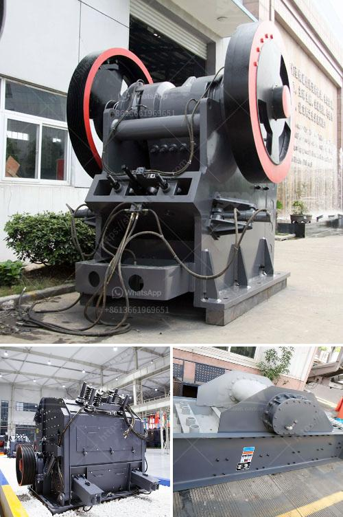

<h3>آلة كسارة الذهب للبيع في جنوب أفريقيا</h3>
تعتبر التعدين من أهم الصناعات في جميع أنحاء العالم، خاصة في أفريقيا التي تعد واحدة من أبرز دول منتجة للذهب. وتعتبر جنوب أفريقيا من أهم الدول المنتجة للذهب في العالم، حيث تحتوي على موارد غنية ومناجم ذهب قيمة.

وفي مجال التعدين، يلعب استخراج الذهب دورًا هامًا في تحقيق الاستقرار الاقتصادي وتعزيز التطور في جنوب أفريقيا. ولتسهيل هذه العملية وزيادة الكفاءة، تم استخدام معدات حديثة وتقنيات تعدين متقدمة، بما في ذلك "آلة كسارة الذهب".

تحظى آلة كسارة الذهب بشعبية كبيرة في صناعة التعدين، حيث تسهم في عملية سحق الصخور والأحجار المحملة بالذهب، مما يساعد في إطلاق الذهب المحتجز داخل هذه الصخور والحصول عليه بكفاءة أعلى.

تتكون آلة كسارة الذهب عادةً من طبقتين من الصلب القوي والمتين، مع شفرات حادة على شكل أسنان. تعتمد عملية الكسر على تطبيق قوة الضغط والصدمة على الصخور، مما يؤدي إلى تفتيتها وسحقها إلى أجزاء أصغر. وبعد ذلك، يتم فصل الصخور المكسورة عن الذهب باستخدام أساليب مختلفة، مثل قاعدة الاهتزاز أو أنظمة فصل الصخور المائية.

تعد آلة كسارة الذهب من المعدات الحيوية في صناعة التعدين، وتعتبر استثمارًا جيدًا للعديد من المنقبين عن الذهب. فبفضل قدرتها على سحق الصخور القوية والصعبة، تساعد الآلة في تحقيق الكفاءة والإنتاجية العالية.

ويمكن العثور على آلة كسارة الذهب المستعملة والجديدة للبيع في جنوب أفريقيا، حيث يوجد العديد من الموردين وشركات تصنيع المعدات التعدين. يجب البحث عن مورد موثوق ومصدر جودة لضمان الحصول على آلة كسارة ذهب ذات أداء عالٍ وموثوقية.

لذا، يمكن اعتبار آلة كسارة الذهب مفتاحًا للنجاح في صناعة التعدين في جنوب أفريقيا. فبفضل فعاليتها وقدرتها على سحق الصخور وفصل الذهب، تمثل وسيلة حديثة ومبتكرة لتحقيق أعلى مستويات الإنتاجية وتحسين العمليات التعدينية.
<h3>Contact us</h3><ul><li><strong>Whatsapp:&nbsp;<a href="https://wa.me/8613661969651">+8613661969651</a></strong></li><li><a href="https://swt.shibang-china.com/?git&amp;zhl&amp;آلة كسارة الذهب للبيع في جنوب أفريقيا"><strong>Online Service(chat now)</strong></a></li></ul><h3>Related</h3><ul><li><a href='رسم مصنع غسيل الفحم.md'>رسم مصنع غسيل الفحم</a></li><li><a href='مطحنة كرة مطحنة مطرقة.md'>مطحنة كرة مطحنة مطرقة</a></li><li><a href='نظام مصنع البنتونيت.md'>نظام مصنع البنتونيت</a></li><li><a href='بائع أحزمة الناقلات في الفلبين.md'>بائع أحزمة الناقلات في الفلبين</a></li><li><a href='خط إنتاج مطحنة ريموند.md'>خط إنتاج مطحنة ريموند</a></li></ul>