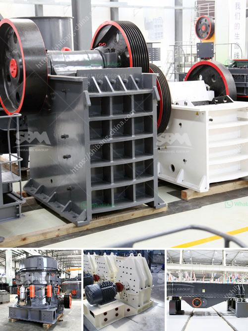

<h3>آلة كسارة الرمل السيليكا المصنعة</h3>
تعتبر آلة كسارة الرمل السيليكا أداة أساسية في صناعة البناء والمناجم. فهي تستخدم لسحق وتجهيز الرمال السيليكا المستخدمة في إنتاج الزجاج والخرسانة والطوب.

تعمل آلة كسارة الرمل السيليكا عن طريق استخدام سرعة دوران الأسطوانة والقوة الميكانيكية لسحق وتجهيز الرمل السيليكا. يتم إدخال الرمال السيليكا في الجزء العلوي من الآلة، ثم تمرر من خلال أسطوانة دوارة تحتوي على أشواط صخرية أو مطارق صلبة. تتحرك الرمال السيليكا بين الصوامع والأشواط، مما يؤدي إلى سحق الرمال وتجهيزها للاستخدام.

آلة كسارة الرمل السيليكا تتميز بعدة مزايا. أولاً، فهي تعمل بكفاءة عالية وتوفر الكثير من الطاقة. بفضل التصميم الفريد والمتقدم للآلة، يتم تحويل أكبر قدر ممكن من الطاقة الكهربائية إلى قوة ميكانيكية لسحق الرمال بفعالية. ثانياً، فهي متينة ومستدامة، مما يعني أنها تدوم لفترة طويلة وتحافظ على أدائها الجيد حتى بعد سنوات من الاستخدام المكثف. ثالثاً، فهي توفر نتائج عالية الجودة. تحتوي الآلة على نظام مراقبة ذكي يضمن تحقيق الحجم والشكل المطلوب للرمل السيليكا المنتج. هذا يعزز جودة الرمل ويضمن استقرارية الأداء في عمليات الإنتاج.

توفر آلة كسارة الرمل السيليكا أيضاً فوائد بيئية. فهي تستخدم تقنية التحكم في الغبار والضوضاء، مما يقلل من التأثير البيئي لعملية السحق ويحافظ على صحة العاملين في المنجم. بالإضافة إلى ذلك، تستهلك الآلة كميات منخفضة من الماء والطاقة، مما يخفض تكاليف التشغيل ويحسن كفاءة الإنتاج.

في النهاية، تعتبر آلة كسارة الرمل السيليكا أداة مهمة وضرورية في صناعة البناء والمناجم. تعمل بكفاءة عالية، توفر نتائج عالية الجودة، وتحافظ على البيئة. لذا، فإن الاستثمار في هذه الآلة يعتبر خطوة حكيمة لتطوير الصناعات القائمة على الرمل السيليكا.
<h3>Contact us</h3><ul><li><strong>Whatsapp:&nbsp;<a href="https://wa.me/8613661969651">+8613661969651</a></strong></li><li><a href="https://swt.shibang-china.com/?git&amp;zhl&amp;آلة كسارة الرمل السيليكا المصنعة"><strong>Online Service(chat now)</strong></a></li></ul><h3>Related</h3><ul><li><a href='آلة مسحوق الدولوميت.md'>آلة مسحوق الدولوميت</a></li><li><a href='فاصل رمل وحجر لغسيل الشمندر.md'>فاصل رمل وحجر لغسيل الشمندر</a></li><li><a href='كسارة الصخور كرات الحديد.md'>كسارة الصخور كرات الحديد</a></li><li><a href='سيور ناقلة في ماليزيا.md'>سيور ناقلة في ماليزيا</a></li><li><a href='مناجم رمل السيليكا في الفلبين.md'>مناجم رمل السيليكا في الفلبين</a></li></ul>