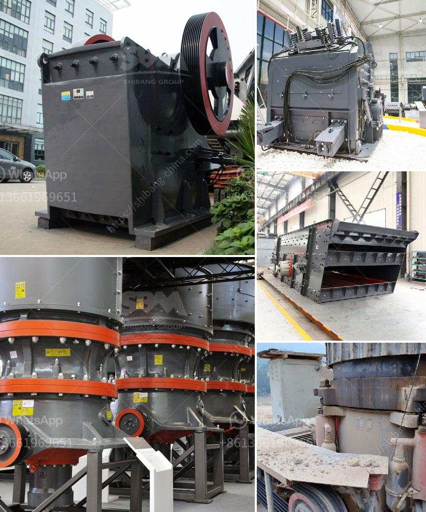

<h3>آلة كسارة الرمل</h3>
تعد آلة كسارة الرمل واحدة من أهم الآلات المستخدمة في صناعة التعدين والبناء. تستخدم هذه الآلة لكسر الصخور والرمال الصلبة إلى قطع صغيرة متجانسة التركيب ومناسبة للاستخدام في البناء والإنشاءات.

تعمل آلة الكسارة على مبدأ الضرب والتصادم، حيث يتم إرسال المواد ضمن غرفة الكسر المتواجدة داخل الجهاز، ومن ثم يقوم الروتور بتشغيل الشواكيش المثبتة على المطرقة. تقوم الشواكيش بالدوران بسرعة عالية وضرب المواد الموجودة داخل غرفة الكسر، مما يؤدي إلى تفتتها وتكسيرها إلى قطع صغيرة.

تتوفر آلة كسارة الرمل بمختلف الأحجام والقدرات، حيث تتراوح الأحجام من 100 إلى 3000 طن في الساعة. تعتمد سعة الكسارة على حجم وصلابة المواد المراد كسرها، وكذلك نوعية الأسطوانة والشواكيش.

إن استخدام آلة كسارة الرمل يوفر عدة فوائد. فعلى سبيل المثال، يمكن استخدامها لكسر الأحجار الكبيرة والصخور الصلبة، مما يتيح استخدامها في مشاريع البناء حيث تكون مطلوبة قطع صغيرة ومتجانسة التركيب. تستخدم الكسارات أيضًا في صناعة الأسفلت وتصنيع الرمل الاصطناعي.

بالإضافة إلى ذلك، تعمل آلة كسارة الرمل بكفاءة عالية وسرعة كبيرة، مما يسمح بإنتاج كميات كبيرة من المواد المكسرة في وقت قصير. كما أنها تساهم في تحسين جودة المنتج النهائي وتقليل تكاليف الإنتاج.

وفي النهاية، يمكن القول إن آلة كسارة الرمل هي آلة أساسية وضرورية في صناعة التعدين والبناء. فهي تقدم الكفاءة والكفاءة المطلوبة لكسر المواد الصلبة إلى قطع صغيرة، مما يسهل استخدامها في المشاريع الكبرى ويساهم في تحسين جودة وكفاءة إجراءات البناء والإنشاءات.
<h3>Contact us</h3><ul><li><strong>Whatsapp:&nbsp;<a href="https://wa.me/8613661969651">+8613661969651</a></strong></li><li><a href="https://swt.shibang-china.com/?git&amp;zhl&amp;آلة كسارة الرمل"><strong>Online Service(chat now)</strong></a></li></ul><h3>Related</h3><ul><li><a href='سعر آلة تكسير الذهب في الولايات المتحدة.md'>سعر آلة تكسير الذهب في الولايات المتحدة</a></li><li><a href='مصنع تكسير محمول للبيع في جنوب أفريقيا.md'>مصنع تكسير محمول للبيع في جنوب أفريقيا</a></li><li><a href='كسارة الصخور 250 طن في الساعة.md'>كسارة الصخور 250 طن في الساعة</a></li><li><a href='مصانع محمولة للبيع في جنوب أفريقيا.md'>مصانع محمولة للبيع في جنوب أفريقيا</a></li><li><a href='تبطين أنابيب مطحنة فحم الحجر.md'>تبطين أنابيب مطحنة فحم الحجر</a></li></ul>