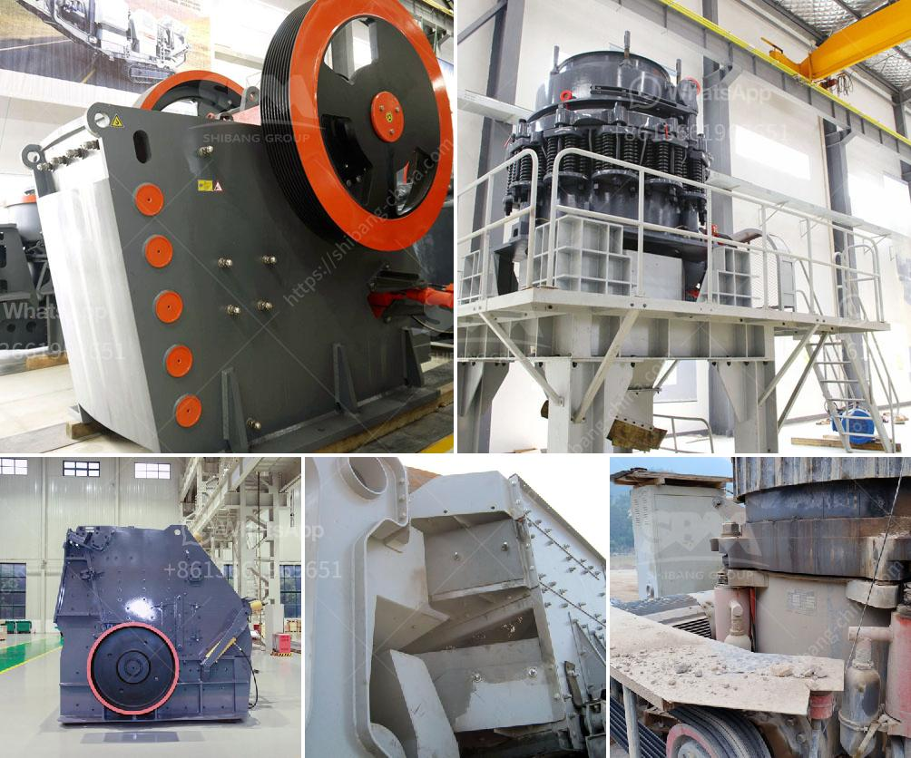

<h3>آلة كسارة الصخور في ماليزيا</h3>
تعتبر آلة كسارة الصخور من أهم الآلات المستخدمة في صناعة البناء والتعدين في ماليزيا. تستخدم هذه الآلة لتكسير الصخور الكبيرة وتحويلها إلى أحجام أصغر يمكن استخدامها في العديد من التطبيقات المختلفة.

إن وجود كمية كبيرة من الصخور في ماليزيا يسهم في زيادة الطلب على آلات الكسارة. تساهم الصخور المتوفرة في تطوير مجموعة واسعة من المشاريع الإنشائية مثل الطرق والجسور والمباني. تلعب آلة كسارة الصخور دورًا حاسمًا في هذه المشاريع حيث تقوم بتحويل الصخور الضخمة إلى قطع صغيرة متناسبة مع احتياجات المشروع.

تتوفر في ماليزيا مجموعة متنوعة من آلات كسارة الصخور التي تستخدم لمختلف التطبيقات. هناك آلات كسارة صغيرة الحجم وآلات كسارة أكبر حجمًا تعمل بالديزل أو الكهرباء. يتم استخدام هذه الآلات في المقام الأول في المحاجر والمناجم لتكسير الصخور واستخراج المواد الأولية اللازمة للمشاريع الإنشائية.

تتميز آلات كسارة الصخور في ماليزيا بالقوة والاستدامة والكفاءة. تتميز بتقنيات التكسير المتقدمة التي تجعلها قادرة على تحمل المواد الخشنة بكفاءة عالية. كما تتميز بآليات هيدروليكية قوية لتكسير الصخور وتجهيزها بسرعة. تعمل الآلات على توفير الوقت والجهد للعمالة وزيادة الإنتاجية بشكل عام.

بالإضافة إلى استخدامها في صناعة البناء، تستخدم آلات كسارة الصخور أيضًا في صناعة التعدين في ماليزيا. يتم استخدامها في تكسير الصخور الصلبة واستخراج المعادن والخامات. تساعد هذه الآلات في تحقيق إنتاجية عالية وتخفيض التكاليف في صناعة التعدين.

لخلاصة القول، تلعب آلة كسارة الصخور دورًا حاسمًا في صناعة البناء والتعدين في ماليزيا. تساهم في استخراج المواد الأولية اللازمة للمشاريع الإنشائية وتحويل الصخور الكبيرة إلى أحجام صغيرة. تعد هذه الآلات قوية وفعالة ومتينة، وتساهم في زيادة الإنتاجية وتحقيق التوفير في التكاليف في صناعة البناء والتعدين في ماليزيا.
<h3>Contact us</h3><ul><li><strong>Whatsapp:&nbsp;<a href="https://wa.me/8613661969651">+8613661969651</a></strong></li><li><a href="https://swt.shibang-china.com/?git&amp;zhl&amp;آلة كسارة الصخور في ماليزيا"><strong>Online Service(chat now)</strong></a></li></ul><h3>Related</h3><ul><li><a href='جهات اتصال ووكلاء شاشات الرمل والغرابيل.md'>جهات اتصال ووكلاء شاشات الرمل والغرابيل</a></li><li><a href='شركة تبيع آلة تكسير الخرسانة.md'>شركة تبيع آلة تكسير الخرسانة</a></li><li><a href='معدات غسيل الذهب.md'>معدات غسيل الذهب</a></li><li><a href='مصنعي مطاحن الرايموند في الهند.md'>مصنعي مطاحن الرايموند في الهند</a></li><li><a href='عرض مصنع معالجة الجير.md'>عرض مصنع معالجة الجير</a></li></ul>