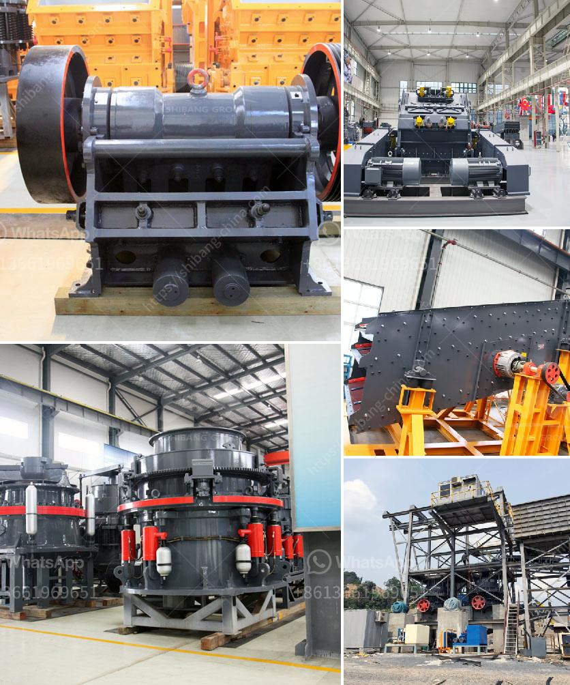

<h3>آلة كسارة الطين في راجكوت</h3>
تُعد آلة كسارة الطين في راجكوت واحدة من الأدوات الهامة في صناعة الطوب في هذه المدينة الواقعة في ولاية جوجارات في الهند. تعتبر صناعة الطوب من أهم الصناعات التقليدية في راجكوت، حيث تشتهر المدينة بإنتاج الطوب عالي الجودة والذي يستخدم في بناء المباني والهياكل المختلفة.

تعتبر آلة كسارة الطين في راجكوت جزءًا أساسيًا في عملية صنع الطوب. تستخدم الآلة لكسر وطحن قطع الطين الخام وتحويلها إلى مادة طينية ناعمة وسهلة التشكيل. يتم تغذية قطع الطين الخام في فتحة الآلة، ثم تتحرك القطع في داخل الجهاز حيث تتعرض لعملية الكسر والطحن عبر القرص الدوار والحلقات الثابتة. يعمل القرص الدوار على تكسير الطين وفصل الشوائب والشوكولاتة عنه. يتم تجميع الطين المكسر في حاوية أسفل الجهاز، حيث يتم تجهيزه للاستخدام في صنع الطوب.

تعتبر آلة كسارة الطين في راجكوت فعالة وموثوقة في إنتاج الطين اللازم لصنع الطوب بجودة عالية. حجم الجسيمات النهائية للطين يتم تحديده بواسطة الفتحات الموجودة في الحلقات الثابتة، مما يضمن الحصول على طين مختلف الأحجام بناءً على احتياجات العملاء ومتطلبات المشروع. بفضل هذه الآلة، يتم تحسين عملية إنتاج الطوب وتجهيز الطين بشكل أسرع وأكثر كفاءة.

تعد صناعة الطوب في راجكوت مورداً هاماً للعديد من فرص العمل والاقتصاد المحلي. يعتمد العديد من السكان المحليين على هذا القطاع لكسب رزقهم. كما أنها تساهم في التنمية الاقتصادية للمنطقة، حيث يتم تصدير الطوب المنتج إلى مناطق أخرى في البلاد. تعتبر آلة كسارة الطين في راجكوت أداة حديثة ومهمة في هذه الصناعة التقليدية، حيث تعمل على تحسين عملية صنع الطوب وزيادة الإنتاجية والجودة.

باختصار، تُعد آلة كسارة الطين في راجكوت واحدة من الأدوات الحديثة التي تستخدم في صناعة الطوب، وتساهم في تحسين العملية وجودة المنتج، كما تسهم في إيجاد فرص عمل وتعزيز التنمية الاقتصادية في المنطقة.
<h3>Contact us</h3><ul><li><strong>Whatsapp:&nbsp;<a href="https://wa.me/8613661969651">+8613661969651</a></strong></li><li><a href="https://swt.shibang-china.com/?git&amp;zhl&amp;آلة كسارة الطين في راجكوت"><strong>Online Service(chat now)</strong></a></li></ul><h3>Related</h3><ul><li><a href='مصنع كسارة الحجر في ويست بنغال.md'>مصنع كسارة الحجر في ويست بنغال</a></li><li><a href='كسارة تأثير الحجر الجيري.md'>كسارة تأثير الحجر الجيري</a></li><li><a href='كسارات الحطام للبيع.md'>كسارات الحطام للبيع</a></li><li><a href='أريد شراء كسارة البوزولان.md'>أريد شراء كسارة البوزولان</a></li><li><a href='البحث عن شريك لكسارة الآلات.md'>البحث عن شريك لكسارة الآلات</a></li></ul>