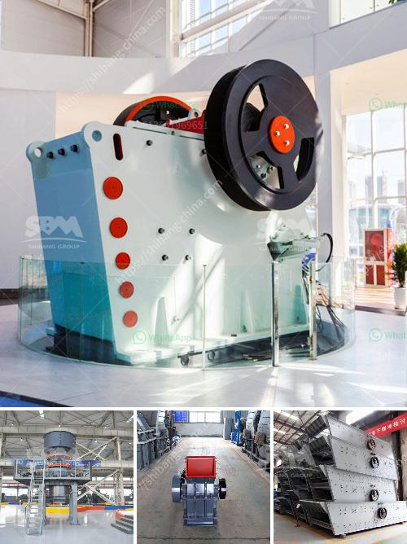

<h3>آلة كسارة الفحم 5 طن في الساعة</h3>
تُعد آلة كسارة الفحم 5 طن في الساعة أداة حاسمة في صناعة تعدين الفحم. تستخدم هذه الآلة لتفتيت الفحم إلى قطع صغيرة قبل استخدامه في عمليات تجهيز الفحم الأخرى مثل الحرق في محطات الطاقة أو تحويله إلى منتجات صناعية. توفر آلة كسارة الفحم هذه كسارة قوية وفعالة تعمل على تحسين عمليات تعدين الفحم وزيادة الإنتاجية بشكل عام.

إحدى الفوائد الرئيسية لآلة كسارة الفحم 5 طن في الساعة هي القدرة على تفتيت كميات كبيرة من الفحم في وقت قصير. حيث يتم تغذية وحدة الكسارة بالفحم الخام باستخدام مخزن أو ناقل، ومن ثم يتم سحق الفحم بواسطة صفيحة رافعة ثابتة تتحرك ببطء. تنقل حركة الرافعة عبور قوة دوران ضاغطة للفحم، مما يؤدي إلى تكسيره وتفتيته.

تعتمد آلات كسارة الفحم على تصميمات قوية ومتينة للتأكد من أنها تستطيع تحمل الضغوط المرتبطة بعملية التكسير. تُصنع هذه الآلات من مواد فولاذية تتحمل التآكل والصدمات اليومية. يتم تجهيز الآلة بأنظمة تحكم حديثة تضمن تشغيلها بكفاءة وسهولة. بالإضافة إلى ذلك، تم تصميم تلك الآلات لتكون آمنة للاستخدام، حيث تحتوي على أنظمة سلامة تضمن سلامة المشغلين وتحد من حدة الحوادث.

توفر آلة كسارة الفحم 5 طن في الساعة مزايا عدة. فمن السهل تثبيتها وصيانتها بفضل تصميمها المبتكر والمعاصر. تعد آلة كسارة الفحم هذه حلاً اقتصاديًا لشركات التعدين ومحطات الطاقة، حيث تعمل على تحسين كفاءة الإنتاج وتوفير الوقت والعمالة. تعتبر هذه الآلات مستدامة وصديقة للبيئة، حيث تحسن استخدام الفحم بشكل عام وتقلل من تأثيره البيئي.

باختصار، تُعتبر آلة كسارة الفحم 5 طن في الساعة أداة فعالة وقوية تعزز صناعة تعدين الفحم وتحسن عمليات تجهيز الفحم. تقدم هذه الآلة فوائد عدة من بينها زيادة الإنتاجية وتحسين الكفاءة وتوفير التكاليف. بفضل تكنولوجيا التحكم الحديثة وتصميمها المتين، تعد آلة كسارة الفحم هذه الحل الأمثل للشركات التي تعمل في صناعة تعدين الفحم.
<h3>Contact us</h3><ul><li><strong>Whatsapp:&nbsp;<a href="https://wa.me/8613661969651">+8613661969651</a></strong></li><li><a href="https://swt.shibang-china.com/?git&amp;zhl&amp;آلة كسارة الفحم 5 طن في الساعة"><strong>Online Service(chat now)</strong></a></li></ul><h3>Related</h3><ul><li><a href='مطرقة الذهب المستخدمة للبيع في زيمبابوي.md'>مطرقة الذهب المستخدمة للبيع في زيمبابوي</a></li><li><a href='مصنع غسيل الذهب المستخدمة.md'>مصنع غسيل الذهب المستخدمة</a></li><li><a href='آلة تعدين النحاس.md'>آلة تعدين النحاس</a></li><li><a href='كسارة حجر ثالثية.md'>كسارة حجر ثالثية</a></li><li><a href='قائمة الشركات المستخرجة في الفلبين.md'>قائمة الشركات المستخرجة في الفلبين</a></li></ul>