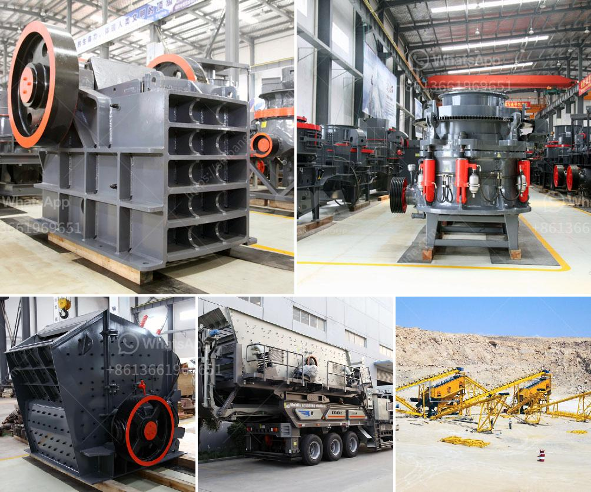

<h3>آلة كسارة الفك في المملكة العربية السعودية</h3>
تحظى آلة كسارة الفك بشعبية كبيرة في المملكة العربية السعودية نظرًا لفوائدها الكبيرة في صناعة البناء والتشييد. فهي تُعتبر أحد أنواع الآلات الثقيلة التي تستخدم في تكسير الصخور الكبيرة إلى قطع أصغر وذلك لتحقيق إعادة تدويرها في خامات البناء.

تعمل آلة كسارة الفك عن طريق وضع الصخور داخل فتحة الفك المتحرك وتحريكه ضد الفك الثابت باستخدام آلية الضغط. يتم توجيه الصخور إلى غرفة التكسير داخل الآلة حيث تُكسر إلى أجزاء أصغر. تعتبر آلة كسارة الفك مثالية لتكسير الصخور الصلبة والصخور الكاشطة.

تتميز آلة كسارة الفك بمزايا عدة. فأولاً، فهي قوية ومتينة وتستطيع التعامل مع الصخور ذات الصلابة العالية. كما أنها سهلة الاستخدام والصيانة، مما يقلل من تكاليف التشغيل. وتوفر هذه الآلة استخدامًا فعالًا للطاقة وتحافظ على استدامة الموارد.

تتميز آلة كسارة الفك أيضًا بكفاءتها في عملية الفصل والفرز بعد عملية التكسير. حيث يتم فصل الصخور المكسرة حسب الحجم المطلوب. وبفضل النتائج الدقيقة التي تعطيها هذه الآلة، يتم تحقيق أعلى جودة للمنتج النهائي.

تستخدم آلة كسارة الفك في العديد من المجالات والصناعات في المملكة العربية السعودية. فمن بين استخداماتها الرئيسية تكسير الحصى والحجارة لإنتاج الخرسانة وفرز الحصى والرمل في صناعة البناء. كما يتم استخدامها في تعدين الفحم والنحاس والحديد والذهب.

من الجدير بالذكر أن آلة كسارة الفك متوفرة بمختلف الأحجام والقدرات، مما يجعلها قابلة للاستخدام في مختلف الظروف والمواد. يمكن تخصيصها وفقًا لاحتياجات ومتطلبات المشروع المحدد.

باختصار، تُعتبر آلة كسارة الفك من الآلات الضرورية في صناعة البناء والتشييد في المملكة العربية السعودية. فوائدها العديدة وقدرتها على التعامل مع الصخور الصلبة تجعلها اختيارًا مناسبًا للكسارات وتعزز من كفاءة عمليات التكسير والفرز والفصل. علاوة على ذلك، فإن هذه الآلة تساهم في الاستدامة البيئية من خلال تحقيق إعادة تدوير الموارد الطبيعية وتقليل النفايات.
<h3>Contact us</h3><ul><li><strong>Whatsapp:&nbsp;<a href="https://wa.me/8613661969651">+8613661969651</a></strong></li><li><a href="https://swt.shibang-china.com/?git&amp;zhl&amp;آلة كسارة الفك في المملكة العربية السعودية"><strong>Online Service(chat now)</strong></a></li></ul><h3>Related</h3><ul><li><a href='معدات تكسير الكالسايت.md'>معدات تكسير الكالسايت</a></li><li><a href='كسارة النحاس للبيع في ماليزيا.md'>كسارة النحاس للبيع في ماليزيا</a></li><li><a href='مصنع مطاحن الأسمنت بسعة 100 طن يومياً.md'>مصنع مطاحن الأسمنت بسعة 100 طن يومياً</a></li><li><a href='مطحنة الكرة لطحن الفلسبار.md'>مطحنة الكرة لطحن الفلسبار</a></li><li><a href='أريد شراء آلة كسارة في باكستان.md'>أريد شراء آلة كسارة في باكستان</a></li></ul>