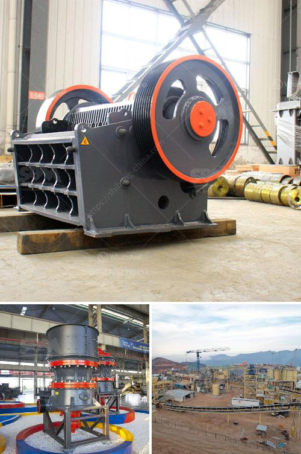

<h3>آلة كسارة الكوارتز</h3>
تعتبر آلة كسارة الكوارتز من أحدث التقنيات المستخدمة في صناعة الكسارات الحجرية. تعمل هذه الآلة على كسر الكوارتز إلى جزيئات صغيرة، مما يسهل استخدامها في العديد من الصناعات مثل صناعة البناء والصناعات الكيماوية.

تتألف آلة كسارة الكوارتز الحديثة من عدة أجزاء أساسية، مثل الفك المتحرك والفك الثابت والدوران. تحتوي الآلة أيضًا على نظام لتشغيل المحرك وناقل الحزام وغربال الفرز. تعمل هذه الأجزاء معًا لتحقيق الكسر الناجح للكوارتز.

تتميز آلة كسارة الكوارتز بالعديد من المميزات. أولاً، يتم استخدامها لكسر الكوارتز بكفاءة عالية وبأحجام متنوعة حسب متطلبات العميل. ثانيًا، تعمل الآلة بسهولة وبشكل آلي، مما يوفر الوقت والجهد للعمالة. ثالثًا، تعمل الآلة بدقة عالية، مما يعني أنها تقوم بتكسير الكوارتز إلى أحجام صغيرة ومتسقة.

تستخدم آلة كسارة الكوارتز في العديد من الصناعات. في صناعة البناء، يتم استخدامها في تكسير الكوارتز لإنتاج مواد البناء مثل الحجر الرملي والسبائك المختلفة. في صناعة الزجاج والسيراميك، تستخدم لكسر الكوارتز لإعطاء الحجر خصائص مثل المتانة والشفافية واللمعان. كما تستخدم أيضًا في صناعة الكيماويات لتحويل الكوارتز إلى مساحيق دقيقة يمكن استخدامها في عمليات الإنتاج المختلفة.

في النهاية، تعد آلة كسارة الكوارتز مهمة جدًا في صناعة الكسارات الحجرية. تساهم في تسهيل عمليات الكسر وتحطيم الكوارتز إلى حجم صغير ومتجانس، مما يوفر الوقت والمجهود. كما توفر أيضًا منتجات نهائية عالية الجودة وفقًا لاحتياجات العملاء. بالإضافة إلى ذلك، تعتبر آلة كسارة الكوارتز اختيارًا مناسبًا للصناعات المختلفة، حيث تساهم في تحقيق أداء ممتاز وفعالية عالية.
<h3>Contact us</h3><ul><li><strong>Whatsapp:&nbsp;<a href="https://wa.me/8613661969651">+8613661969651</a></strong></li><li><a href="https://swt.shibang-china.com/?git&amp;zhl&amp;آلة كسارة الكوارتز"><strong>Online Service(chat now)</strong></a></li></ul><h3>Related</h3><ul><li><a href='عملية الكرة الطحن.md'>عملية الكرة الطحن</a></li><li><a href='كسارة مخروطية لنيجيريا.md'>كسارة مخروطية لنيجيريا</a></li><li><a href='الفرق بين كسارة الفك وكسارة الصدم.md'>الفرق بين كسارة الفك وكسارة الصدم</a></li><li><a href='مورد مصنع تكسير الحجر في الفلبين.md'>مورد مصنع تكسير الحجر في الفلبين</a></li><li><a href='مطاحن رايموند في المكسيك.md'>مطاحن رايموند في المكسيك</a></li></ul>