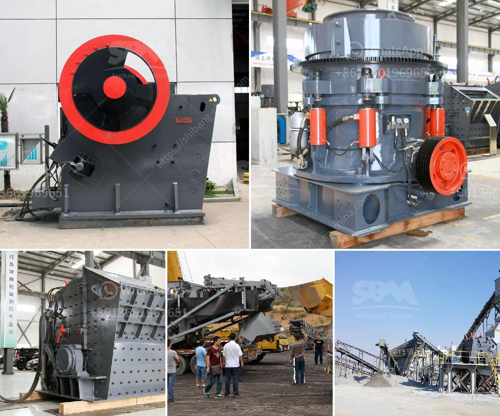

<h3>آلة كسارة حجر الجرانيت في تايلاند</h3>
تعتبر آلة كسارة حجر الجرانيت في تايلاند من الوسائل الحديثة التي تستخدم لتحطيم الجرانيت بكفاءة وسهولة. تستخدم هذه الآلات في مواقع الإنشاءات ومناجم الحجر حيث يتم استخراج الجرانيت.

تتكون آلة كسارة الجرانيت من العديد من الأجزاء المختلفة التي تعمل بالتناغم لتحطيم الصخور الكبيرة إلى قطع أصغر. تحتوي هذه الآلة على محرك كهربائي يوفر القوة اللازمة للحركة وعملية التحطيم. بالإضافة إلى ذلك، تحتوي على فكين قابلين للتعديل وقادرين على التحرك لأعلى ولأسفل لتمكين إدخال الجرانيت وتفريغه بسهولة.

تعمل آلة كسارة حجر الجرانيت عن طريق الضغط والتحرير، حيث يتم وضع الجرانيت بين الفكين وتُطبق قوة ضاغطة عليها. تتحطم الصخور الكبيرة وتتم تحويلها إلى قطع أصغر بفضل قوة الضغط العالية المولدة بواسطة الآلة. تتم عملية التحطيم بسهولة وسلامة، مما يسهم في زيادة إنتاجية الموقع وتقليل الجهد والوقت اللازم لتحطيم الحجارة يدويًا.

يتم استخدام آلة كسارة الجرانيت في تايلاند في صناعة البناء لتحطيم الجرانيت واستخلاص الحصى والركام. تستخدم هذه الأحجام المحطمة في العديد من التطبيقات التجارية والصناعية مثل الخرسانة المسلحة وتعبئة الطرق وإعادة تدوير الحجارة. تقوم هذه الآلات بتحويل الجرانيت المستخرج إلى منتجات ذات جودة عالية يمكن استخدامها في مجموعة متنوعة من المشاريع البنائية.

تمتاز آلة كسارة حجر الجرانيت في تايلاند بفعاليتها ودقتها في تحطيم الصخور بسرعة وسهولة، مما يسهم في زيادة إنتاجية الموقع وتقليل التكلفة والجهد البشري المطلوب. بفضل التكنولوجيا المتقدمة المستخدمة في هذه الآلة، يمكن إنجاز المهام بشكل أكثر كفاءة وسرعة.

باختصار، آلة كسارة حجر الجرانيت في تايلاند هي وسيلة حديثة وفعالة لتحطيم الصخور الكبيرة إلى قطع أصغر. تعتبر هذه الآلة أداة أساسية في صناعة البناء واستخراج الحجر، حيث تساهم في تحسين كفاءة العمل وتوفير الوقت والموارد.
<h3>Contact us</h3><ul><li><strong>Whatsapp:&nbsp;<a href="https://wa.me/8613661969651">+8613661969651</a></strong></li><li><a href="https://swt.shibang-china.com/?git&amp;zhl&amp;آلة كسارة حجر الجرانيت في تايلاند"><strong>Online Service(chat now)</strong></a></li></ul><h3>Related</h3><ul><li><a href='مطحنة الكرة الثقيلة الوزن في الهند.md'>مطحنة الكرة الثقيلة الوزن في الهند</a></li><li><a href='كسارة محمولة في الفلبين.md'>كسارة محمولة في الفلبين</a></li><li><a href='شاشة اهتزاز في إندونيسيا.md'>شاشة اهتزاز في إندونيسيا</a></li><li><a href='مطاحن الطحن للبيع في باكستان.md'>مطاحن الطحن للبيع في باكستان</a></li><li><a href='تكلفة الكسارة المحمولة للساعة الواحدة.md'>تكلفة الكسارة المحمولة للساعة الواحدة</a></li></ul>