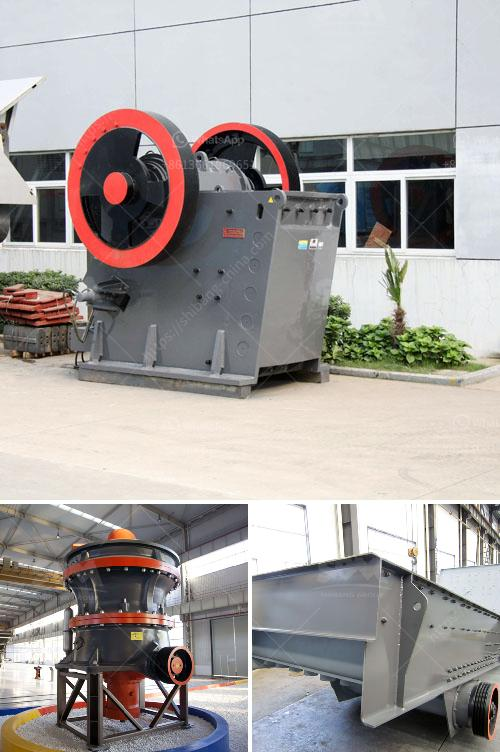

<h3>آلة كسارة صخور صغيرة</h3>
تعد آلة كسارة الصخور الصغيرة من الأدوات التقنية الحديثة التي تستخدم في صناعة التعدين والبناء. تتميز هذه الآلة بأنها قادرة على تكسير الصخور الكبيرة إلى قطع أصغر بسهولة وفعالية. يتم استخدامها في العديد من التطبيقات المختلفة، مثل البناء، والهندسة المدنية، وصناعة الأسمنت.

تتكون آلة كسارة الصخور الصغيرة من العديد من الأجزاء المهمة، مثل المحرك، والفك المتحرك، والفك الثابت، وسلة الصخور. يتم تشغيل الآلة بواسطة محرك قوي يدفع الفك المتحرك للحركة الصعودية والهبوطية. عند تشغيل الآلة، يتم وضع الصخور الكبيرة في السلة وتمريرها تحت الفك المتحرك والفك الثابت. تتم سحق الصخور عن طريق ضغط الفكين معًا، مما يسمح بتكسير الصخور إلى قطع أصغر.

تتميز الآلة بقدرتها على تكسير الصخور بسرعة وبكفاءة عالية. كما أنها توفر تكلفة منخفضة ووقتًا قصيرًا لتحقيق العملية. تعتبر آلة كسارة الصخور الصغيرة خيارًا مثاليًا للشركات الصغيرة والمتوسطة الحجم التي تحتاج إلى تكسير الصخور الكبيرة في مواقع بناء صغيرة.

بفضل حجمها الصغير، تعد آلة كسارة الصخور الصغيرة محمولة وسهلة التركيب والتشغيل. يمكن نقلها بسهولة من موقع إلى آخر عن طريق المركبة، مما يجعلها مريحة للاستخدام في العديد من المواقع المختلفة. تعمل الآلة بكفاءة على الصخور المختلفة، بما في ذلك الحجارة الطبيعية والحصى والحجارة الصناعية.

بشكل عام، تعد آلة كسارة الصخور الصغيرة أداة قوية وفعالة تستخدم في العديد من صناعات البناء والتعدين. توفر هذه الآلة التيار الكهربائي المستقر، وسرعة التشغيل، وجودة التكسير الممتازة. يمكن استخدامها في مجموعة متنوعة من المشاريع، مما يسهم في زيادة الإنتاجية وتحسين جودة العمل.

لذا، فإن آلة كسارة الصخور الصغيرة تعد أداة ثمينة للشركات والمقاولين الذين يحتاجون إلى تكسير الصخور بكفاءة ومرونة. بفضل تكنولوجياها المتقدمة وأدائها الممتاز، ستستمر في تلبية احتياجات الشركات المختلفة في مجالات التعدين والبناء.
<h3>Contact us</h3><ul><li><strong>Whatsapp:&nbsp;<a href="https://wa.me/8613661969651">+8613661969651</a></strong></li><li><a href="https://swt.shibang-china.com/?git&amp;zhl&amp;آلة كسارة صخور صغيرة"><strong>Online Service(chat now)</strong></a></li></ul><h3>Related</h3><ul><li><a href='مطاحن الكرة للبيع في زيمبابوي.md'>مطاحن الكرة للبيع في زيمبابوي</a></li><li><a href='كيفية حساب تكلفة الطحن.md'>كيفية حساب تكلفة الطحن</a></li><li><a href='أسعار معدات التكسير والفحص جنوب أفريقيا.md'>أسعار معدات التكسير والفحص جنوب أفريقيا</a></li><li><a href='كسارة محمولة في السويد.md'>كسارة محمولة في السويد</a></li><li><a href='مصنع صنع مسحوق الجبس.md'>مصنع صنع مسحوق الجبس</a></li></ul>