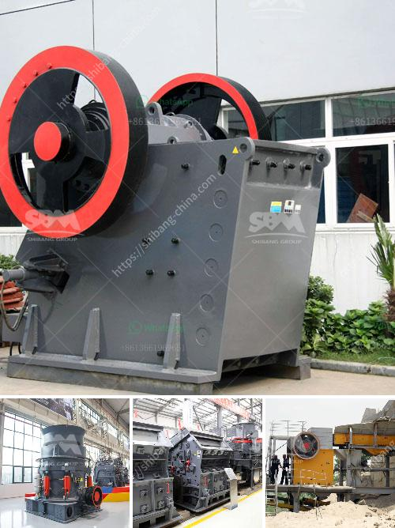

<h3>آلة كسارة صغيرة للبيع في زيمبابوي</h3>
تتمثل أهمية آلة كسارة صغيرة في العديد من البلدان حول العالم، بما في ذلك زيمبابوي، حيث يعد القطاع الزراعي أحد أهم القطاعات الاقتصادية في البلاد. تستخدم آلة الكسارة الصغيرة في زيمبابوي لتحويل المواد الخام مثل الصخور والحجارة إلى قطع صغيرة قابلة للاستخدام في صناعات متعددة مثل البناء والطرق والزراعة.

توفر آلة الكسارة الصغيرة فرصة للمزارعين والعمال في قطاع البناء لتحسين إنتاجيتهم ورفع دخلهم. فعند استخدام آلة الكسارة الصغيرة، يتمكن المستخدمون من تكسير وسحق المواد الخام المتوفرة بشكل سهل وفعال، مما يتيح لهم استخدام تلك القطع الصغيرة في مشاريعهم وبيعها للمقاولين الآخرين.

وتعتبر آلات الكسارة الصغيرة معروفة بتكلفتها المنخفضة وصغر حجمها مقارنة بالكسارات الكبيرة. يمكن العثور على آلات الكسارة الصغيرة في الأسواق المحلية في زيمبابوي بأسعار تتراوح بين 200 و 400 دولار، مما يجعلها ميسورة التكلفة للكثير من الناس.

بالإضافة إلى ذلك، تعمل آلة الكسارة الصغيرة بمحرك كهربائي أو بنزين، مما يوفر للمستخدمين خيارات متعددة لاستخدامها في مناطق لا تتوفر فيها خدمة الكهرباء الثابتة. هذا يسهل تشغيل الآلة وصيانتها.

وعلاوة على ذلك، تعتبر آلة الكسارة الصغيرة سهلة الاستخدام وآمنة، حيث تأتي مع أجزاء حماية وأزرار تحكم واضحة. يمكن لأي شخص مهتم في زيمبابوي شراء آلة الكسارة الصغيرة واستخدامها بسهولة بعد التدريب الأولي.

باختصار، تعتبر آلة الكسارة الصغيرة فرصة مثالية للمستثمرين والعمال في زيمبابوي للاستفادة من القطاع الزراعي والبناء. يمكنهم شراء هذه الآلة المهمة بأسعار ميسورة واستخدامها لتحسين مشاريعهم وزيادة دخلهم. بالإضافة إلى ذلك، يمكن للمستخدمين الاعتماد على سهولة الاستخدام والصيانة في تشغيل آلة الكسارة الصغيرة بفعالية وسلامة.
<h3>Contact us</h3><ul><li><strong>Whatsapp:&nbsp;<a href="https://wa.me/8613661969651">+8613661969651</a></strong></li><li><a href="https://swt.shibang-china.com/?git&amp;zhl&amp;آلة كسارة صغيرة للبيع في زيمبابوي"><strong>Online Service(chat now)</strong></a></li></ul><h3>Related</h3><ul><li><a href='خطة المشروع حول آلة تحطيم الحجر.md'>خطة المشروع حول آلة تحطيم الحجر</a></li><li><a href='خطة عمل لإنتاج الطوب.md'>خطة عمل لإنتاج الطوب</a></li><li><a href='سعر كسارة الحجر سعة طن في الساعة.md'>سعر كسارة الحجر سعة طن في الساعة</a></li><li><a href='عملية تصنيع لوح الجبس.md'>عملية تصنيع لوح الجبس</a></li><li><a href='عملية تصنيع الإسمنت بالطريقة الرطبة.md'>عملية تصنيع الإسمنت بالطريقة الرطبة</a></li></ul>