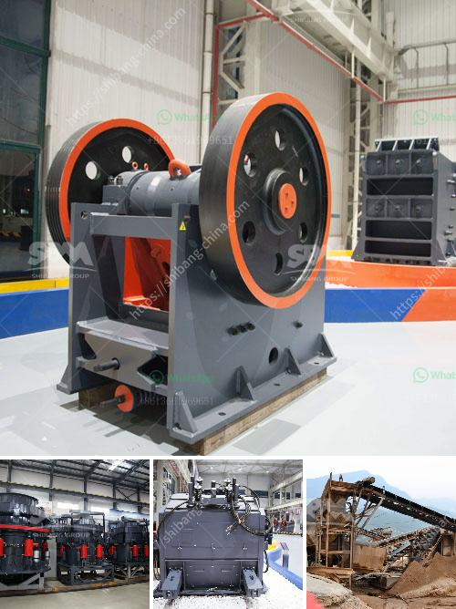

<h3>آلة كسارة في أوروبا</h3>
تعد آلة الكسارة أحد الأدوات الهامة في صناعة البناء والهدم. وتستخدم هذه الآلة لطحن وتكسير المواد الصلبة مثل الحجر والخرسانة والزجاج، لتحويلها إلى قطع صغيرة يمكن التخلص منها بسهولة أو إعادة استخدامها في بناء مواد أخرى.

تأتي أغلب الكسارات في أوروبا بتصاميم وتقنيات حديثة وتتمتع بالقدرة على التعامل مع مجموعة واسعة من المواد والقدرات المختلفة. فهي تشتمل على محركات قوية وأنظمة هيدروليكية متطورة تسمح بسحق المواد بكفاءة عالية. وتعتبر هذه الآلات دقيقة في الأداء وأكثر سرعة وأمانًا من الطرق التقليدية للكسر اليدوي.

وبالنظر إلى التزام أوروبا بالحفاظ على البيئة وتحقيق التنمية المستدامة، فإن آلات الكسارة في القارة تتمتع بتكنولوجيا التحكم في الغبار والضوضاء. فهي تأخذ بعين الاعتبار تقليل انبعاثات الغازات السامة وتخفيض مستوى الضوضاء الناتجة عن عملية الكسر، مما يقلل من تأثيرها البيئي وصحة العمال في الموقع.

وتوفر آلات الكسارة في أوروبا فوائد عدة. فهي تزيد من كفاءة العمل وتوفر الوقت والجهد البشري. كما تزيد من سرعة وجودة العمل وتحسن الأداء العام للمشروع. وبفضل تقنيتها المتقدمة ومرونتها في التعامل مع أنواع مختلفة من المواد، فهي تلبي احتياجات العديد من القطاعات كصناعة البناء والهدم وإعادة التدوير.

بالإضافة إلى ذلك، يتمتع العمال في صناعة البناء بالكثير من الخبرة والمهارة في استخدام آلات الكسارة. فهم يمتلكون المعرفة والفهم اللازم لتشغيل هذه الآلات والحفاظ عليها بشكل صحيح. وهذا يؤدي إلى زيادة الأمان وتقليل حوادث العمل في مواقع البناء.

في النهاية، فإن آلة الكسارة في أوروبا تعتبر أحد التطورات الهامة في صناعة البناء والهدم. إن تقنيتها المتطورة ومرونتها في التعامل مع المواد المختلفة تجعلها أداة فعالة وآمنة لتحويل المواد الصلبة إلى قطع صغيرة قابلة للاستخدام بالبناء الجديد أو إعادة التدوير. ومع الحفاظ على البيئة وتحقيق التنمية المستدامة كأهداف أوروبا، فإن آلة الكسارة تلبي بشكل كبير احتياجات القارة في مجال البناء والهدم والاستدامة.
<h3>Contact us</h3><ul><li><strong>Whatsapp:&nbsp;<a href="https://wa.me/8613661969651">+8613661969651</a></strong></li><li><a href="https://swt.shibang-china.com/?git&amp;zhl&amp;آلة كسارة في أوروبا"><strong>Online Service(chat now)</strong></a></li></ul><h3>Related</h3><ul><li><a href='مجفف رمل مستعمل للبيع.md'>مجفف رمل مستعمل للبيع</a></li><li><a href='مصنع غسيل رمال الكروم بأسعار مناسبة.md'>مصنع غسيل رمال الكروم بأسعار مناسبة</a></li><li><a href='خط إنتاج الجرانيت.md'>خط إنتاج الجرانيت</a></li><li><a href='آلة طحن الكرة من المنغنيز.md'>آلة طحن الكرة من المنغنيز</a></li><li><a href='تقليل حجم مطحنة المطرقة.md'>تقليل حجم مطحنة المطرقة</a></li></ul>