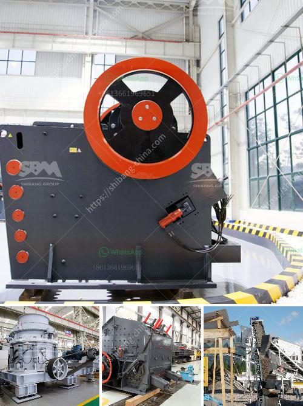

<h3>آلة كسارة في الإمارات</h3>
لا يمكن إنكار أن صناعة البناء تمثل قطاعًا هامًا في الاقتصاد الإماراتي المزدهر، حيث تشهد الإمارات تطورًا مستمرًا في البنية التحتية والمشاريع الضخمة. ولتلبية احتياجات هذا القطاع، تم تطوير العديد من الآلات والمعدات المبتكرة، ومنها آلة الكسارة التي تلعب دورًا حاسمًا في عمليات تكسير الصخور والأحجار.

تعتبر آلة الكسارة من أهم الآلات المستخدمة في صناعة البناء، فهي تستخدم لتحطيم الصخور والأحجار الكبيرة إلى جزيئات صغيرة قابلة للاستخدام في مشاريع البناء. تتوفر هذه الآلة في أحجام وأشكال مختلفة، وتستخدم على نطاق واسع لتكسير الخامات المختلفة مثل خامات الحصى والجرانيت والحجر الجيري.

ما يميز آلة الكسارة في الإمارات هو توافر مجموعة متنوعة من النماذج، والتي تتميز بالقوة والكفاءة والجودة. وتعمل هذه الآلات بمحركات قوية وتقنيات مبتكرة تتيح تكسير الصخور بسرعة وفعالية. تتمتع الآلات بقدرة عالية على التكيف مع ظروف العمل المختلفة، حيث تتيح للعمال تعديل إعدادات الكسارة وفقًا لاحتياجات المشروع.

تستخدم الكسارات في الإمارات في العديد من التطبيقات مثل إعادة تدوير النفايات البنائية وتجهيز المواد الخام لمشاريع البناء الكبرى. كما تشتمل استخدامات الكسارات على تكسير الصخور لاستخراج المواد الثقيلة والركام لاستخدامها في مشاريع الطرق والجسور والمباني.

ومن الجوانب الإيجابية لآلة الكسارة في الإمارات هو تأثيرها على البيئة. تعتبر الكسارات حلاً مستدامًا لإعادة تدوير النفايات البنائية، حيث يتم تحويل المواد الكبيرة إلى مواد صغيرة يمكن إعادة استخدامها. كما أن استخدام تقنيات حديثة في الكسارات يقلل من انبعاثات الغبار والضجيج الناتجة عن عملية التكسير.

بالاختصار، تعتبر آلة الكسارة في الإمارات جزءًا لا يتجزأ من صناعة البناء وتحقق تقدمًا ملحوظًا في القطاع. يتميز الإمارات بتوفير العديد من النماذج المتقدمة والقوية، مما يساهم في تنفيذ المشاريع بكفاءة وجودة عالية. بالإضافة إلى ذلك، فإن استخدام الكسارات يسهم في المحافظة على البيئة وتحقيق استدامة في صناعة البناء.
<h3>Contact us</h3><ul><li><strong>Whatsapp:&nbsp;<a href="https://wa.me/8613661969651">+8613661969651</a></strong></li><li><a href="https://swt.shibang-china.com/?git&amp;zhl&amp;آلة كسارة في الإمارات"><strong>Online Service(chat now)</strong></a></li></ul><h3>Related</h3><ul><li><a href='معدات إنتاج الأسمنت في ألمانيا.md'>معدات إنتاج الأسمنت في ألمانيا</a></li><li><a href='سعر آلة كسارة الفك.md'>سعر آلة كسارة الفك</a></li><li><a href='مصنع طحن الذهب في زيمبابوي.md'>مصنع طحن الذهب في زيمبابوي</a></li><li><a href='آلة صنع الرمل الحجر في نيجيريا.md'>آلة صنع الرمل الحجر في نيجيريا</a></li><li><a href='كسارة الفك 1200 طن في الساعة.md'>كسارة الفك 1200 طن في الساعة</a></li></ul>