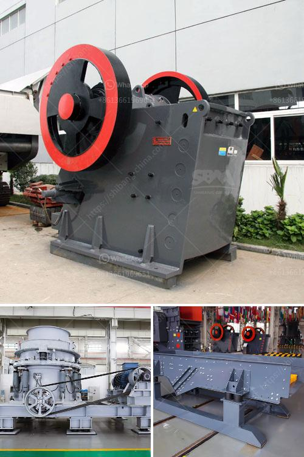

<h3>آلة كسارة في الصين</h3>
تعتبر آلة الكسارة من الآلات الحديثة التي تستخدم في العديد من مجالات الصناعة في الصين. تتميز هذه الآلة بقدرتها على تحطيم المواد الصلبة إلى حجم أصغر يمكن استخدامه في عمليات الإنتاج المختلفة.

تستخدم آلة الكسارة في العديد من الصناعات مثل التعدين والبناء وصناعة المعادن. وتعد الصين واحدة من أكبر الدول المصنعة لهذه الآلة في العالم، حيث تتميز بتقنيات متطورة وجودة عالية في الإنتاج.

تتكون آلة الكسارة في الصين من عدة أجزاء رئيسية. أولاً، تحتوي الآلة على محرك يستخدم لتوفير الطاقة اللازمة لتشغيل الكسارة. ثم، تحتوي الكسارة على طبل أو قرص يتم تركيبه بشكل ثابت ويدور بسرعة عالية. وبفضل هذا الدوران، تستطيع الكسارة تحطيم المواد الصلبة.

وبجانب الطبل أو القرص، تحتوي الكسارة على شفرات حادة تقوم بتفتيت المواد الصلبة. كما يتم تجهيز الكسارة بوسائط أمان حماية المشغل من الحوادث المحتملة.

تعتبر آلة الكسارة في الصين فعالة وقوية، حيث يمكنها سحق المواد الصلبة بسهولة وسرعة. ونظرًا لقدراتها الفائقة، يمكن استخدام الكسارة في تحطيم الصخور الكبيرة والأحجار الثقيلة لاستخراج المعادن المفيدة.

وتعتبر صيانة آلة الكسارة أمرًا مهمًا للاحتفاظ بأداء هذه الآلة في أفضل حالة. يوصى بإجراء فحوصات دورية وتنظيف الآلة بانتظام لضمان عملية تشغيل سلسة وفعالة.

باختصار، فإن آلة الكسارة في الصين هي أداة قوية وفعالة تستخدم في مجالات متعددة مثل التعدين والبناء وصناعة المعادن. وتتميز هذه الآلة بالجودة العالية والتقنيات المتطورة المستخدمة في الإنتاج. ومن المهم الاهتمام بصيانة هذه الآلة للاستمرار في أداء أفضل.
<h3>Contact us</h3><ul><li><strong>Whatsapp:&nbsp;<a href="https://wa.me/8613661969651">+8613661969651</a></strong></li><li><a href="https://swt.shibang-china.com/?git&amp;zhl&amp;آلة كسارة في الصين"><strong>Online Service(chat now)</strong></a></li></ul><h3>Related</h3><ul><li><a href='مصنعين لمصانع الأسمنت في الهند.md'>مصنعين لمصانع الأسمنت في الهند</a></li><li><a href='كسارة الذهب في جنوب أفريقيا.md'>كسارة الذهب في جنوب أفريقيا</a></li><li><a href='آلة كسارة الحجر الصينية.md'>آلة كسارة الحجر الصينية</a></li><li><a href='مطحنة رايموند في ماليزيا.md'>مطحنة رايموند في ماليزيا</a></li><li><a href='الدوران الروتوري لكسارة الحجر الجيري.md'>الدوران الروتوري لكسارة الحجر الجيري</a></li></ul>