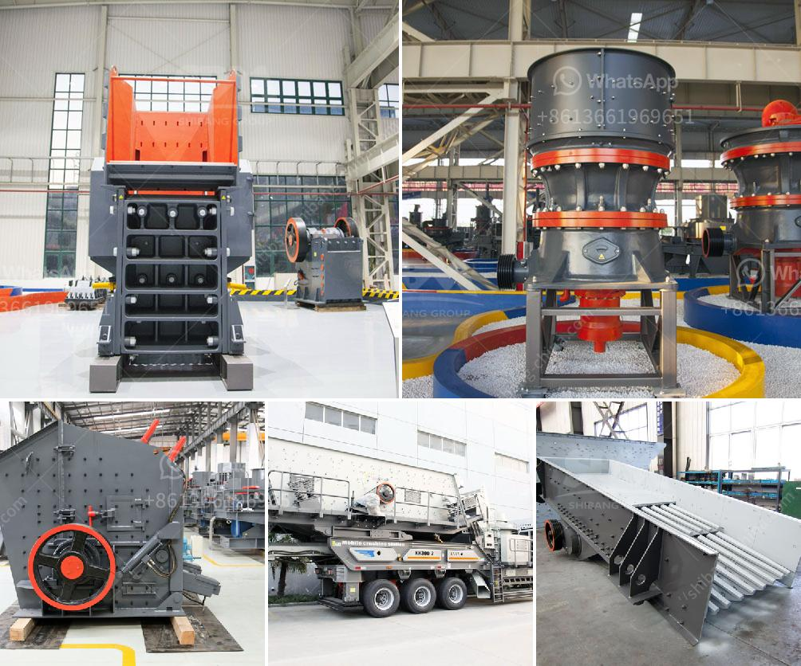

<h3>آلة كسارة في الفلبين</h3>
تعد آلة الكسارة واحدة من أهم الآليات المستخدمة في مجال البناء والتشييد في الفلبين. تستخدم هذه الآلة لتكسير المواد الصلبة مثل الصخور والحجارة لتحويلها إلى حصمة صغيرة، والتي يمكن استخدامها في تشييد الطرق والمباني وغيرها من المشاريع الإنشائية. توفر آلة الكسارة أداءً هائلاً في تحقيق الإنتاجية والكفاءة في العمل وتحسين جودة المشاريع.

تتكون آلة الكسارة من عدة أجزاء مهمة تعمل معًا لتحقيق الهدف المطلوب من التكسير. تشمل هذه الأجزاء المحرك الذي يعمل على تشغيل الآلة، بالإضافة إلى الكسارة نفسها والفك المتحرك الذي يقوم بتكسير المادة الصلبة. يمكن ضبط فجوة الفك لتنظيم حجم الحصمة المخرجة، مما يتيح مرونة أكبر في استخدام المادة المكسرة.

تتميز آلة الكسارة في الفلبين بأنها مصممة باستخدام تقنيات حديثة ومبتكرة، مما يؤدي إلى تحسين الأداء بشكل عام. فهي تستخدم محركات كهربائية عالية الجودة التي توفر قوة كبيرة لتشغيل الكسارة، مما يقلل من استهلاك الوقود ويقلل من الانبعاثات الضارة للبيئة. كما تحتوي العديد من الطرازات على أنظمة تحكم آلية تعمل بواسطة الكمبيوتر لضمان عملية تشغيل سلسة وموحدة.

بالإضافة إلى ذلك، فإن آلة الكسارة في الفلبين قابلة للنقل بسهولة، بفضل هياكلها المدمجة والمحمولة. يمكن نقل هذه الآلة بسرعة إلى مناطق العمل المختلفة، حيث يكون الطلب على التكسير عاليًا، مما يجعلها حلاً مثاليًا للمشاريع المتحركة أو البُعد الطويل.

تلعب آلة الكسارة في الفلبين دورًا هامًا في تعزيز قطاع البناء والتشييد وتحقيق التنمية. فهي تساهم في تحسين البنية التحتية وتوفير المواد اللازمة للمشاريع. بفضل هذه التكنولوجيا الحديثة، يمكن تحقيق الكفاءة والإنتاجية، مما يؤدي في نهاية المطاف إلى تحقيق التنمية الاقتصادية للفلبين.

تلخص آلة الكسارة في الفلبين فوائد عديدة، بما في ذلك تقليل التكلفة والزمن وزيادة الإنتاجية والجودة. تسهم في توفير فرص العمل وتعزيز النمو الاقتصادي بشكل عام. لذا، فإن استخدام هذه الآلة في الفلبين نموذج جيد لتطبيق التكنولوجيا الحديثة لتحقيق التنمية المستدامة.
<h3>Contact us</h3><ul><li><strong>Whatsapp:&nbsp;<a href="https://wa.me/8613661969651">+8613661969651</a></strong></li><li><a href="https://swt.shibang-china.com/?git&amp;zhl&amp;آلة كسارة في الفلبين"><strong>Online Service(chat now)</strong></a></li></ul><h3>Related</h3><ul><li><a href='آلة كسارة حجر للبيع.md'>آلة كسارة حجر للبيع</a></li><li><a href='مطحنة الاسمنت الرأسية الثانية للبيع.md'>مطحنة الاسمنت الرأسية الثانية للبيع</a></li><li><a href='شركة تصنيع معدات التعدين في الصين.md'>شركة تصنيع معدات التعدين في الصين</a></li><li><a href='كسارة الكوارتز السيليكون.md'>كسارة الكوارتز السيليكون</a></li><li><a href='سعر آلة طاحونة الهامر.md'>سعر آلة طاحونة الهامر</a></li></ul>