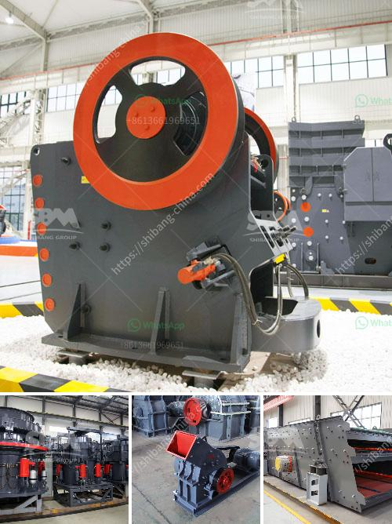

<h3>آلة كسارة في زامبيا</h3>
تعد آلة الكسارة واحدة من أهم الآلات المستخدمة في صناعة التعدين والبناء. وتُعتبر زامبيا، التي تقع في جنوب أفريقيا، من بين الدول التي تشتهر بمواردها المعدنية الهائلة والمتنوعة، مما يعني أنها بحاجة إلى آلات كسارة فعالة لاستخراج وتجهيز هذه الموارد بشكل فعال.

تحضى زامبيا بموارد طبيعية غنية، مثل النحاس والزنك والرصاص والذهب والفضة والروبي أو الزمرد. وتقوم صناعة التعدين في البلاد بدور رئيسي في الاقتصاد، إذ تساهم بشكل كبير في إيرادات الصادرات وتوفير فرص العمل.

تعد آلة الكسارة أحد الأدوات الرئيسية في صناعة التعدين. فهي تستخدم لكسر الخامات الصخرية الكبيرة إلى قطع صغيرة، مما يسهل استخلاص المعادن الموجودة فيها. بفضل آلة الكسارة، يتم تقليل الحجم الكبير للصخور إلى قطع صغيرة التي يمكن سهولة نقلها وتجهيزها للاستخدام النهائي. ويمكن استخدام هذه القطع الصغيرة لإنتاج مواد بناء مثل الحصى والرمل، الذي يعد ضرورياً لصناعة البناء.

وتوجد العديد من الكسارات في زامبيا، حيث يتم استخدامها في تعدين الموارد المعدنية المختلفة. كما أنها تلعب دورًا رئيسيًا في تجهيز الخامات لتكون جاهزة للاستخدام الصناعي. وتتميز آلات الكسارة في زامبيا بأنها تتوفر بمختلف الأحجام والقدرات، ما يتيح للشركات الاستجابة لمتطلباتها الخاصة.

تلقى صناعة الكسارة في زامبيا دعمًا كبيرًا من الحكومة، حيث تتبنى سياسات مشجعة للتعدين والبناء. وتعمل الحكومة على تسهيل إجراءات الحصول على تراخيص التعدين وتوفير الخدمات اللازمة للشركات المعدنية. وبفضل هذا الدعم، تستطيع الشركات استثمار في آلات الكسارة الحديثة والفعالة.

وفي الختام، يعد استخدام آلة الكسارة في زامبيا ضروريًا لتعدين وتجهيز الموارد المعدنية بشكل فعال واقتصادي. ومن المتوقع أن تستمر هذه الصناعة في النمو والتطور في السنوات القادمة، مع زيادة الطلب على الموارد المعدنية وتوسع القطاعات الصناعية والبنية التحتية في البلاد.
<h3>Contact us</h3><ul><li><strong>Whatsapp:&nbsp;<a href="https://wa.me/8613661969651">+8613661969651</a></strong></li><li><a href="https://swt.shibang-china.com/?git&amp;zhl&amp;آلة كسارة في زامبيا"><strong>Online Service(chat now)</strong></a></li></ul><h3>Related</h3><ul><li><a href='كسارات محمولة للإيجار.md'>كسارات محمولة للإيجار</a></li><li><a href='سحق 100 طن في الساعة.md'>سحق 100 طن في الساعة</a></li><li><a href='كسارة الحجر في المملكة المتحدة.md'>كسارة الحجر في المملكة المتحدة</a></li><li><a href='تدفق عملية مصنع البنتونايت.md'>تدفق عملية مصنع البنتونايت</a></li><li><a href='تعدين المحاجر ومعدات البناء.md'>تعدين المحاجر ومعدات البناء</a></li></ul>