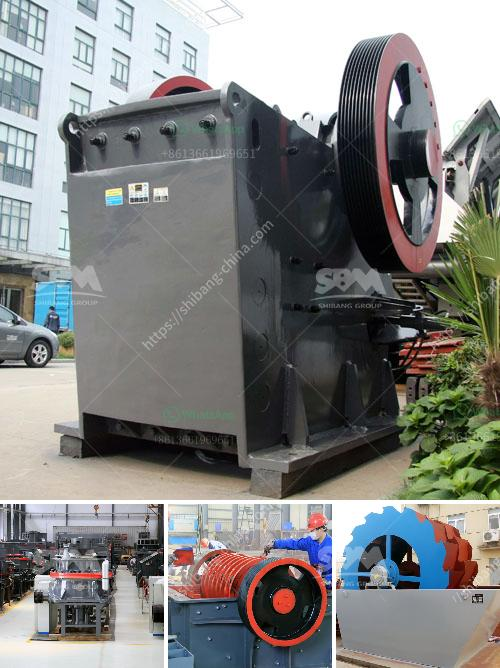

<h3>آلة كسارة لصنع الرمل من الحجر</h3>
آلة كسارة لصنع الرمل من الحجر هي آلة حديثة تستخدم في عملية تحويل الحجر إلى رمل صناعي عالي الجودة. يعتبر الرمل الصناعي المحصل عليه من الآلة مثاليًا للاستخدام في البناء والبناء والصناعات الأخرى.

تتألف آلة كسارة لصنع الرمل من الحجر من محرك الكهربائية وصواني التغذية والهيكل الرئيسي والغربال الاهتزازي والمطحنة العمودية والحزام الناقل. تهدف هذه العناصر إلى تجهيز الحجر بطريقة فعالة وفعالة لتحقيق أقصى استفادة من المواد الخام.

تعتمد آلة كسارة لصنع الرمل من الحجر على آلية الكسر والطحن لتحطيم الحجر إلى جزيئات صغيرة. يتم إدخال الحجر في آلة الكسارة من قبل صواني التغذية ويتم نقله إلى المطحنة العمودية. يستخدم المطحنة العمودية قوة الجاذبية لتكسير وطحن الحجر بفعالية. المواد المكسورة تمر من خلال الغربال الاهتزازي لفصل الرمل والحصى المكتسبين.

تتميز آلة كسارة لصنع الرمل من الحجر بعدة مزايا. أولاً وقبل كل شيء، تقدم قدرة كبيرة على الإنتاج مما يسمح بتلبية الطلب العالي على الرمل الصناعي.ثانياً، تنتج آلة صنع الرمل حبيبات رملية متناسقة الحجم وبجودة عالية. سوف يساعد ذلك في تحسين جودة المنتج النهائي وتخفيض تكاليف البناء.

بالإضافة إلى ذلك، فإن آلة كسارة لصنع الرمل تعتبر صديقة للبيئة. يتم استخدام الماء لتبريد الجهاز ومنع إنبعاث الغبار وتلوث الجو. هذا يضمن الحفاظ على البيئة المحيطة وصحة العمال المشاركين في عملية الإنتاج.

استخدام آلة كسارة لصنع الرمل من الحجر يوفر فوائد اقتصادية أيضًا. عندما يتم استخدام رمل صناعي في البناء والبناء، يتم توفير الرمل الطبيعي الذي يعتبر من الموارد الضرورية. أيضا، يمكن تحسين جودة البناء بفضل خصائص الرمل الصناعي المثالي للاستخدام في الخرسانة والأسمنت والإنشاءات الأخرى.

في الختام، آلة كسارة لصنع الرمل من الحجر هي ابتكار حديث ذو فوائد عديدة. تحويل الحجر إلى رمل صناعي عالي الجودة يوفر فوائد اقتصادية وبيئية. يمكن استخدام الرمل الصناعي في البناء والبناء والصناعات الأخرى لتحسين جودة المنتج وتوفير الموارد الطبيعية المحدودة. يمكن القول إن آلة كسارة لصنع الرمل من الحجر هي تكنولوجيا مهمة تساهم في تطور الصناعات المعمارية والبنائية.
<h3>Contact us</h3><ul><li><strong>Whatsapp:&nbsp;<a href="https://wa.me/8613661969651">+8613661969651</a></strong></li><li><a href="https://swt.shibang-china.com/?git&amp;zhl&amp;آلة كسارة لصنع الرمل من الحجر"><strong>Online Service(chat now)</strong></a></li></ul><h3>Related</h3><ul><li><a href='تأجير كسارة صغيرة دبلن.md'>تأجير كسارة صغيرة دبلن</a></li><li><a href='سعر آلة معالجة الحديد.md'>سعر آلة معالجة الحديد</a></li><li><a href='سعة مطحنة الكرة بالأطنان.md'>سعة مطحنة الكرة بالأطنان</a></li><li><a href='مطحنة كرات صغيرة لهنان الصين.md'>مطحنة كرات صغيرة لهنان الصين</a></li><li><a href='مورد كسارة النحاس.md'>مورد كسارة النحاس</a></li></ul>