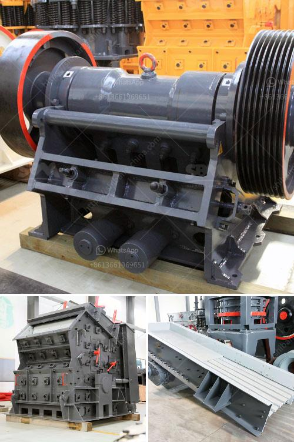

<h3>آلة كسارة للبيع</h3>
تعد آلة الكسارة من الأدوات الهامة التي تستخدم في صناعة التعدين والبناء. تستخدم لكسر المواد الخام الكبيرة إلى حجم أصغر يمكن استخدامها في عملية التصنيع أو البناء. يمكن شراء آلة الكسارة جديدة أو مستعملة بآلفي ريال سعودي واحد فقط.

تتكون آلة الكسارة من عدة أجزاء رئيسية، بما في ذلك المحرك الكهربائي أو المحرك الديزلي، والفك الثابت والفك المتحرك، وصفيحة الحماية والحامل، وذراع الربط والرافعة الهيدروليكية. يوفر الفك الثابت والفك المتحرك المساحة اللازمة لادخال المواد الخام وكسرها بفعل الضغط والاحتكاك.

تحتوي آلة الكسارة على العديد من المزايا التي تجعلها مثالية للاستخدام الصناعي والبنائي. أولاً، فإنها توفر طاقة عالية وكفاءة في عملية الكسر، مما يوفر الوقت والجهد. ثانيًا، يمكن تعديل حجم الإخراج بسهولة باستخدام الفك المتحرك، مما يجعلها مناسبة لمختلف الاحتياجات الصناعية والبنائية. ثالثًا، فإنها توفر مرونة في عملية الكسر، حيث يمكن استخدامها في كسر مختلف أنواع المواد مثل الحجر والرخام والخرسانة والطوب.

يتوفر العديد من أنواع الكسارات المتاحة للبيع، بدءًا من الكسارات الثابتة التي تستخدم في المصانع والمناجم، وتنتهي بالكسارات المتنقلة التي يمكن نقلها بسهولة واستخدامها في مواقع البناء المختلفة. يمكن شراء آلة الكسارة بسعر مناسب وفقًا لاحتياجاتك وميزانيتك.

عند البحث عن آلة كسارة للبيع، يجب أن تأخذ في الاعتبار العديد من العوامل المهمة مثل حجم الإخراج المطلوب، والقدرة، والتحمل، ونوع المواد التي ترغب في كسرها. يمكنك الاتصال بالشركات المصنعة للحصول على مزيد من المعلومات وتقييم العروض المتاحة.

باختصار، تعتبر آلة الكسارة أداة أساسية لصناعة التعدين والبناء، ويمكن شراؤها بسعر مناسب بين 200 إلى 400 ألف ريال سعودي. توفر آلة الكسارة العديد من المزايا مثل الطاقة العالية، وقابلية التعديل، والمرونة في عملية الكسر. قبل الشراء، يجب أن تنظر في العوامل المهمة مثل حجم الإخراج والقدرة لاختيار الجهاز المناسب لاحتياجاتك.
<h3>Contact us</h3><ul><li><strong>Whatsapp:&nbsp;<a href="https://wa.me/8613661969651">+8613661969651</a></strong></li><li><a href="https://swt.shibang-china.com/?git&amp;zhl&amp;آلة كسارة للبيع"><strong>Online Service(chat now)</strong></a></li></ul><h3>Related</h3><ul><li><a href='آلة طلاء مسحوق كربونات الكالسيوم في الهند.md'>آلة طلاء مسحوق كربونات الكالسيوم في الهند</a></li><li><a href='كسارة خام الحديد في المكسيك.md'>كسارة خام الحديد في المكسيك</a></li><li><a href='مصنع تحسين الكروميت في ماليزيا.md'>مصنع تحسين الكروميت في ماليزيا</a></li><li><a href='آلة طحن الحجر الجيري المصنع.md'>آلة طحن الحجر الجيري المصنع</a></li><li><a href='مصنع إنتاج مسحوق الجبس في أوروبا.md'>مصنع إنتاج مسحوق الجبس في أوروبا</a></li></ul>