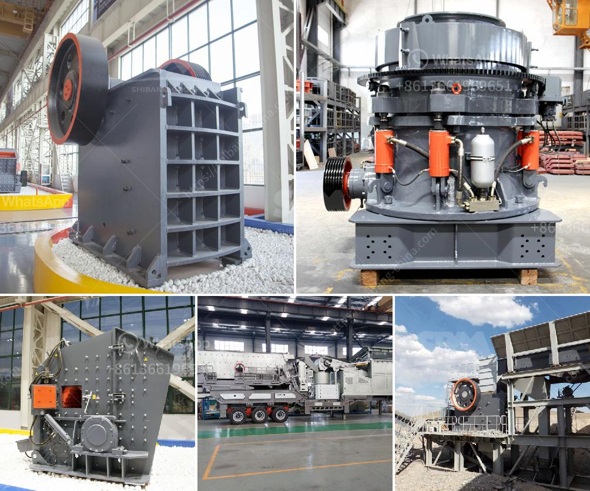

<h3>آلة مسحوق الباريت</h3>
تعتبر آلة مسحوق الباريت أداة هامة في صناعة التعدين ومعالجة المواد الخام. يتم استخدامها بشكل رئيسي لطحن الباريت إلى مسحوق ناعم، والذي يمكن استخدامه في العديد من التطبيقات الصناعية.

يتم استخراج الباريت من الصخور الجبلية ويتكون من معدن الباريوم. يتم طحن الباريت الخام باستخدام آلة مسحوق الباريت لتحويله إلى نسق دقيق جدًا. يتميز الباريت بكثافته العالية وصلابته وقدرته على التحمل الحراري العالي. وبالتالي، يمكن استخدامه في صناعة البلاستيك، الورق، الدهانات، الزجاج، المطاط، والكيماويات.

تتألف آلة مسحوق الباريت من العديد من الأجزاء الأساسية التي تعمل معًا لإنتاج مسحوق الباريت النهائي. تشمل هذه الأجزاء:

- الغربال الاهتزازي: يتم استخدامه لفصل الباريت الناعم عن الحبيبات الخشنة وتنظيفها وفقًا للحجم المطلوب.

- الكسارة الفكية: يتم استخدامها لسحق الباريت الخام إلى قطع صغيرة قبل الدخول إلى الآلة الرئيسية لطحنه.

- جهاز تجفيف الهواء: يتم استخدامه لنزح الماء من الباريت وتجفيفه قبل دخوله إلى آلة الطحن.

- المطحنة الرئيسية: هنا يتم طحن الباريت الجاف إلى مسحوق ناعم باستخدام الطاقة الكهربائية المولدة من المحرك.

- جهاز تصنيف الهواء: يستخدم لفصل الجزيئات الدقيقة من الباريت عن الهواء وتهوية المواد بشكل صحيح.

تتميز آلة مسحوق الباريت بعدة مزايا. بفضل الآلية المتقدمة والتكنولوجيا الحديثة، فإنها تسمح بإنتاج مسحوق الباريت عالي الجودة وبشكل مستدام. بالإضافة إلى ذلك، تعتبر موفرة للطاقة وتقلل من تكاليف التشغيل. كما أنها تتوفر بتصاميم وأحجام مختلفة، مما يتيح استخدامها في مختلف الصناعات.

في الختام، تعد آلة مسحوق الباريت أداة فعالة وضرورية للتعامل مع مادة الباريت وتحويلها إلى مسحوق ناعم. يمكن استخدام هذا المسحوق في العديد من الصناعات، وبالتالي يلعب الباريت دورًا هامًا في تعزيز الاقتصاد وتلبية الطلب العالمي على المواد الكيميائية.
<h3>Contact us</h3><ul><li><strong>Whatsapp:&nbsp;<a href="https://wa.me/8613661969651">+8613661969651</a></strong></li><li><a href="https://swt.shibang-china.com/?git&amp;zhl&amp;آلة مسحوق الباريت"><strong>Online Service(chat now)</strong></a></li></ul><h3>Related</h3><ul><li><a href='مطحنة كرات محمولة لتعدين الحجم الصغير.md'>مطحنة كرات محمولة لتعدين الحجم الصغير</a></li><li><a href='معدات استخراج الحجر.md'>معدات استخراج الحجر</a></li><li><a href='موردين طاحونة الفحم.md'>موردين طاحونة الفحم</a></li><li><a href='كسارة على أساس الإيجار في نيجيريا.md'>كسارة على أساس الإيجار في نيجيريا</a></li><li><a href='تصميم مطحنة الهامر.md'>تصميم مطحنة الهامر</a></li></ul>