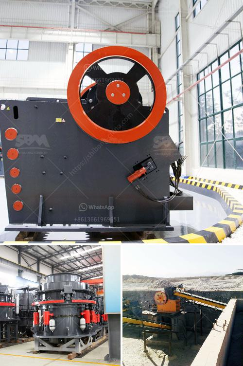

<h3>آلة مسحوق التلك</h3>
تعتبر آلة مسحوق التلك من الآلات المستخدمة في صناعة مساحيق التلك المختلفة. تتميز هذه الآلة بالقدرة على طحن حبيبات التلك إلى شكل مسحوق دقيق يستخدم في العديد من التطبيقات المختلفة.

تتكون آلة مسحوق التلك من عدة أجزاء رئيسية، بما في ذلك وحدة التغذية ووحدة الطحن ووحدة التصنيف. تبدأ عملية التصنيع بتغذية حبيبات التلك إلى وحدة التغذية، حيث يتم توجيهها بشكل متساوٍ إلى وحدة الطحن. تتم عملية الطحن باستخدام أسطوانة تدور بسرعة عالية، وتقوم بسحق حبيبات التلك وتحويلها إلى مسحوق دقيق. يتم تصنيف المسحوق الناتج بواسطة وحدة التصنيف، التي تفصل المسحوق حسب حجم الجسيمات.

توفر آلة مسحوق التلك العديد من المزايا. فهي توفر عملية تحويل حبيبات التلك إلى مسحوق دقيق وموحد بسهولة وكفاءة عالية. كما أنها قادرة على التعامل مع كميات كبيرة من المواد في وقت قصير، مما يزيد من إنتاجية العملية ويوفر الوقت والجهد. بالإضافة إلى ذلك، تتميز هذه الآلة بالدقة في عملية التصنيف، حيث يتم فصل المسحوق إلى فئات مختلفة تلبي متطلبات التطبيقات المختلفة.

تستخدم مساحيق التلك في العديد من الصناعات، بما في ذلك صناعة مستحضرات التجميل ومنتجات العناية بالبشرة والشعر. تعتبر مساحيق التلك أحد المكونات الرئيسية في صناعة مستحضرات التجميل، حيث تستخدم للحصول على ملمس ناعم ومات. كما تستخدم في صناعة الدهانات وطلاء السيارات لتقديم مزايا مثل القدرة على امتصاص الرطوبة ومقاومة الحرارة.

باختصار، تعد آلة مسحوق التلك أحد الآلات الهامة في صناعة مساحيق التلك. تعمل هذه الآلة على طحن حبيبات التلك وتحويلها إلى مسحوق دقيق يستخدم في العديد من التطبيقات المختلفة. تتميز هذه الآلة بالكفاءة والدقة في العملية، مما يجعلها خيارًا مناسبًا للشركات المصنعة في صناعة مساحيق التلك.
<h3>Contact us</h3><ul><li><strong>Whatsapp:&nbsp;<a href="https://wa.me/8613661969651">+8613661969651</a></strong></li><li><a href="https://swt.shibang-china.com/?git&amp;zhl&amp;آلة مسحوق التلك"><strong>Online Service(chat now)</strong></a></li></ul><h3>Related</h3><ul><li><a href='كسارات الحجر الجيري المستخدمة للبيع في تكساس.md'>كسارات الحجر الجيري المستخدمة للبيع في تكساس</a></li><li><a href='إجمالي الطاقة لكسارة الفك 500 طن في الساعة.md'>إجمالي الطاقة لكسارة الفك 500 طن في الساعة</a></li><li><a href='سعر كسارة الح.md'>سعر كسارة الح</a></li><li><a href='فاصل عالي التدرج في زينغتشو.md'>فاصل عالي التدرج في زينغتشو</a></li><li><a href='تكلفة تقديرية لمصنع التعدين.md'>تكلفة تقديرية لمصنع التعدين</a></li></ul>