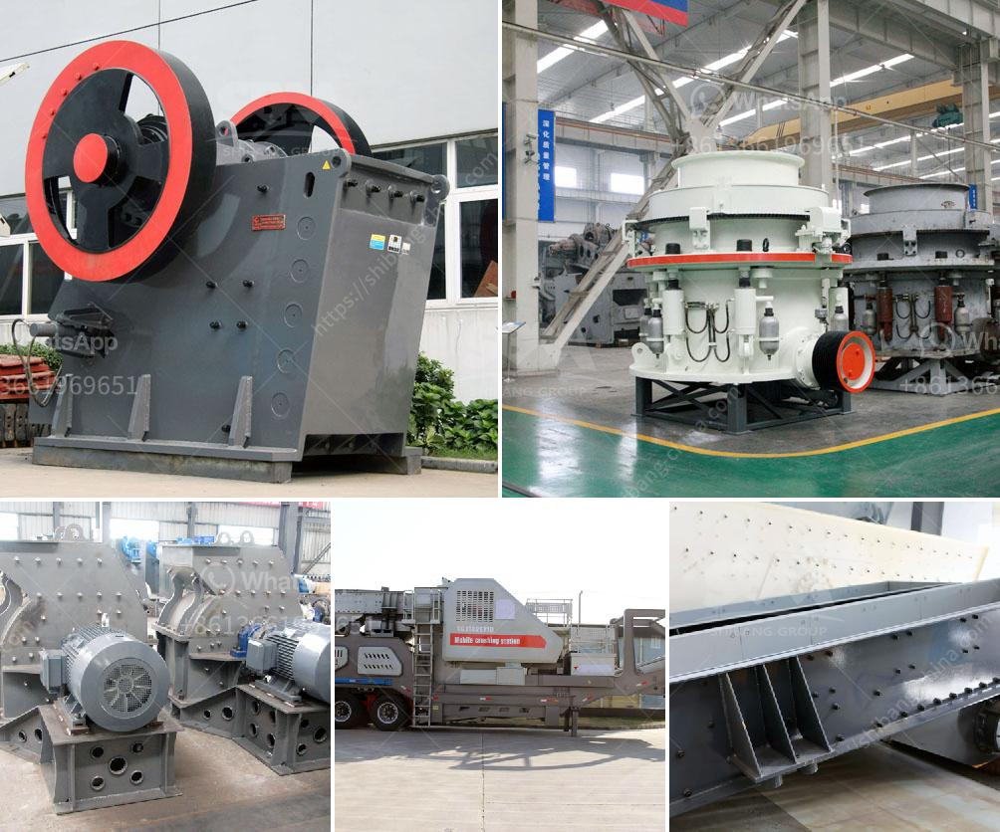

<h3>آلة مسحوق الجير السريع</h3>
تُعتبر آلة مسحوق الجير السريع أداة حديثة ومبتكرة تستخدم في العديد من المجالات، وتشتهر بقدرتها على إنتاج مسحوق الجير بطريقة سريعة وفعالة. تُستخدم هذه الآلة في مجالات البناء، والصناعة، والزراعة، حيث يمكن استخدام مسحوق الجير في عمليات التصنيع وصيانة الجدران وتنظيف المياه والتربة.

تتميز آلة مسحوق الجير السريع بعدة ميزات تجعلها خياراً مثاليًا للعديد من الشركات والصناعات. فمن أهم هذه الميزات هي سرعة عملها وكفاءتها، حيث تعتبر العملية التي تتبعها هذه الآلة بسيطة وفعالة، مما يوفر الوقت والجهد للعمال. بالإضافة إلى ذلك، فإنها تعمل بكفاءة عالية وقادرة على إنتاج كمية كبيرة من مسحوق الجير في وقت قصير.

تعتمد آلة مسحوق الجير السريع على المبدأ الكيميائي لتحويل الحجر الجيري إلى جير غير قابل للذوبان في الماء. يتم طحن الحجر الجيري إلى مسحوق ناعم ثم تُخلط هذه الحبيبات بالماء، وتتفاعل مع بعضها البعض لتكوين جير كيميائي. يتم بعدها تجفيف المعجون الناتج للحصول على مسحوق الجير النهائي.

يعتبر مسحوق الجير منتجًا متعدد الاستخدامات، حيث يُمكن استخدامه في العديد من الصناعات والتطبيقات المختلفة. في مجال البناء، يُستخدم مسحوق الجير في عمليات البناء والتشييد كتراكيباً وأسمنتاً. كما يُمكن استخدامه في عمليات الترميم والتجديد للجدران، حيث يُطبق عليها على شكل طبقة رقيقة تحميها من التأثيرات الخارجية.

وفي مجال الصناعة، يُستخدم مسحوق الجير في إنتاج الزجاج والورق والمواد الكيميائية والأسمدة. كما يُستخدم في صناعة الأخشاب لتطبيعها وتنقيتها. بالإضافة إلى ذلك، يُمكن استخدام مسحوق الجير في معالجة مياه الشرب ومياه الصرف الصحي، حيث يمتلك قدرة فعالة على التخلص من الشوائب والبكتيريا.

في الزراعة، يُستخدم مسحوق الجير لتحسين خواص التربة وتعديل حموضتها. يُعتبر مسحوق الجير مبيدًا حيويًا فعالًا ويُستخدم في القضاء على الآفات والحشرات الضارة. كما يُعتبر مصدرًا غنيًا بالكالسيوم والمغنيسيوم والفوسفور، وبالتالي يُساهم في تغذية النباتات وتعزيز نموها.

باختصار، آلة مسحوق الجير السريع توفر طريقة سهلة وفعالة لإنتاج مسحوق الجير، وتستخدم في العديد من المجالات مثل البناء والصناعة والزراعة. يمتلك مسحوق الجير مزايا عديدة واستخدامات متنوعة في تحسين البنية التحتية وصيانة الجدران وتحسين مياه الشرب والتربة. بالتالي، يُمثل هذا المنتج باعًا كبيرًا في السوق ويساهم في تطوير العديد من الصناعات والقطاعات المختلفة.
<h3>Contact us</h3><ul><li><strong>Whatsapp:&nbsp;<a href="https://wa.me/8613661969651">+8613661969651</a></strong></li><li><a href="https://swt.shibang-china.com/?git&amp;zhl&amp;آلة مسحوق الجير السريع"><strong>Online Service(chat now)</strong></a></li></ul><h3>Related</h3><ul><li><a href='مطحنة هامر لطحن البولي إيثيلين منخفض الكثافة.md'>مطحنة هامر لطحن البولي إيثيلين منخفض الكثافة</a></li><li><a href='آلة كسارة الحجر في جنوب أفريقيا.md'>آلة كسارة الحجر في جنوب أفريقيا</a></li><li><a href='كسارة الحجر في الفلبين للبيع.md'>كسارة الحجر في الفلبين للبيع</a></li><li><a href='شاشة اهتزازية لرمل الكوارتز.md'>شاشة اهتزازية لرمل الكوارتز</a></li><li><a href='آلات محجر كاملة للبيع في الصين.md'>آلات محجر كاملة للبيع في الصين</a></li></ul>