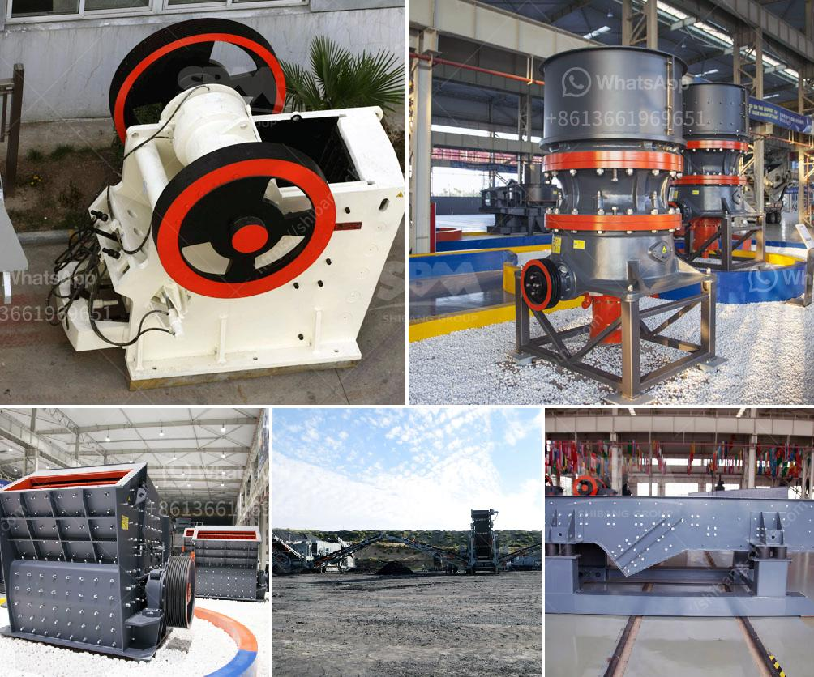

<h3>آلة مسحوق الحجر الجيري</h3>
مسحوق الحجر الجيري هو مادة تستخدم في العديد من الصناعات المختلفة. واحدة من الأدوات المستخدمة في عملية إنتاج مسحوق الحجر الجيري هي آلة مسحوق الحجر الجيري. تعد هذه الآلة مهمة جدًا للعديد من الصناعات والعمليات، وسأتحدث في هذه المقالة عن آلة مسحوق الحجر الجيري وفوائدها.

تتكون آلة مسحوق الحجر الجيري من عدة أجزاء رئيسية، ومنها الكسارة الفكية والمطحنة العمودية والطاحونة اللولبية. تعتبر الكسارة الفكية الأولى في سلسلة الإنتاج، حيث يتم استخدامها لسحق الحجارة الكبيرة إلى مواد صغيرة الحجم. بعد ذلك، يتم تغذية المواد المسحوقة إلى المطحنة العمودية حيث يتم طحنها إلى مسحوق ناعم. تعمل الطاحونة اللولبية على نقل المسحوق من المطحنة العمودية إلى مجمع الغبار الموجود في الجهاز.

تتميز آلة مسحوق الحجر الجيري بالعديد من الفوائد. قد تكون أهم فوائدها السرعة والكفاءة. يمكن لهذه الآلة معالجة كمية كبيرة من الحجارة في وقت قصير، مما يزيد من كفاءة الإنتاج. بالإضافة إلى ذلك، تعتبر هذه الآلة قابلة للتطبيق في العديد من الصناعات المختلفة مثل البناء والطلاء والصناعات الكيماوية والصناعات الزراعية وغيرها.

أيضًا، فإن مسحوق الحجر الجيري بفضل آلة مسحوق الحجر الجيري يمكن استخدامه في العديد من المجالات. يتم استخدامه في صناعة البناء لإنتاج الخرسانة والجبس والطلاء. يمكن أيضًا استخدامه في صناعة الصلب والزجاج والورق والمواد الكيميائية. بالإضافة إلى ذلك، يمكن استخدامه في صناعة الطلاء البلاستيكي واللاصق والمواد الكيماوية الزراعية.

بالاختصار، آلة مسحوق الحجر الجيري هي أداة حيوية في عملية إنتاج مسحوق الحجر الجيري. تعتبر هذه الآلة فعالة من حيث الكفاءة والسرعة، وتوفر مجموعة واسعة من المزايا التطبيقية في العديد من الصناعات المختلفة. يمكن استخدام مسحوق الحجر الجيري المنتج باستخدام هذه الآلة في البناء والصناعات الكيميائية والزراعية وغيرها. إنها آلة لا تقدر بثمن في عمليات الإنتاج الحديثة.
<h3>Contact us</h3><ul><li><strong>Whatsapp:&nbsp;<a href="https://wa.me/8613661969651">+8613661969651</a></strong></li><li><a href="https://swt.shibang-china.com/?git&amp;zhl&amp;آلة مسحوق الحجر الجيري"><strong>Online Service(chat now)</strong></a></li></ul><h3>Related</h3><ul><li><a href='آلة الجبس في ألمانيا.md'>آلة الجبس في ألمانيا</a></li><li><a href='معدات صنع مسحوق كربونات الكالسيوم في ألمانيا.md'>معدات صنع مسحوق كربونات الكالسيوم في ألمانيا</a></li><li><a href='كسارات الحجر في غانا.md'>كسارات الحجر في غانا</a></li><li><a href='مصنع كسارة الفك في ولاية جوجارات الهند.md'>مصنع كسارة الفك في ولاية جوجارات الهند</a></li><li><a href='كسارات تأجير.md'>كسارات تأجير</a></li></ul>