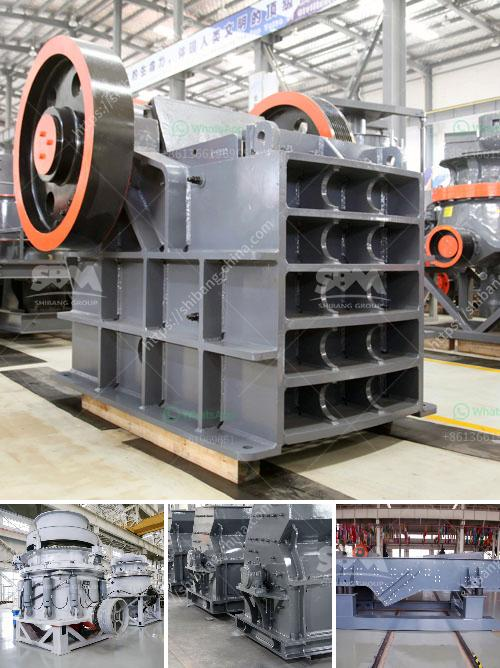

<h3>آلة مسحوق الدولوميت في سريلانكا</h3>
مسحوق الدولوميت هو معدن يتم استخراجه من الصخور الدولوميتية وتحويله إلى شكل مسحوق رفيع. يتم استخدامه في العديد من الصناعات بسبب خصائصه الفريدة والمتعددة التطبيقات. واحدة من الآلات الرئيسية المستخدمة في عملية إنتاج مسحوق الدولوميت هي آلة مسحوق الدولوميت في سريلانكا.

تعد سريلانكا واحدة من أبرز الدول المصدرة للدولوميت في العالم. يتم استخراج الدولوميت من الصخور الجيرية في المناجم وتحويلها إلى مسحوق دقيق باستخدام آلة مسحوق الدولوميت. تتألف الآلة من العديد من الأجزاء المهمة مثل المحرك والمحور وغطاء الحماية.

يتم استخدام آلة مسحوق الدولوميت في سريلانكا لإنتاج مسحوق الدولوميت عالي الجودة والنقاء. يتم تغذية الصخور الدولوميتية في الآلة عن طريق الحزام الناقل والتي تنقلها إلى مطحنة الطحن. يتم استخدام المطرقة أو الفك لكسر الصخور الكبيرة إلى قطع صغيرة. بعد ذلك، يتم طحن القطع الصغيرة في مطحنة الطحن للحصول على مسحوق الدولوميت النهائي.

تتميز آلة مسحوق الدولوميت في سريلانكا بالكفاءة العالية والأداء الموثوق به. تعتمد الآلة على تقنيات متقدمة في الطحن والتحكم في الجودة. تتيح هذه الآلة للشركات المصنعة إنتاج مسحوق الدولوميت بجودة عالية وبكميات كبيرة. تلعب هذه الآلة دورًا حاسمًا في تلبية احتياجات الصناعات المختلفة في مجالات مثل البناء والزراعة والصناعة الكيميائية.

باختصار، آلة مسحوق الدولوميت في سريلانكا تعد أداة أساسية في عملية إنتاج مسحوق الدولوميت. تساعد الآلة على الحصول على مسحوق عالي الجودة والنقاء من الصخور الدولوميتية. تلعب هذه الصناعة دورًا هامًا في توفير المواد الخام للعديد من الصناعات المختلفة في سريلانكا وحول العالم. من المتوقع أن تستمر صناعة مسحوق الدولوميت في النمو والازدهار في المستقبل بفضل آلات مثل آلة مسحوق الدولوميت في سريلانكا.
<h3>Contact us</h3><ul><li><strong>Whatsapp:&nbsp;<a href="https://wa.me/8613661969651">+8613661969651</a></strong></li><li><a href="https://swt.shibang-china.com/?git&amp;zhl&amp;آلة مسحوق الدولوميت في سريلانكا"><strong>Online Service(chat now)</strong></a></li></ul><h3>Related</h3><ul><li><a href='آلة سحق الدولوميت للبيع في دبي.md'>آلة سحق الدولوميت للبيع في دبي</a></li><li><a href='مورد معدات كسارة الفك.md'>مورد معدات كسارة الفك</a></li><li><a href='مصنع غسيل الماس في جنوب أفريقيا.md'>مصنع غسيل الماس في جنوب أفريقيا</a></li><li><a href='سلسلة SCM لطحن المساحيق الدقيقة.md'>سلسلة SCM لطحن المساحيق الدقيقة</a></li><li><a href='مصنع تكسير خام البوكسيت.md'>مصنع تكسير خام البوكسيت</a></li></ul>