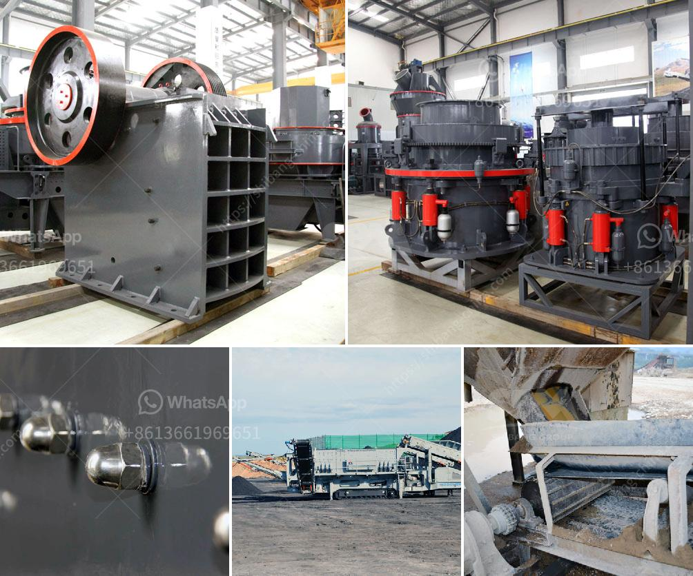

<h3>آلة مسحوق الدولوميت</h3>
تعتبر آلة مسحوق الدولوميت أحدث التقنيات المستخدمة في صناعة الدولوميت المطحون. الدولوميت هو معدن متعدد الاستخدامات يستخدم في العديد من الصناعات مثل التعدين والبناء الهندسي والزراعة والصناعات الكيماوية.

تعتبر آلة مسحوق الدولوميت عبارة عن معدات تصنيع تستخدم لطحن الدولوميت إلى مسحوق ناعم. وتوفر الآلة مسحوقاً نهائياً عالي الجودة ومتناسق في الحجم والشكل، مما يزيد من قيمة الدولوميت في السوق.

تتألف آلة مسحوق الدولوميت من العديد من الأجزاء المهمة مثل الكسارة الفكية والطاحونة العمودية ومغذي الاهتزاز والمرشح وناقل الإرسال ومروحة الشفط ونظام التحكم الكهربائي. تعمل هذه الأجزاء بشكل متناغم لتحقيق العملية الأمثل لطحن الدولوميت.

يبدأ العمل بوضع الدولوميت في الكسارة الفكية. يتم سحق الدولوميت إلى حجم صغير تمهيداً لعملية الطحن. ثم يتم نقل الدولوميت المسحوق إلى الطاحونة العمودية حيث يتم طحنه بشكل أكثر دقة ودقة. بفضل تصميمها الفريد وطريقة الطحن المتقدمة، تساهم الطاحونة العمودية في تجنب تلوث الدولوميت المسحوق بالشوائب الأخرى وتحسين جودتها.

يتم تجميع السحق والطحن في هذه الآلة بفضل وجود نظام التحكم الكهربائي الذي يتحكم في عملية المعالجة بشكل تلقائي. يعتبر هذا النظام جزءًا هامًا من آلة مسحوق الدولوميت، حيث يحافظ على استقرار عملية الطحن وتحقيق انتاجية عالية.

بالإضافة إلى ذلك، يتم استخدام مراقبة التلوث في هذه الآلة لمراقبة تلوث الهواء والضوضاء التي قد تحدث خلال عملية الطحن. هذا يساعد في الحفاظ على بيئة عمل أكثر صحة للعمال ويحسن سمعية المنطقة المحيطة بالمصنع.

باختصار، آلة مسحوق الدولوميت هي تقنية حديثة تعمل على تحويل الدولوميت إلى مسحوق ناعم وعالي الجودة. تعتبر هذه الآلة حلاً مثاليًا للعديد من الصناعات التي تحتاج إلى الدولوميت المطحون، مثل صناعة البناء والزراعة والصناعات الكيماوية. تضمن آلة مسحوق الدولوميت نتائج ممتازة وتحقق كفاءة عالية وانتاجية كبيرة.
<h3>Contact us</h3><ul><li><strong>Whatsapp:&nbsp;<a href="https://wa.me/8613661969651">+8613661969651</a></strong></li><li><a href="https://swt.shibang-china.com/?git&amp;zhl&amp;آلة مسحوق الدولوميت"><strong>Online Service(chat now)</strong></a></li></ul><h3>Related</h3><ul><li><a href='كسارة الحجر في هيماتشال براديش.md'>كسارة الحجر في هيماتشال براديش</a></li><li><a href='تكنولوجيا معالجة خام الباريت.md'>تكنولوجيا معالجة خام الباريت</a></li><li><a href='كسارة صغيرة للبيع في المحجر.md'>كسارة صغيرة للبيع في المحجر</a></li><li><a href='شركة تصنيع كسارات صغيرة في الصين.md'>شركة تصنيع كسارات صغيرة في الصين</a></li><li><a href='التكلفة المقدرة لإنشاء محجر.md'>التكلفة المقدرة لإنشاء محجر</a></li></ul>