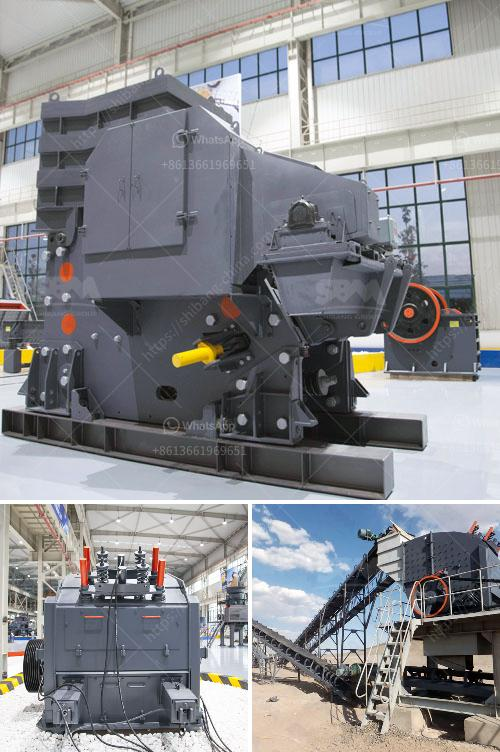

<h3>آلة مسحوق رمل السيليكا إندونيسيا</h3>
إن الآلة المسحوقة لرمل السيليكا تعتبر واحدة من الآلات الحديثة التي يتم استخدامها في صناعة البناء والتشييد. تُستخدم رمل السيليكا في العديد من التطبيقات مثل صناعة الزجاج والسيراميك والمواد اللاصقة. لذا فإن توفير رمل السيليكا عالي الجودة ضرورة حتمية للصناعات المختلفة.

إن إندونيسيا هي واحدة من الدول التي تُعرف بانتاجها الممتاز لرمل السيليكا المستخدم في مختلف الصناعات. ولتحقيق ذلك، تم استخدام الآلة المسحوقة لإنتاج رمل السيليكا بجودة عالية.

تتميز هذه الآلة بالعديد من الميزات، فهي قوية وفعالة وسريعة في إنتاج الرمل المسحوق. تعمل الآلة عن طريق سحق الكتل الكبيرة من رمل السيليكا إلى حجم أصغر وذلك باستخدام قوة التصادم الميكانيكي للمطرقة الدوارة. ثم يتم استخدام الشاشة الاهتزازية لفصل الجسيمات المتناهية الصغر وفقًا للحجم المطلوب.

باستخدام هذه الآلة، يمكن الحصول على رمل السيليكا المسحوق بنسبة تناسب مثالية للعديد من التطبيقات المختلفة. فمن خلال ضبط طول وعرض وسماكة الشاشة، يمكن التحكم في حجم الجسيمات المنتجة.

يعتبر رمل السيليكا المسحوقة ناتجًا من عملية تحويل المواد الخام إلى مادة ذات خواص جديدة. فهو يتميز بنسبة عالية من النقاء والنعومة، كما أنه خالٍ من الشوائب الضارة. علاوة على ذلك، يمتاز بتوفره بكميات كبيرة وبسعر معقول.

تستخدم آلة مسحوق رمل السيليكا بشكل واسع في العديد من الصناعات مثل البناء والصناعات الكيماوية والفضاء والطاقة الشمسية. فمن خلال استخدام الرمل المسحوق، يتم تحسين جودة المنتج النهائي وتحقيق أداء أفضل.

لخلاصة القول، تلعب الآلة المسحوقة لرمل السيليكا دورًا حاسمًا في صناعة البناء والصناعات الأخرى. تمكن هذه الآلة من تحويل رمل السيليكا إلى شكل مسحوق ذو نسبة عالية من النقاء والنعومة. بفضل استخدام هذه الآلة، تعتبر إندونيسيا واحدة من الدول الرائدة في إنتاج رمل السيليكا عالي الجودة وبأسعار تنافسية.
<h3>Contact us</h3><ul><li><strong>Whatsapp:&nbsp;<a href="https://wa.me/8613661969651">+8613661969651</a></strong></li><li><a href="https://swt.shibang-china.com/?git&amp;zhl&amp;آلة مسحوق رمل السيليكا إندونيسيا"><strong>Online Service(chat now)</strong></a></li></ul><h3>Related</h3><ul><li><a href='معدات طحن مطحنة ريموند.md'>معدات طحن مطحنة ريموند</a></li><li><a href='شركات تصنيع مصانع المحاجر في المملكة المتحدة.md'>شركات تصنيع مصانع المحاجر في المملكة المتحدة</a></li><li><a href='كسارات الفك في جنوب أفريقيا.md'>كسارات الفك في جنوب أفريقيا</a></li><li><a href='مشغل مصنع كسارة في كسارة.md'>مشغل مصنع كسارة في كسارة</a></li><li><a href='كتلة الآلات وكسارة في AutoCAD.md'>كتلة الآلات وكسارة في AutoCAD</a></li></ul>