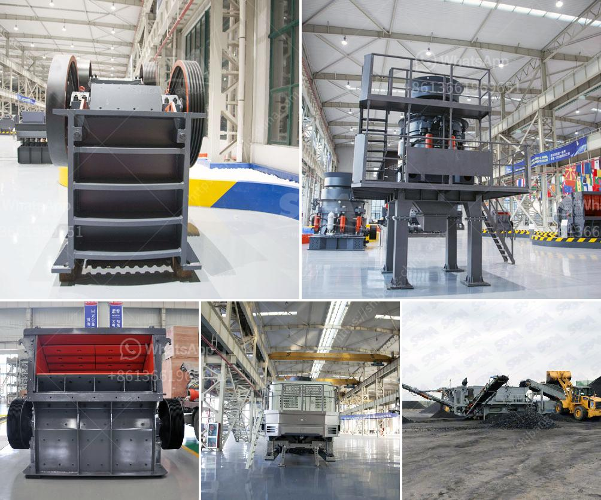

<h3>آلة مطحنة الأسطوانة في فرنسا</h3>
تعتبر آلة مطحنة الأسطوانة واحدة من الآلات الحديثة التي تستخدم في صناعة الطحين في فرنسا. تعد هذه الآلة تقنية متقدمة جدًا تستخدم لطحن الحبوب وتحويلها إلى طحين ناعم وعالي الجودة.

تتكون آلة مطحنة الأسطوانة من عدة أسطوانات متلاصقة تدار بشكل مستقل لتكوين نظام طحن فعال. كل أسطوانة مطلية بمادة خاصة تعمل على طحن الحبوب بفعالية. تؤدي حركة التدوير المستمرة للأسطوانات إلى سحق الحبوب بينها وتحويلها إلى جسيمات صغيرة.

تعمل هذه الآلة باستخدام محرك قوي يدفع الأسطوانات في الاتجاه المعاكس، وتعتمد على ضغط وحرارة مناسبة للتحكم في طحن الحبوب بشكل صحيح. وفي نهاية العملية، يتم فصل الطحين عن الجسيمات الأخرى بواسطة آلية خاصة توجد في الآلة.

يعود استخدام آلة مطحنة الأسطوانة في فرنسا إلى العصور الوسطى، حيث كانت تستخدم لطحن الحبوب في المطاحن الريفية. ومع مرور الوقت، تطورت هذه التكنولوجيا وتحسنت لتصبح أكثر كفاءة ودقة في عملها.

تعد فرنسا واحدة من الدول الرائدة في صناعة الطحين، واستخدام آلة مطحنة الأسطوانة يعزز جودة الطحين المنتج ويزيد من إنتاجية المطاحن. كما أنها توفر وقتًا وجهدًا قيمين للعمال القائمين على العملية.

يتم استخدام آلة مطحنة الأسطوانة في فرنسا في صناعة مختلفة مثل صناعة الخبز والمعجنات والحلويات. تساهم هذه الآلة في تحسين الأداء العام للصناعة ورفع مستوى الجودة والتنافسية.

بالاعتماد على تكنولوجيا متطورة، تستمر فرنسا في تطوير آلة مطحنة الأسطوانة وتحسينها بشكل مستمر للحفاظ على الريادة في صناعة الطحين. ومن المتوقع أن تستمر الآلة في التطور والتحسين في المستقبل لتلبية احتياجات السوق المتغيرة وتحقيق أعلى مستويات الجودة والكفاءة في صناعة الطحين في فرنسا.
<h3>Contact us</h3><ul><li><strong>Whatsapp:&nbsp;<a href="https://wa.me/8613661969651">+8613661969651</a></strong></li><li><a href="https://swt.shibang-china.com/?git&amp;zhl&amp;آلة مطحنة الأسطوانة في فرنسا"><strong>Online Service(chat now)</strong></a></li></ul><h3>Related</h3><ul><li><a href='مصنعين محطم في جنوب أفريقيا.md'>مصنعين محطم في جنوب أفريقيا</a></li><li><a href='مصنع غسل الحجارة الكوارتز.md'>مصنع غسل الحجارة الكوارتز</a></li><li><a href='كسارة الفك 1200 طن في الساعة.md'>كسارة الفك 1200 طن في الساعة</a></li><li><a href='مطحنة طحن عمودية.md'>مطحنة طحن عمودية</a></li><li><a href='شركة كسارة في دبي.md'>شركة كسارة في دبي</a></li></ul>