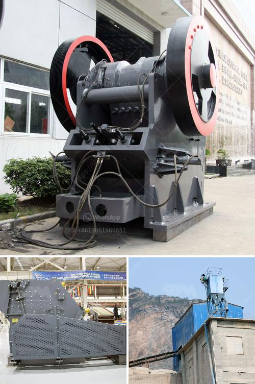

<h3>آلة مطحنة الدورين</h3>
تعتبر آلة مطحنة الدورين واحدة من الأدوات المهمة في مجال صناعة الطحين. فهي تعمل على طحن الحبوب وتحويلها إلى مادة خام تستخدم في صناعة الخبز والمخبوزات الأخرى. تتمتع آلة المطحنة بقدرة فائقة وكفاءة عالية في أداء مهمتها، إذ تنتج كمية كبيرة من الطحين بأقل جهد ووقت ممكنين.

تعمل آلة مطحنة الدورين على مبدأ بسيط وفعال. تتكون الآلة من اسطوانتين متوازيتين مشابهتين، مركبة على إطار قوي. تتدلي الاسطوانتين بواسطة محاور تدور على نحو متزامن عن طريق استخدام محرك كهربائي. توضع الحبوب على الجانب العلوي من الآلة، ومع تدور الروافع، تسقط الحبوب بين الاسطوانتين المتدليتين.

ما يميز آلة مطحنة الدورين هو تصميمها الهندسي الذكي ووظائفها المتعددة. فمن خلال تواجد الدورين المتراكبين أفقيًا، تساعد هذه الآلة على زيادة عملية الطحن بشكل كبير. فعندما تسقط الحبوب بين الدورين، يتم سحقها وتفتيتها تحت الضغط القوي الذي ينشأ بين الاسطوانتين. وبمجرد أن تمر الحبوب بين الدورين ، تخرج من الآلة على شكل مسحوق ناعم يسمى الطحين.

يعتبر استخدام آلة مطحنة الدورين مفيد جدًا في صناعة الخبز والمخبوزات. فهي تساعد على تحقيق إنتاجية عالية والحصول على طحين ذو جودة عالية. كما تعمل الآلة على ضمان توزيع متساوٍ للطحين وحبوب الحبوب، مما يجعلها أكثر فعالية في استخدام الطحين وتوفير الوقت والموارد.

بالإضافة إلى ذلك، تتميز آلة مطحنة الدورين بقدرتها على ضبط درجة نعومة الطحين حسب الاحتياجات المختلفة. فهي تسمح بتعديل المسافة بين الأسطوانتين مما يؤثر على درجة الطحن. وبذلك يمكن أن تنتج الآلة طحينًا خشنًا أو ناعمًا حسب الرغبة.

باختصار، آلة مطحنة الدورين هي واحدة من الآلات المهمة في صناعة الطحين. فهي توفر عملية طحن سريعة وفعالة وبجودة عالية. إن استخدام هذه الآلة يتيح للمصانع الحصول على كمية كبيرة من الطحين بأقل جهد ووقت ممكنين، مما يسهم في زيادة الإنتاجية وتحقيق الربحية.
<h3>Contact us</h3><ul><li><strong>Whatsapp:&nbsp;<a href="https://wa.me/8613661969651">+8613661969651</a></strong></li><li><a href="https://swt.shibang-china.com/?git&amp;zhl&amp;آلة مطحنة الدورين"><strong>Online Service(chat now)</strong></a></li></ul><h3>Related</h3><ul><li><a href='آلة صنع مسحوق الحجر الجيري في الهند.md'>آلة صنع مسحوق الحجر الجيري في الهند</a></li><li><a href='تكلفة الكسارة المحمولة.md'>تكلفة الكسارة المحمولة</a></li><li><a href='مطحنة طحن في ألمانيا.md'>مطحنة طحن في ألمانيا</a></li><li><a href='مصنع طحن الحجر.md'>مصنع طحن الحجر</a></li><li><a href='كسارات للركام الجرانيت.md'>كسارات للركام الجرانيت</a></li></ul>