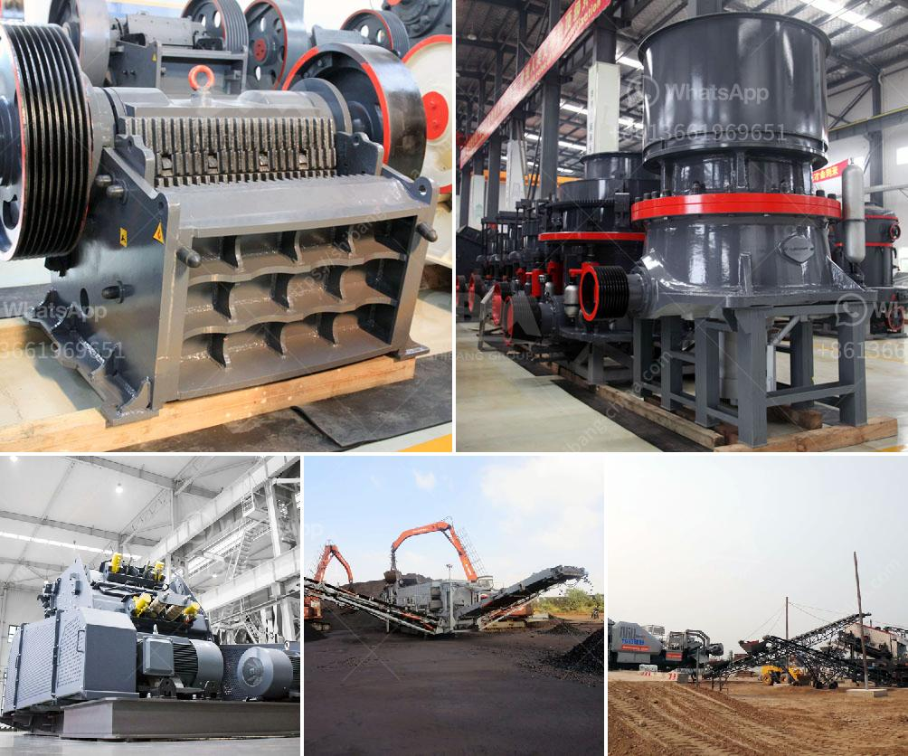

<h3>آلة مطحنة الدولوميت</h3>
يعتبر الدولوميت من المعادن الطبيعية التي تستخدم في العديد من الصناعات، ومطحنة الدولوميت هي آلة تستخدم لطحن وتكسير الدولوميت إلى جسيمات صغيرة. تتكون مطحنة الدولوميت عادة من طبل دوار وأسطوانة غربال صغيرة، حيث يتم إدخال الدولوميت المكسورة في الطبل الدوار، ثم يتم طحنها وتكسيرها بواسطة الأسطوانة الدوارة.

تستخدم مطاحن الدولوميت في عمليات الطحن والتكسير لتحويل الدولوميت إلى مسحوق ناعم يمكن استخدامه في صناعة البناء والزراعة والأعلاف وصناعة البلاستيك والدهانات. فعلى سبيل المثال، تستخدم في البناء لتحسين خواص الخرسانة وزيادة مقاومتها ومتانتها. كما يتم استخدامها في صناعة البلاستيك والدهانات كملء ومثبط للحريق.

بالإضافة إلى ذلك، فإن مطاحن الدولوميت تتميز بالعديد من المزايا. فهي تحتوي على نظام تحكم ذكي يسمح بضبط حجم الجسيمات ونسبة التفاوت في الحجم وفقًا لاحتياجات الإنتاج. كما أنها توفر كفاءة عالية في الطحن وتوزيع متساوٍ للجسيمات المطحونة. تعمل المطاحن بسلاسة وتتميز بعمر خدمة طويل، مما يمكن الشركات من تحسين كفاءة الإنتاج وتقليل تكاليف التشغيل.

علاوة على ذلك، فإن استخدام مطاحن الدولوميت يسهم في الحفاظ على البيئة. فهي تستخدم تكنولوجيا حديثة تسمح بالتحكم في الغبار والضوضاء المنبعثين خلال عملية الطحن. وبالتالي، يمكن الحفاظ على نوعية الهواء والحفاظ على صحة العاملين في المنشأة.

بهذه الطريقة، تعد مطاحن الدولوميت وسيلة فعالة للطحن والتكسير وتحويل الدولوميت إلى مسحوق ناعم يمكن استخدامه في مجموعة متنوعة من الصناعات. توفر هذه الآلة فوائد اقتصادية وبيئية، بالإضافة إلى تحسين كفاءة الإنتاج في الصناعات المختلفة.
<h3>Contact us</h3><ul><li><strong>Whatsapp:&nbsp;<a href="https://wa.me/8613661969651">+8613661969651</a></strong></li><li><a href="https://swt.shibang-china.com/?git&amp;zhl&amp;آلة مطحنة الدولوميت"><strong>Online Service(chat now)</strong></a></li></ul><h3>Related</h3><ul><li><a href='مورد جنوب أفريقي لمطحنة الكرة.md'>مورد جنوب أفريقي لمطحنة الكرة</a></li><li><a href='كسارة مخروطية أساسية.md'>كسارة مخروطية أساسية</a></li><li><a href='كسارة للبيع بسعر دبي.md'>كسارة للبيع بسعر دبي</a></li><li><a href='آلة طحن السلاغ الفرن العالي في الهند.md'>آلة طحن السلاغ الفرن العالي في الهند</a></li><li><a href='آلات سحق الكرةست.md'>آلات سحق الكرةست</a></li></ul>